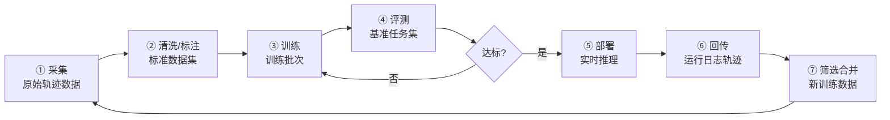
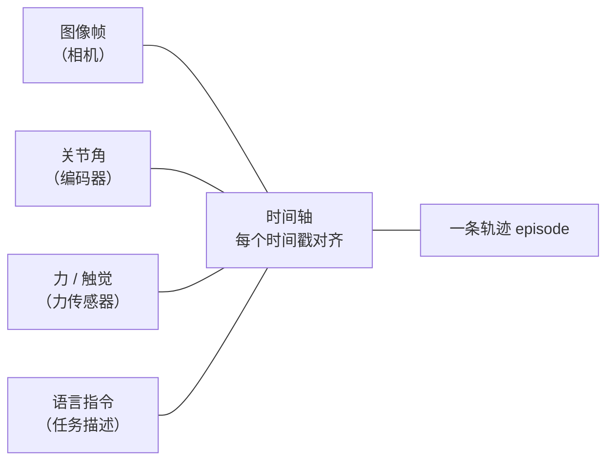
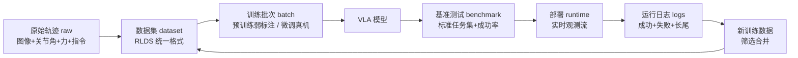

# 周 1 图：数据闭环

> 作业：画出闭环 + 每环节标出"数据是什么 / 谁产生 / 谁消费"。D2 完成文字版 + 图 v1，D5 定稿。

## 一句话

数据从采集到使用的循环系统：每一站的输出是下一站的输入，部署后真实场景的数据再回传，循环永动——飞轮转的不是数据量，是**数据价值密度**（每转一圈，模型见过的真实情况更多）。

## 图 1：数据闭环全景（7 环节）

## 图 2：轨迹数据长什么样（时间轴绑定）

> 一条轨迹 = 同一时刻的多模态信号按时间戳对齐排下来。

## 图 3：数据形态演变（7 种数据）

> 每个环节数据长得都不一样——这就是"数据平台"要管的 7 种数据。

## 每环节的数据（D2 完成版）

| 环节 | 数据是什么 | 谁产生 | 谁消费 | 平台要提供的软件能力 |
| --- | --- | --- | --- | --- |
| 采集 | 原始轨迹（图像+关节角+力+语言指令，时间轴绑定） | 遥操作 / 真机 / 仿真 / 穿戴式（UMI）/ 数据商 | 清洗、训练 | 采集工具、上传、格式转换 |
| 清洗/标注 | 标准数据集（去重、对齐、RLDS 格式、带标注） | 清洗流水线 + 标注人员 | 训练 | 清洗流水线、标注平台、数据集管理 |
| 训练 | 训练批次（预训练吃弱标注数据，微调吃真机数据） | 数据集 | VLA 模型 | 训练任务调度、数据版本管理（← 九州任务中心经验） |
| 评测 | 基准任务集 + 成功率统计 | 评测系统 | 部署决策 | 评测平台、标准任务集管理 |
| 部署 | 实时观测流（真实场景传感器数据） | 现场机器人 | 推理模型 | 模型版本管理、推理服务 |
| 回传 | 运行日志轨迹（成功/失败/长尾场景） | 现场机器人 | 筛选合并 | 回传管道、日志存储、合规 |
| 再采集 | 新训练数据（筛选后的回传数据） | 筛选系统 | 下一轮采集/训练 | 数据合并、闭环编排 |

## 关键洞察（面试可讲）

1. **最贵的是 ① 采集**：又贵又慢，且普遍同质化（模态质量差、样本重复度高）。
2. **最容易断的是 ⑥ 回传**：场景封闭、用户不配合、合规要求——这一环一断，闭环就死。
3. **失败数据最宝贵**：部署后真实场景的失败/长尾案例，是下一轮训练最缺的数据。
4. **"谁消费"决定平台的服务对象**：训练要 RLDS 格式，评测要标准任务集，部署要模型版本——把这些连线画出来，就是平台的需求图。
