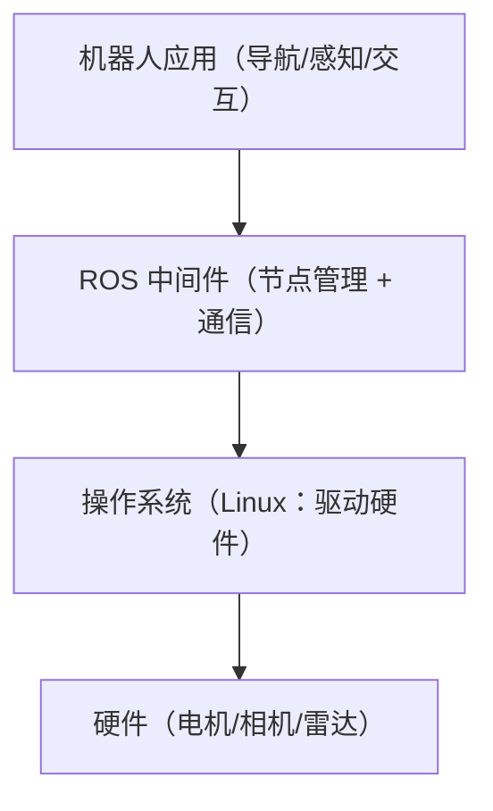

# 周 1 笔记：《ROS 2 概念 + 感知/规划/控制》（D3）

> 费曼法：能用自己的话讲给外行听 = 懂。
> 本文是"工程师人话版"：先人话，术语标括号里。Web 工程师用 Web 类比记忆。
> 状态：定稿（2026-08-03 用户复核通过）。

## 1. ROS 2 一句话

机器人领域的**程序通信框架**（不是操作系统）：一堆各干一摊活的独立程序（节点）互相传数据。传数据就三种方式：话题、服务、动作。

## 2. 节点（Node）= 微服务

一个独立进程、只干一件事的程序。一台机器人 = 几十个节点协同（雷达节点、规划节点、轮子节点……）。

## 3. 话题（Topic）= 消息队列 / 发布订阅

- 发布者往频道放数据，订阅者从频道取数据，**两边互不认识、异步**
- 适合：持续产生的**实时数据流**（雷达扫描、摄像头画面、机器人状态）
- 类比：Kafka topic / Redis pub-sub
- 机器人例子：雷达每秒放 10 帧扫描数据进频道，规划程序订阅取走

## 4. 服务（Service）= 接口调用 / RPC

- 客户端发请求 → 服务端处理 → 返回结果，**同步等答案**
- 适合：一次性查询 / 触发（查电量、拍照）
- 类比：HTTP 请求 / RPC（底层是 DDS 不是 HTTP，但调用语义一样）

**一句话区分：话题 = 广播电台（持续放，谁爱听谁听）；服务 = 打电话（一问一答，等答案）。**

## 5. 动作（Action）= 带进度回调的长任务（一句话记住）

跑几秒到几分钟、中途报进度、能取消（如"导航去充电桩"）。类比：带进度条、能取消的长任务 API。

## 6. 消息（Message）= 强类型 API Schema

传的数据必须符合定义好的格式（激光扫描有激光的格式、图像有图像的格式）。类比：接口的 DTO / 类型定义。

## 7. 感知 / 规划 / 控制（机器人三层）

| 层 | 是什么 | 输出 | Web 类比 |
| --- | --- | --- | --- |
| 感知 | 眼睛+皮肤：摄像头/雷达/IMU 把物理世界变数据 | **数据**（图像、点云、姿态） | 采集端/数据源 |
| 规划 | 大脑：根据数据做决定（任务规划→轨迹规划） | **决策/路径**（去哪、走哪条路） | 业务逻辑层 |
| 控制 | 手脚：把决策变电机指令 | **指令**（转多少、加多少伏） | 执行层/调硬件 |

- **闭环** = 执行 → 传感器反馈（偏了）→ 修正 → 再执行。类比：调接口收到错误响应后修正重试。
- 例子一条线：机器人端水给你 = 感知算出杯子坐标 → 规划决定伸手路径 → 控制让关节电机转到对应角度。

## 8. 平台视角（我的位置）

感知/规划/控制是机器人的本体。**我的平台工作在它们之上的数据/训练/可视化层**：采集传感器数据、清洗标注、训练模型、可视化。不需要会写 ROS 节点，但要能处理它们产生的数据、听懂它们说话。

## 9. 自测（工程师版，秒过即可）

- 雷达每秒 10 帧广播给所有需要的人 → 话题（消息队列）
- 查机器人电量等结果 → 服务（RPC）
- 导航去充电桩，跑 2 分钟、要进度、能叫停 → 动作（长任务）
- 任务中心把任务状态广播给多个 worker → 话题（一对多异步广播）

---

## 深入篇：4 个追问（2026-08-06 补充，关于底层机制）

### Q1：一个机器人跑几十个节点是什么意思？

节点 = 独立运行的进程（程序实例），就像电脑同时跑 Chrome、VS Code、终端。机器人同理：相机驱动、SLAM、路径规划、机械臂控制、状态监控各一个进程……各自独立运行、一个崩了不影响其他，靠 ROS 总线协作。

```mermaid
flowchart LR
    subgraph 一个机器人 = 几十个节点（进程）
        A["相机驱动节点<br/>发布图像话题"] --> B["SLAM 节点<br/>订阅图像+IMU"]
        C["底盘控制节点"] --> D["导航节点<br/>订阅地图/位姿"]
        E["机械臂控制节点"] --> F["状态监控节点"]
        G["安全监控节点"]
    end
    B --> H["…共几十个节点"]
```

### Q2：ROS 在操作系统上运行吗？

是。ROS 不是操作系统本身，是跑在 OS（主要是 Ubuntu Linux）之上的**中间件**层。



（ROS 1 只支持 Linux；ROS 2 跨平台，但实际部署 99% 还是 Linux。）

### Q3：发布-订阅是不是有一个中间节点转发？

有中间层（DDS），但**不是"中心节点转发"**——这是 ROS 1 vs ROS 2 的最大区别：

```mermaid
flowchart LR
    subgraph ROS 2 通信（去中心化，DDS）
        P["发布者<br/>（相机节点）"]
        D["DDS 发现协议<br/>互相发现：我发XX / 我收XX"]
        S["订阅者<br/>（SLAM 节点）"]
    end
    P <-->|"① 发现后 ② 点对点直连（不经转发）"| S
    P --- D
    S --- D
```

- **ROS 1**：有中心节点（master），双方先找 master 互相认识，之后直连。
- **ROS 2**：去中心化，底层 DDS 标准——双方通过发现协议互相广播（"我发图像话题"/"我收图像话题"），对上后**点对点直连**。
- **client library**（rclcpp/rclpy）是给开发者的 API 层，内部调 DDS。

### Q4：消息格式是业界统一标准吗？

分两层：**ROS 生态内统一，行业不统一**。

- **ROS 内**：统一。`.msg` 定义 + 标准序列化，传感器厂商发标准消息，下游不用改。
- **ROS 1 vs ROS 2**：不完全兼容（要桥接）。
- **行业**：不统一。各家中间件（LCM、自研方案）各说各话，数据集格式五花八门——就是 D2 讲的"数据孤岛"（国家在推统一标准，预计 2027 发布）。
- **数据集层面**：Open X-Embodiment 推 **RLDS** 作为统一格式（第 2 周 D3-D5 学）。

> 结论：ROS 内统一 = 工程师的便利；行业不统一 = 数据平台的机会（兼容多格式就是卖点）。

### 面试一句话

> "机器人软件是一张 ROS 节点网，数据从传感器节点流经感知、规划、控制节点，rosbag 记录的就是这些话题流——我的平台在这层数据之上做采集、清洗、训练、回传闭环。"
