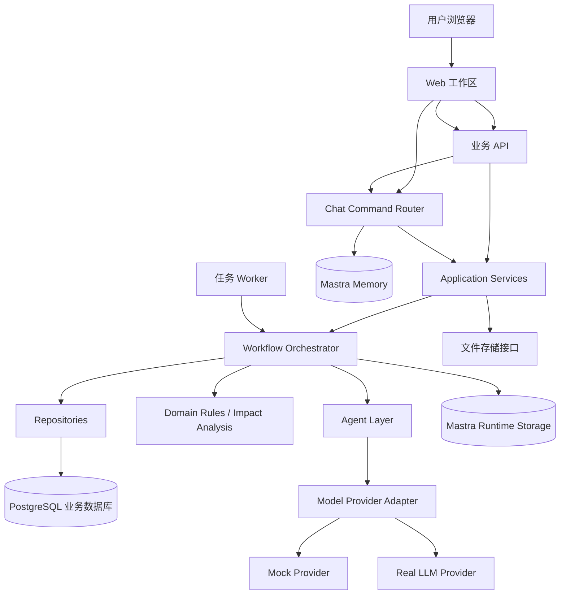
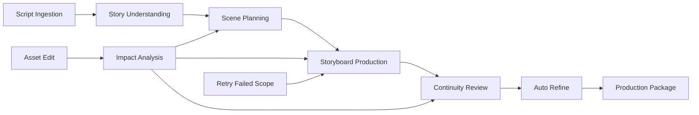

# 整体架构设计方案

> 状态：产品方向已确认，技术架构方案待评审
>
> 本文档描述目标产品架构，不代表现有 Spike 已经满足全部架构要求。

## 1. 架构目标

系统需要支持：

- 一集剧本到分镜生产包的自动连续流程；
- 页面实时查看任务进度；
- 单个场次或镜头失败隔离；
- 故事资产修改后的影响分析和局部重生成；
- 版本和问题可追踪；
- 服务器部署；
- Mock / Real 模型切换；
- 未来增加真实图像/视频生成而不重做业务层。

## 2. 总体架构



## 3. 分层职责

### 3.1 Web 工作区

负责：

- 导入剧本；
- 显示生成进度；
- 显示故事资产、场次和分镜卡片；
- 编辑资产；
- 展示问题和版本；
- 触发重试、导出和聊天。

不负责：

- 判断业务状态；
- 计算影响范围；
- 直接写数据库；
- 直接调用模型。

### 3.2 API 层

负责：

- HTTP 接口；
- 请求校验；
- 创建任务；
- 查询任务和资产；
- 返回统一错误格式；
- 提供下载和文件访问。

API 不应该在请求生命周期内同步执行完整生产流程。

### 3.3 Application Service

负责把用户操作转换为明确业务用例：

- `createIngestionTask`；
- `startProductionTask`；
- `editStoryAsset`；
- `editShot`；
- `retryFailedScope`；
- `exportProductionPackage`；
- `askChatAssistant`。

### 3.4 Workflow 层

负责：

- 自动连续执行各阶段；
- 任务状态；
- 进度；
- 重试；
- 并发控制；
- 单项失败隔离；
- 局部重跑；
- 调用 Agent 和领域规则；
- 写入审查与版本记录。

用户不需要直接操作 Workflow。

### 3.5 Agent 层

Agent 只负责需要模型判断的内容：

- Script Analyst；
- Scene Planner；
- Storyboard Director；
- Continuity Reviewer；
- Prompt Refiner；
- Chat Assistant。

Agent 输出必须经过结构化 Schema 校验，Agent 不能直接写数据库。

### 3.6 Domain Rules

确定性规则负责：

- 输入格式解析；
- 数据 Schema 校验；
- 问题等级分类；
- 影响范围计算；
- 资产状态推进；
- 版本 Diff；
- 导出前检查。

### 3.7 Repository

Repository 负责业务数据读写，不负责模型推理。

业务事实：

```text
Project
Episode
ScriptVersion
StoryBible
Character
Location
Prop
Relationship
TimelineEvent
Scene
Shot
PromptVersion
Review
Feedback
ExportPackage
ChangeProposal
DomainTask
```

## 4. 业务数据、Runtime 和聊天记忆分离

```text
PostgreSQL 业务库
  └── 结构化业务事实、版本、问题、导出、任务

Mastra Runtime Storage
  └── Workflow snapshot、运行状态、执行上下文

Mastra Memory
  └── 聊天 thread、message、辅助上下文
```

聊天记录不能替代角色、场景、镜头等业务事实。

## 5. 目标生产流程架构



默认自动连续执行，不在 StoryBible 或 Scene 设置强制确认节点。

## 6. 资产依赖关系

```text
ScriptVersion
  ↓
StoryBible
  ├── Character
  ├── Location
  ├── Prop
  ├── Relationship
  └── TimelineEvent
       ↓
     Scene
       ↓
      Shot
       ├── PromptVersion(image)
       ├── PromptVersion(video)
       └── Review
```

编辑影响规则示例：

```text
Character 外观变化
  → 受影响 Scene
  → 受影响 Shot
  → Image Prompt / Video Prompt
  → Review 重新执行
```

## 7. 任务执行设计

目标部署采用 API 与 Worker 分离：

```text
浏览器 → API：创建任务，立即返回 taskId
Worker → 领取 queued 任务
Worker → 执行 Workflow
Worker → 更新 DomainTask 和资产
浏览器 → API：轮询或订阅任务状态
```

第一版可采用 PostgreSQL 任务表作为轻量队列：

- 使用任务状态和租约字段；
- Worker 通过行锁领取任务；
- 超时任务可以重新入队；
- 任务结果和进度写入 PostgreSQL。

后续任务规模扩大时，可以替换为 Redis/BullMQ，不改变 Application Service 和 Workflow 接口。

## 8. 模型适配层

```text
ModelProvider
├── MockProvider
├── OpenAIProvider
├── ZhipuProvider
└── FutureImage/VideoProvider
```

模型适配层负责：

- 模型名称；
- 请求和响应格式；
- Token 统计；
- 延迟；
- 重试和错误分类；
- 结构化输出。

业务层不直接依赖某个模型厂商。

## 9. 文件存储

抽象接口：

```ts
interface AssetStorage {
  put(key: string, content: Buffer | string): Promise<string>;
  get(key: string): Promise<Buffer>;
  delete(key: string): Promise<void>;
}
```

第一版默认：

```text
服务器本地磁盘 /data/exports
```

后续可替换为：

- S3；
- MinIO；
- OSS；
- COS。

## 10. API 设计原则

- 写操作返回资源或任务 ID；
- 长任务返回 `202 Accepted`；
- 查询接口可以在页面刷新后恢复；
- 编辑操作返回新版本；
- 重试操作只接收明确 scope；
- 业务错误使用可理解的中文 message 和机器可读 code；
- API 不暴露必须由用户理解的内部 Workflow step。

## 11. 可观测性

至少记录：

- taskId；
- projectId / episodeId；
- assetId；
- workflow 类型；
- agent 类型；
- model / mode；
- 开始时间；
- 结束时间；
- 输入输出 token；
- 错误；
- 重试次数；
- 受影响范围。

## 12. 安全边界

第一版不实现用户体系，但服务器部署仍需：

- 不把模型 API Key 写入前端；
- API Key 只存在服务器环境变量；
- 文件目录不能任意路径读写；
- 上传文件限制扩展名、大小和编码；
- 生产环境建议通过反向代理设置访问保护；
- 后续认证层应位于 Web/API 入口，不侵入领域层。

## 13. 与现有 Spike 的关系

可复用候选：

- Markdown Parser；
- Zod 领域 Schema；
- Agent 结构化输出；
- 部分 Workflow 步骤；
- Prisma Repository；
- PromptVersion 和 Review 数据结构。

需要重构：

- 强制 StoryBible/Scene 确认门槛；
- 测试面板式前端；
- 进程内 `void start...` 任务执行；
- 内存 Job Map；
- 资产编辑和影响分析；
- 服务器版 Worker；
- 页面信息架构。
