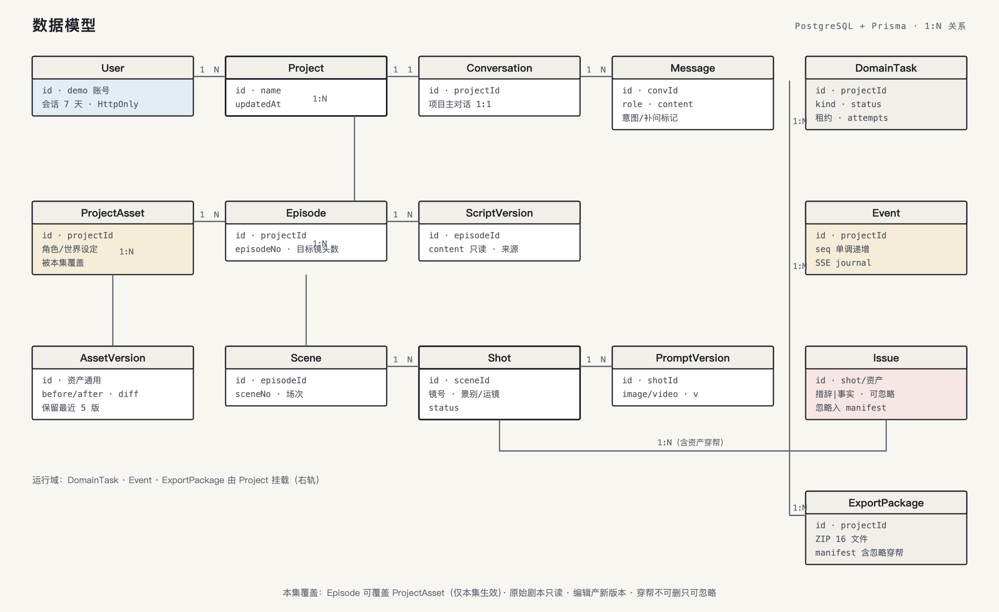
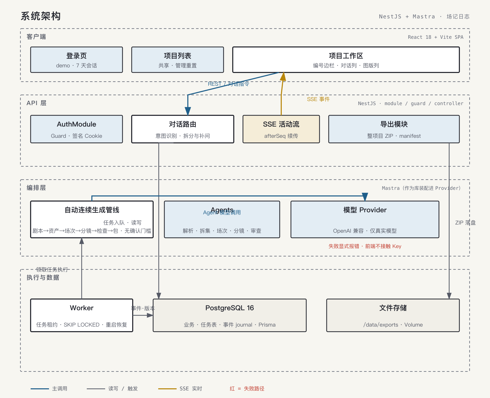

# 短剧分镜制作助手：技术架构

> 状态：已确认（2026-08-30 问答定案）
> 配套基线：`product-design.md`（产品）+ `DESIGN.md`（视觉）

## 1. 技术栈（已确认）

| 层 | 选型 | 决策依据 |
|---|---|---|
| 后端运行时 | Node 22 + TypeScript + NestJS | API、Worker 和真实模型 Agent 编排 |
| API 框架 | NestJS | 用户熟悉栈（agent-base 同款）；模块/Guard/DI 结构强制力；SSE 用 @nestjs/common Sse |
| 前端 | React 18 + Vite（SPA） | 生态成熟；视觉稿转组件直接 |
| 服务端状态 | TanStack Query + 少量 Zustand | SSE/缓存/表单编辑均有现成模式 |
| 数据库 | PostgreSQL 16 | 任务租约（SKIP LOCKED）、事件 journal、双进程并发写 |
| ORM | Prisma（Spike schema 迁移扩展） | 迁移零成本复用 |
| 实时通道 | SSE + 事件表 journal + `afterSeq` 续传 | 单向推送足够；刷新先快照再续订 |
| 模型接入 | OpenAI 兼容接口（`MODEL_BASE_URL`/`MODEL_API_KEY`/`MODEL_NAME`） | 真实模型 only；失败显式报错并支持重试 |
| 仓库结构 | pnpm monorepo（原地改造本目录） | apps/web + apps/server + packages/shared |

## 2. Monorepo 结构（原地改造）

```text
mastra-short-drama-agent/
├── apps/
│   ├── server/            # 现 src/ + prisma/ 迁入（NestJS）
│   │   ├── src/
│   │   │   ├── auth/      # module + guard（demo 登录、cookie 会话）
│   │   │   ├── projects/  # module + controller + service（项目/剧集/对话）
│   │   │   ├── events/    # SSE module（journal 读取 + afterSeq 续传）
│   │   │   ├── exports/   # 整项目 ZIP module
│   │   │   ├── llm/       # 真实模型 Agent 与结构化 Provider
│   │   │   ├── pipeline/  # 自动连续生成管线（去确认门槛）
│   │   │   ├── infrastructure/ # Redis 与运行时依赖
│   │   │   ├── worker.ts  # Worker 入口（Nest 独立应用，无 HTTP）
│   │   │   ├── domain/    # 影响分析 / 版本 / 导出 / 会话服务
│   │   │   └── config.ts  # local/test/production 配置加载与校验
│   │   └── prisma/        # schema + migrations（从 Spike 迁移）
│   └── web/               # React + Vite
│       └── src/
│           ├── pages/     # 登录 / 项目列表 / 项目工作区
│           └── features/  # 对话流 / 编号边栏 / 图版区 / 输入框
├── packages/
│   └── shared/            # Zod schema + TS 类型 + SSE 事件契约（前后端共用）
├── pnpm-workspace.yaml
├── CONTEXT.md
├── PRODUCT.md / DESIGN.md
└── docs/
```

迁移纪律：一次性 `git mv` 重组，`src/ → apps/server/src/` 保持文件历史；重组提交与功能提交分开。

## 3. 数据模型（PG + Prisma，概要）



在 Spike 模型基础上扩展：

```text
User（demo 账号） + Session（7 天，HttpOnly 签名 cookie）
Project ── Episode ── ScriptVersion（原文只读）
   │
   ├── ProjectAsset（项目级角色/世界设定，可被各集覆盖）
   └── EpisodeAsset / Scene / Shot / PromptVersion
Review / Issue（措辞|事实两类，可忽略→入 manifest）
AssetVersion（每资产保留最近 5 版，before/after/diff）
Conversation / Message（项目主对话）
DomainTask（kind/status/progress/leaseOwner/leaseUntil/attempts）
Event（journal：projectId 内 seq 单调递增，SSE 读此表）
ExportPackage（ZIP 落盘 /data/exports）
```

关键约束：原始剧本只读；编辑产生新版本不覆盖；问题不可删除只可忽略；事件先落库再推送。

## 4. API 设计（REST + SSE）

```text
POST /api/auth/login          demo 账号，7 天 cookie（AuthGuard 保护其余路由）
GET  /api/projects            共享列表（最近更新倒序）
POST /api/projects            新建（进入空对话）
GET  /api/projects/:id/snapshot   刷新恢复：消息+工件当前态+任务态
POST /api/projects/:id/messages   对话统一入口（意图路由：导入/补问/修改/重试/导出）
GET  /api/projects/:id/events?sse  活动流（Last-Event-ID / afterSeq 续传）
POST /api/tasks/:id/cancel    取消（保留已完成）
POST /api/episodes/:id/retry  失败单项重试（明确 scope）
POST /api/exports/:projectId  整项目 ZIP
POST /api/admin/reset         管理口令 → 清空 Demo 数据
```

## 5. 任务执行（API + Worker 分离）

- 任务写 `DomainTask`，Worker 以 `SELECT ... FOR UPDATE SKIP LOCKED` 领取并设置租约；
- 同一项目一次只跑一个任务（项目级互斥，产品已确认）；
- 生成管线：剧本解析 → 故事资产 → 场次 → 分镜 → Prompt → 连续性检查 → 生产包，无确认门槛；
- 每阶段完成即写事件（stage_completed / artifact_created …），SSE 实时推；
- 取消 = 停止后续阶段，已完成资产保留，可"继续制作"（从第一个未完成阶段续跑）；
- 服务器重启后 lease 过期任务可重新入队，不丢已完成结果。

## 6. 模型层（真实模型 only）

```text
RealProvider（OpenAI 兼容：chat + 结构化 JSON 输出 + Zod 校验 + 有限重试）
```

- 开发环境即配置真实 Key，输出质量从第一天验证；
- 未配置 Key、网络失败、HTTP 错误或 Zod 校验失败 → 任务显式失败，记录结构化错误并支持重试；
- 前端永不接触 API Key。

## 7. 前端架构

- 路由：`/login` `/projects` `/projects/:id`（工作区）；
- 工作区 = 编号边栏（阶段账+场次索引）+ 对话列 + 图版列，按 `DESIGN.md` 令牌实现；
- SSE 客户端：EventSource + afterSeq 重连；服务端状态 TanStack Query 缓存，SSE 事件到达时失效对应 query；
- 修改链路：打字 → 影响分析卡（划掉→替换 diff）→ 确认 → 后台重生成 → 图版原位更新（v+1）。

## 8. 部署

```text
docker-compose.yml
├── postgres:16（volume 持久化）
├── api（服务 web-dist 静态产物 + API + SSE）
└── worker（独立进程，同一镜像不同入口）
```

- 首次部署自动跑 `prisma migrate deploy`；
- 导出目录 `/data/exports` 挂 volume；
- 环境变量：`DATABASE_URL` / `REDIS_URL` / `MODEL_*` / `ADMIN_TOKEN` / `SESSION_SECRET` / `EXPORT_ROOT`。

## 9. 配图



完整图表索引见 [assets/README.md](assets/README.md)。

## 10. 明确不做

WebSocket、BullMQ、微服务拆分、K8s、CDN、多区域、真实图像/视频生成接入。Redis 仅作为本地运行时依赖和事件通知，不承担任务队列。
