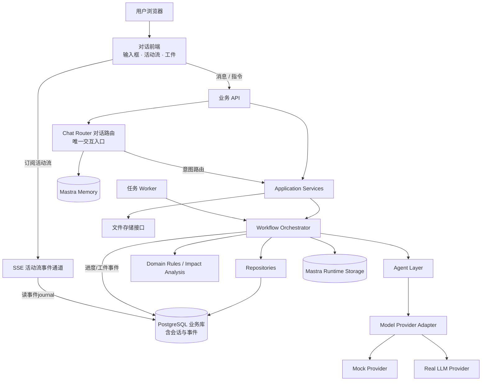
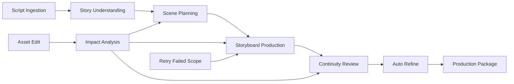

# 整体架构设计方案

> 状态：产品方向已确认，技术架构方案待评审
>
> 本文档描述目标产品架构，不代表现有 Spike 已经满足全部架构要求。
>
> 2026-08-30：按产品形态决策（`product-form.md`，对话即产品）更新——对话路由升为唯一交互入口，新增会话与事件协议设计。

## 1. 架构目标

系统需要支持：

- 一集剧本到分镜生产包的自动连续流程；
- **对话即产品**：第一屏输入框、活动流实时滚动、工件内联呈现（见 `product-form.md`）；
- 会话 = 项目 × 集：历史栏即项目列表，刷新/换设备恢复同一会话；
- 打字修改：自然语言 → 意图路由 → 影响分析 → 局部重生成 → 新版本工件；
- 单个场次或镜头失败隔离；
- 故事资产修改后的影响分析和局部重生成；
- 版本和问题可追踪；
- 服务器部署；
- Mock / Real 模型切换；
- 未来增加真实图像/视频生成而不重做业务层。

## 2. 总体架构



与旧版关键差异：**Chat Router 从"右侧辅助助手"升为唯一交互入口**（打字与点选操作都经过它路由）；新增 **SSE 活动流事件通道**，从事件 journal 读取并向对话前端推送；会话与事件成为持久化业务数据。

## 3. 分层职责

### 3.1 对话前端

负责：

- 会话历史栏（项目 × 集 = 会话，状态实时同步）；
- 第一屏输入框：粘贴剧本、上传 `.md`/`.txt`；
- 订阅并渲染活动流（阶段、进度、耗时，可折叠）；
- 渲染工件：资产组、场次/分镜组、问题汇总、制作摘要、生产包；
- 输入框发送打字指令与 `/` 快捷指令；点卡片编辑作为兜底入口。

不负责：

- 判断业务状态；
- 计算影响范围；
- 直接写数据库；
- 直接调用模型；
- 在前端保存业务事实（工件状态以服务端为准）。

### 3.2 API 层

负责：

- HTTP 接口；
- 请求校验；
- 创建任务；
- 查询任务和资产；
- 返回统一错误格式；
- 提供下载和文件访问。

API 不应该在请求生命周期内同步执行完整生产流程。

### 3.3 Chat Router（唯一交互入口）与 Application Service

Chat Router 负责把用户的每一条输入路由为业务用例：

- 意图识别：导入 / 修改资产 / 修改镜头与 Prompt / 查询 / 重试 / 忽略问题 / 导出；
- 参数补齐：缺失的项目名称、集数、镜号等就地追问；
- 快捷指令：`/导出`、`/只看第 N 场`、`/重试镜 N`；
- 无法确定时询问用户，不猜测副作用操作。

Application Service 负责把路由结果转换为明确业务用例：

- `createIngestionTask`；
- `startProductionTask`；
- `editStoryAsset`；
- `editShot`；
- `retryFailedScope`；
- `ignoreIssue`；
- `exportProductionPackage`；
- `queryAssets` / `queryIssues` / `queryVersions`。

约束：Chat Router 只做意图路由，不直接执行业务、不直接写数据库；所有副作用走 Application Service，与点卡片操作共用同一条管道。

### 3.4 Workflow 层

负责：

- 自动连续执行各阶段；
- 任务状态；
- 进度；
- 重试；
- 并发控制；
- 单项失败隔离；
- 局部重跑；
- 调用 Agent 和领域规则；
- 写入审查与版本记录。

用户不需要直接操作 Workflow。

### 3.5 Agent 层

Agent 只负责需要模型判断的内容：

- Script Analyst；
- Scene Planner；
- Storyboard Director；
- Continuity Reviewer；
- Prompt Refiner；
- Chat Assistant。

Agent 输出必须经过结构化 Schema 校验，Agent 不能直接写数据库。

### 3.6 Domain Rules

确定性规则负责：

- 输入格式解析；
- 数据 Schema 校验；
- 问题等级分类；
- 影响范围计算；
- 资产状态推进；
- 版本 Diff；
- 导出前检查。

### 3.7 Repository

Repository 负责业务数据读写，不负责模型推理。

业务事实：

```text
Project
Episode
ScriptVersion
StoryBible
Character
Location
Prop
Relationship
TimelineEvent
Scene
Shot
PromptVersion
Review
Feedback
ExportPackage
ChangeProposal
DomainTask
```

## 4. 业务数据、Runtime 和聊天记忆分离

```text
PostgreSQL 业务库
  └── 结构化业务事实、版本、问题、导出、任务

Mastra Runtime Storage
  └── Workflow snapshot、运行状态、执行上下文

Mastra Memory
  └── 聊天 thread、message、辅助上下文
```

聊天记录不能替代角色、场景、镜头等业务事实。

### 4.1 会话与事件协议（对话形态新增）

**会话模型**：

```text
Conversation（会话）= Project × Episode
  ├── Message：用户消息（剧本折叠）、agent 回复
  ├── Run：一次生成/修改任务的引用（DomainTask）
  └── Artifact：资产组 / 场次组 / 分镜组 / 问题汇总 / 制作摘要 / 生产包
```

- 会话持久化在业务库；历史栏数据 = 会话列表查询；
- 每个工件有稳定 `activityId`，重试/重生成后**原位更新**并携带新版本号，不在对话里重复堆叠。

**活动流事件 envelope**：

```ts
type StreamEvent = {
  schemaVersion: 1;
  eventId: string;
  seq: number;              // 会话内单调递增
  conversationId: string;
  type:
    | 'run_started' | 'stage_started' | 'stage_progress' | 'stage_completed'
    | 'message' | 'artifact_created' | 'artifact_updated'
    | 'issue_reported' | 'done' | 'error';
  occurredAt: string;
  payload: unknown;         // 按 type 定义，工件事件必须带 activityId
};
```

不变量（沿用 drama-agent 活动流研究成果）：

1. `seq` 会话内单调递增，前端按 `seq` 去重与排序；
2. 一个 Run 只有一个终态（`done`/`error`），终态后拒绝新的业务事件；
3. 事件先写 journal 再推送，慢消费者不阻塞生产；
4. 客户端断线默认**不等于**取消任务。

**断线恢复**：

- SSE 携带 `Last-Event-ID`（或 `?afterSeq=`）从 journal 重放；
- journal 过期或首次进入历史会话时返回会话快照（消息 + 工件当前态 + 终态），不重新执行任何 Workflow。

## 5. 目标生产流程架构



默认自动连续执行，不在 StoryBible 或 Scene 设置强制确认节点。

## 6. 资产依赖关系

```text
ScriptVersion
  ↓
StoryBible
  ├── Character
  ├── Location
  ├── Prop
  ├── Relationship
  └── TimelineEvent
       ↓
     Scene
       ↓
      Shot
       ├── PromptVersion(image)
       ├── PromptVersion(video)
       └── Review
```

编辑影响规则示例：

```text
Character 外观变化
  → 受影响 Scene
  → 受影响 Shot
  → Image Prompt / Video Prompt
  → Review 重新执行
```

## 7. 任务执行设计

目标部署采用 API 与 Worker 分离：

```text
浏览器 → API：创建任务，立即返回 taskId
Worker → 领取 queued 任务
Worker → 执行 Workflow
Worker → 更新 DomainTask 和资产
Worker → 进度/工件事件写入 journal
浏览器 → SSE：订阅会话活动流（Last-Event-ID 断线续传）
```

第一版可采用 PostgreSQL 任务表作为轻量队列：

- 使用任务状态和租约字段；
- Worker 通过行锁领取任务；
- 超时任务可以重新入队；
- 任务结果和进度写入 PostgreSQL。

后续任务规模扩大时，可以替换为 Redis/BullMQ，不改变 Application Service 和 Workflow 接口。

## 8. 模型适配层

```text
ModelProvider
├── MockProvider
├── OpenAIProvider
├── ZhipuProvider
└── FutureImage/VideoProvider
```

模型适配层负责：

- 模型名称；
- 请求和响应格式；
- Token 统计；
- 延迟；
- 重试和错误分类；
- 结构化输出。

业务层不直接依赖某个模型厂商。

## 9. 文件存储

抽象接口：

```ts
interface AssetStorage {
  put(key: string, content: Buffer | string): Promise<string>;
  get(key: string): Promise<Buffer>;
  delete(key: string): Promise<void>;
}
```

第一版默认：

```text
服务器本地磁盘 /data/exports
```

后续可替换为：

- S3；
- MinIO；
- OSS；
- COS。

## 10. API 设计原则

- 会话是一级资源：
  - `GET /conversations`：历史栏列表；
  - `POST /conversations/:id/messages`：打字统一入口（Chat Router 路由）；
  - `GET /conversations/:id/events`：SSE 活动流（支持 `afterSeq` 重放）；
  - `GET /conversations/:id/snapshot`：恢复快照；
- 写操作返回资源或任务 ID；
- 长任务返回 `202 Accepted`；
- 查询接口可以在刷新后恢复；
- 编辑操作返回新版本；
- 重试操作只接收明确 scope；
- 业务错误使用可理解的中文 message 和机器可读 code；
- API 不暴露必须由用户理解的内部 Workflow step。

## 11. 可观测性

至少记录：

- taskId；
- projectId / episodeId；
- assetId；
- workflow 类型；
- agent 类型；
- model / mode；
- 开始时间；
- 结束时间；
- 输入输出 token；
- 错误；
- 重试次数；
- 受影响范围。

## 12. 安全边界

第一版不实现用户体系，但服务器部署仍需：

- 不把模型 API Key 写入前端；
- API Key 只存在服务器环境变量；
- 文件目录不能任意路径读写；
- 上传文件限制扩展名、大小和编码；
- 生产环境建议通过反向代理设置访问保护；
- 后续认证层应位于 Web/API 入口，不侵入领域层。

## 13. 与现有 Spike 的关系

可复用候选：

- Markdown Parser；
- Zod 领域 Schema；
- Agent 结构化输出；
- 部分 Workflow 步骤；
- Prisma Repository；
- PromptVersion 和 Review 数据结构。

需要重构：

- 强制 StoryBible/Scene 确认门槛；
- 测试面板式前端（→ 对话前端：输入框 + 活动流 + 工件）；
- 进程内 `void start...` 任务执行；
- 内存 Job Map（→ 持久化任务表 + 事件 journal）；
- 资产编辑和影响分析；
- 服务器版 Worker；
- 无会话模型的临时交互（→ 会话、消息、工件持久化 + SSE）。

## 14. 配套图表

由 fireworks-tech-graph 生成，源文件与导出图位于 `docs/diagrams/`（索引见其 README）：

- `architecture-conversation`：本文 §2 总体架构的可视化（六层 + 主流程/异步分色）；
- `sequence-chat-edit`：打字修改全链路时序（意图路由 → 影响分析 → G2A 重生成 → 事件推送 → 工件更新）；
- `flow-production`：生产流水线与三条回路（修改 / 失败 / 不中断旁路）。
