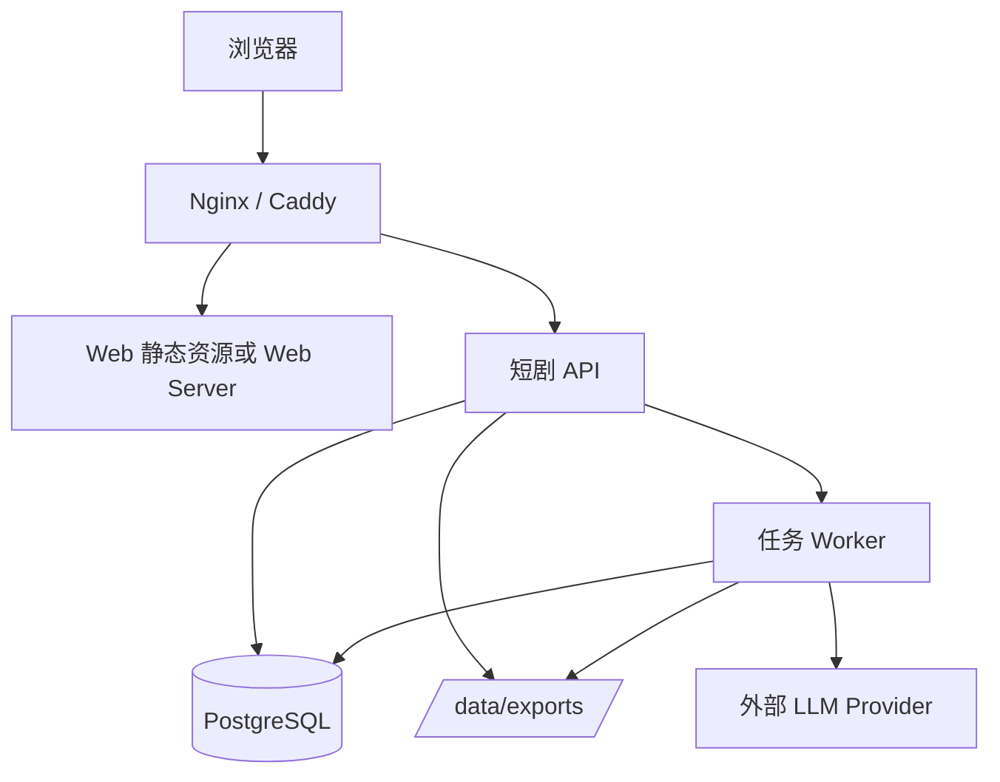

# 服务器部署方案

> 状态：部署目标已确认，部署方案待评审
>
> 第一版部署到服务器，但暂不做用户体系。访问控制、认证和多租户属于后续能力。

## 1. 部署目标

```text
服务器地址
  → Web 工作区
  → API
  → Worker
  → PostgreSQL
  → Runtime Storage
  → 服务器文件存储
```

用户通过浏览器访问，不需要在本地安装 Node、pnpm 或数据库。

## 2. 推荐部署拓扑



第一版可以将 Web 和 API 放在同一个应用容器中，但 Worker 必须可以独立运行，避免长任务占用 HTTP 进程。

## 3. Docker Compose 服务

建议服务：

```text
short-drama-web-api
short-drama-worker
short-drama-postgres
reverse-proxy（可选）
```

### API 容器

负责：

- 提供网页；
- 提供业务 API；
- 创建任务；
- 查询任务和资产；
- 生成下载链接。

### Worker 容器

负责：

- 领取 queued 任务；
- 执行 Story Understanding；
- 执行 Scene Planning；
- 执行 Storyboard Production；
- 执行 Continuity Review；
- 执行局部重生成；
- 更新任务进度和结果。

### PostgreSQL 容器

负责：

- 业务事实；
- 版本记录；
- Review/Issue；
- ExportPackage；
- DomainTask；
- Mastra Runtime Storage。

## 4. 环境变量

```env
NODE_ENV=production
PORT=4120

DATABASE_URL=postgresql://...
STORAGE_MODE=postgres

LLM_MODE=mock
LLM_MODEL=...
OPENAI_API_KEY=...
ZHIPU_API_KEY=...

EXPORT_ROOT=/data/exports
MAX_ROUNDS=3
CONCURRENCY=3
```

注意：

- 模型 API Key 只能存在服务器环境变量；
- 不允许写入前端代码；
- `LLM_MODE=mock` 可以用于部署验收；
- `LLM_MODE=real` 只有在配置有效 Provider Key 后启用。

## 5. 首次部署步骤

```bash
# 1. 获取项目
cd mastra-short-drama-agent

# 2. 配置环境变量
cp .env.example .env
# 修改 DATABASE_URL、EXPORT_ROOT 和模型配置

# 3. 启动数据库
 docker compose up -d postgres

# 4. 执行迁移
pnpm run db:deploy

# 5. 启动 API 和 Worker
 docker compose up -d web-api worker

# 6. 打开浏览器
http://服务器地址/
```

最终部署镜像中应在启动前执行迁移检查，禁止让应用以未迁移状态直接运行。

## 6. 任务可靠性

任务必须写入 `DomainTask`，不能只存在进程内 Map。

推荐字段：

```text
taskId
kind
status
progress
inputRef
outputRef
leaseOwner
leaseUntil
attempts
lastError
createdAt
startedAt
finishedAt
```

Worker 领取流程：

```text
查找 queued 或 lease 过期任务
  → 使用数据库行锁领取
  → 设置 leaseOwner / leaseUntil
  → 执行任务
  → 定期更新 progress
  → 成功完成或记录失败
```

服务器重启时：

- 已完成任务保持完成；
- 未完成且 lease 过期的任务可以重新领取；
- 已生成的资产不能被无条件清空；
- 重试必须保留旧版本。

## 7. 文件存储

第一版默认：

```text
服务器本地目录：/data/exports
```

Docker 使用持久化 Volume：

```yaml
volumes:
  - exports:/data/exports
```

导出文件命名建议：

```text
/data/exports/{projectId}/{episodeId}/{exportPackageId}/
```

后续可以替换为 S3/MinIO，不改变导出业务接口。

## 8. 数据备份

服务器部署至少需要：

- PostgreSQL 每日备份；
- `/data/exports` 定期备份；
- `.env` 或密钥单独安全保存；
- 迁移文件纳入版本控制；
- 不把数据库 Volume 当作唯一备份。

## 9. 反向代理

虽然第一版不做用户体系，仍建议使用 HTTPS 和反向代理：

```text
https://drama.example.com
  → reverse proxy
  → web-api:4120
```

基础配置应包括：

- HTTPS；
- 请求体大小限制；
- 上传超时；
- 长连接或轮询接口代理；
- 静态文件缓存；
- 基础访问保护可选。

## 10. 监控和日志

至少监控：

- API 可用性；
- Worker 是否存活；
- PostgreSQL 连接；
- queued 任务数量；
- 任务平均耗时；
- 失败任务数量；
- 模型调用错误；
- 磁盘空间；
- 导出目录空间。

日志必须包含：

```text
timestamp
level
requestId
taskId
projectId
episodeId
kind
error
```

## 11. 部署验收

### 基础启动

- [ ] Docker Compose 可以启动；
- [ ] API 健康检查通过；
- [ ] Worker 健康检查通过；
- [ ] PostgreSQL 迁移成功；
- [ ] 首页可以访问。

### 业务链路

- [ ] 上传或粘贴剧本；
- [ ] 任务返回 ID；
- [ ] Worker 自动执行；
- [ ] 页面显示进度；
- [ ] 生成故事资产、场次、分镜；
- [ ] 单项失败可重试；
- [ ] 编辑资产后可局部重生成；
- [ ] 导出文件可下载。

### 恢复能力

- [ ] API 重启后可以查询任务；
- [ ] Worker 重启后未完成任务可以恢复；
- [ ] PostgreSQL 重启后业务数据不丢失；
- [ ] 已有版本不会被重试覆盖；
- [ ] 导出文件在容器重启后仍存在。

## 12. 第一版部署边界

暂不包含：

- 登录和注册；
- 用户数据隔离；
- 团队邀请；
- 细粒度权限；
- 多租户；
- 云对象存储强依赖；
- Kubernetes；
- 自动弹性扩容。

但架构中保留以下扩展点：

```text
Authentication Middleware
AssetStorage Adapter
Queue Adapter
ModelProvider Adapter
```
