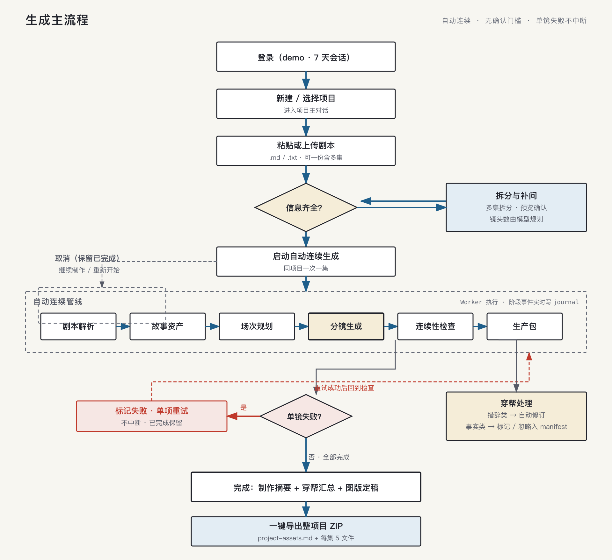
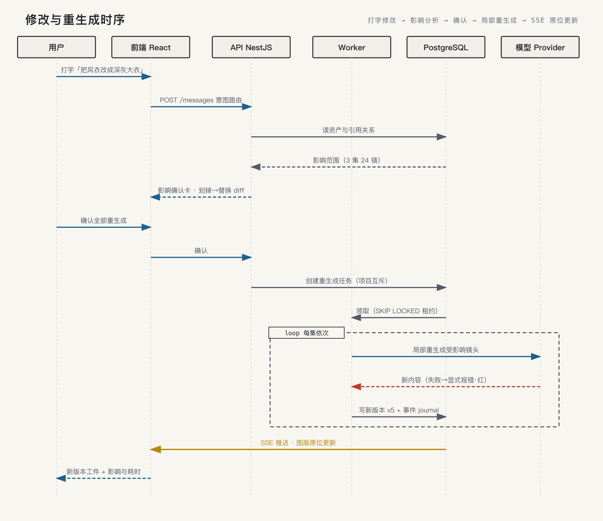

# 短剧制作 Demo：产品设计

> 状态：问答确认中的新基线
> 目标：先做一个可用、可演示的 Demo，不继承旧产品文档的交互假设。
> 最后更新：2026-08-30

## 1. 一句话定义

用户登录 Demo 账号后，通过一个项目主对话导入多集剧本，系统自动将剧本制作成故事资产、场次、分镜和 Prompt，并提供可编辑、可重生成、可导出的短剧分镜生产包。

## 2. Demo 目标

首要验收闭环：

```text
登录 Demo 账号
  → 创建项目
  → 在对话中粘贴或上传一集剧本
  → 自动生成故事资产、场次、分镜和 Prompt
  → 右侧查看流程和资产
  → 修改一次
  → 确认影响范围并重生成
  → 下载项目 ZIP
```

Demo 重点验证真实剧本能否完成完整制作闭环，而不是实现完整商业系统。

## 3. 访问与数据

- 提供预置 Demo 账号和密码，登录页直接展示：账号 `demo`，密码 `demo123`。
- 用户点击“进入 Demo”后进入共享 Demo 用户空间。
- 登录状态在浏览器中保持 7 天。
- 所有访客共享项目列表，并可查看、编辑、重生成和导出项目。
- 项目列表按最近更新时间倒序排列，显示项目名称、集数、各集生成状态、最近更新时间和问题数量。
- 普通访客不能删除项目或剧集。
- 管理员通过项目列表右上角的隐藏管理入口和管理员口令执行 Demo 数据重置。
- 服务器保存项目、剧本、生成结果、对话和版本数据。

## 4. 项目结构

```text
Demo 用户
  └── 项目
       ├── 项目主对话
       ├── 项目级角色与世界设定
       ├── 第 1 集
       │    ├── 剧本
       │    ├── 故事资产
       │    ├── 场次
       │    ├── 分镜
       │    └── Prompt
       └── 第 2 集 …
```

- 一个项目支持多集。
- 项目内逐集创建剧集。
- 一个项目只有一个主对话，支持项目级和剧集级操作。
- 当前剧集通过界面选择器选择，也支持用户在对话中明确说“第 2 集”。
- 从项目列表进入项目时，默认打开上次操作的剧集。
- 第一集自动抽取项目级角色和世界设定，后续剧集引用。
- 项目级资产可以由用户在右侧资产视图编辑。
- 后续剧本与项目级设定冲突时，助手列出冲突，由用户选择更新项目设定、仅当前集生效或暂不处理。
- 当前集默认引用项目级资产，也允许设置明确标记的本集覆盖；本集覆盖不修改项目全局设定。

## 5. 首次使用

```text
打开 Demo
  → Demo 账号登录
  → 共享项目列表
  → 点击“新建项目”
  → 直接进入项目主对话
  → 助手邀请用户粘贴第一集剧本
```

项目名称、集数和目标镜头数量优先由助手从剧本中识别；缺失时在对话中依次补问，不使用独立创建表单。信息补齐后才开始制作。

补问镜头数量时建议 20–40 个，默认 30 个。

剧本输入支持：

- 直接粘贴文本；
- 上传 `.md` / `.txt` 文件。

## 6. 核心生成流程



用户提交剧本后，默认一键自动制作：

```text
剧本解析
  → 故事资产
  → 场次规划
  → 分镜生成
  → Image / Video Prompt
  → 基础连续性检查
  → 生产包准备
```

- 默认不设置强制审批节点。
- 用户可以选择在故事资产生成后暂停一次，确认后再继续。
- 生成过程中允许查看已完成结果、补充要求和取消。
- 补充要求不打断当前阶段，记录后排队到下一个尚未开始的阶段生效。
- 取消后保留已经完成的资产和分镜。
- “继续制作”从第一个未完成阶段接着执行；“重新开始”基于原始剧本创建全新的生成版本。
- 任务失败时保留已完成内容，失败项可以单独重试。
- 用户按每集指定目标镜头数量（建议 20–40，默认 30），系统按场次分配。
- 其他制作参数使用默认值，并可通过对话调整。
- 同一项目一次只允许制作一集，避免共享项目级资产发生并发冲突。

默认制作参数：

- 镜头数量：每集由用户指定；
- 视觉风格：电影感；
- 画幅：16:9；
- 镜头密度：标准；
- 媒体生成：模拟预览，不调用真实图像/视频服务。

镜头数量、节奏、画幅和视觉风格的修改只影响当前集。提交修改后展示当前集影响范围，确认后生成当前集新版本。

## 7. 对话能力

第一版只做制作闭环指令，不做开放式编剧聊天。

支持：

- 导入和开始制作；
- 查询角色、场景、道具、场次和镜头；
- 修改项目级资产或剧集资产；
- 修改镜头制作字段和 Prompt；
- 调整当前集的镜头数量、视觉风格、画幅和节奏；
- 查看影响范围；
- 确认或取消重生成；
- 重试失败项；
- 导出项目 ZIP。

## 8. 页面布局

```text
┌────────────────┬────────────────────────────────┐
│ 项目 / 剧集列表 │ 项目主对话                       │
│                │ 用户消息 · 助手回复 · 活动进度    │
│                │                                  │
│                │                          ┌───────┤
│                │                          │ 工作区 │
│                │                          │流程/资产│
└────────────────┴──────────────────────────┴───────┘
```

右侧工作区顶部提供两个视图：

```text
[制作流程] [资产结果]
```

- 生成中默认显示“制作流程”；
- 生成完成后默认显示“资产结果”；
- 用户可以随时切换。

> 2026-08-30 视觉稿修订（用户选定 comp-c 构图后）：右侧双视图 tab 由「编号边栏阶段账（剧本→资产→场次→分镜→检查→穿帮→包）+ 对话内进度卡」取代，制作流程角色由边栏承担；此修订已经用户确认（2026-08-30）。

### 制作流程视图

展示：

- 剧本解析；
- 故事资产；
- 场次规划；
- 分镜生成及数量进度；
- 连续性检查；
- 生产包准备；
- 当前阶段耗时、失败项和取消入口。

### 资产结果视图

按资产类型组织：

- 项目级角色和世界设定；
- 当前集故事资产；
- 场次；
- 分镜卡片；
- 问题；
- 生产包。

分镜卡片包含：

- 场次和镜头编号；
- 统一风格的模拟关键帧占位图，并明确标注“Demo 模拟预览”；
- 画面描述；
- 人物、动作、景别、构图、运镜、时长、光线和情绪；
- Image Prompt；
- Video Prompt；
- 编辑、重试、版本入口。

## 9. 修改与版本



支持两种修改方式：

1. 自然语言对话；
2. 右侧卡片字段编辑。

右侧第一版只开放固定核心字段：

- 角色：外观、服装；
- 场景：时间、氛围；
- 分镜：画面、动作、景别、运镜、时长；
- Prompt：Image Prompt、Video Prompt。

两种方式使用同一版本管道：

```text
提交修改
  → 生成 before / after
  → 计算影响范围
  → 展示影响范围
  → 用户确认
  → 重生成受影响内容
  → 创建新版本
```

项目级角色或世界设定修改需要展示跨集影响，例如：

```text
第 1 集：3 场 / 12 镜
第 2 集：2 场 / 8 镜
第 3 集：1 场 / 4 镜
```

每个资产保留最近 5 个版本，支持查看 diff 和回退。

## 10. 问题检查

第一版执行基础连续性检查：

- 角色外观和身份；
- 场景空间；
- 道具状态；
- 时间和光线；
- 动作连续性。

问题显示在右侧问题区：

- 已完成内容的问题不阻断整集结果；
- 事实问题只标记并定位，不自动改写；
- 措辞或格式问题可以自动修订；
- 失败项支持单项重试；
- 被忽略的问题在导出清单中保留记录。

## 11. 模型与媒体

- 生成内容默认使用简体中文。
- 文本模型：服务端通过 OpenAI 兼容接口调用。
- 使用 Base URL、API Key 和模型名配置，统一要求结构化 JSON 输出。
- 没有完整 Key 时 API/Worker 启动失败；真实调用失败时任务显式失败并支持重试。
- 真实模型错误写入任务错误、事件和穿帮记录，不产生替代模型资产。
- 前端不暴露模型 API Key。
- 图片和视频：第一版不调用真实媒体服务，只展示统一风格的模拟关键帧占位图。

## 12. 项目导出

导出范围为整个项目，生成一个 ZIP：

```text
city-heart.zip
├── project-assets.md
├── episode-01/
│   ├── story-assets.md
│   ├── scenes.md
│   ├── storyboard.md
│   ├── prompts.json
│   └── manifest.json
└── episode-02/
    └── …
```

每集固定 5 个文件：

- `story-assets.md`；
- `scenes.md`；
- `storyboard.md`；
- `prompts.json`；
- `manifest.json`。

根目录额外包含：

- `project-assets.md`。

## 13. 明确不做

第一版不做：

- 开放式剧本创作和大幅改写；
- 真实图片生成；
- 真实视频生成；
- 配音、字幕、剪辑和发布；
- 多人实时协作；
- 多租户；
- 复杂权限；
- 普通访客删除数据；
- 无限版本历史；
- 复杂格式导出；
- MCP 或插件市场。

## 14. 遗留待定（实现时按默认处理，必要时再确认）

- ZIP manifest 的具体字段清单（M6 导出实现时落定）；
- 首个 Demo 演示用真实剧本样本与验收用例（M1 前选定）。

（其余原列条目——登录有效期、取消/继续规则、跨集冲突、资产数据结构、版本编号——均已定案并入正文与 architecture.md。）
