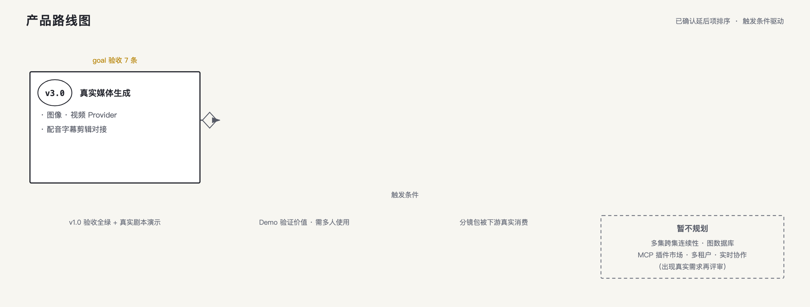

# 产品路线图

> 状态：已确认（2026-08-30）
> 依据：`product-design.md` §13 延后项 + `architecture.md` §9 扩展点 + 历轮问答确认的决策。
> v2 及以后均为**已确认的延后项**排序，不含任何未确认的新功能设想。



## 总览

```text
v1.0  Demo 闭环（当前 goal 范围）
v1.x  质量与体验打磨
v2.0  多用户生产化
v3.0  真实媒体生成
暂不规划
```

## v1.0 — Demo 闭环（进行中）

范围 = `product-design.md` 全部 + goal 验收 7 条：

登录 → 项目列表 → 对话导入剧本（补问链路）→ 自动连续生成（阶段账 + 图版实时生长）→ 打字修改（跨集影响 + 局部重生成）→ 版本（5 版/diff/回退）→ 穿帮处理 → 整项目 ZIP 导出；Docker 部署可恢复。

**触发进入 v1.x**：v1.0 验收全绿并经真实剧本实操演示。

## v1.x — 质量与体验打磨（候选项，按需启动）

| 项 | 来源 |
|---|---|
| 真实模型输出质量验收：样本集（≥5 剧本 + 连续性/道具/歧义样本）、输出/Token/延迟记录 | 旧评估计划继承 |
| 表格导出（CSV/Excel 分镜表） | G4A 决策明确"留待后续版本" |
| 上传格式扩展（docx/pdf） | §5.1 第一版仅 md/txt |
| 会话内搜索/筛选（"只看第 2 场"类指令强化） | 产品设计对话能力自然延伸 |

## v2.0 — 多用户生产化

| 项 | 来源 |
|---|---|
| 用户体系：注册/登录/密码，替代共享 demo 账号 | §13"暂不做登录注册"为第一版边界 |
| 认证层置于 API 入口，不侵入领域层 | 架构安全边界既定 |
| 数据按用户隔离（项目/会话归属） | 共享 Demo 数据的替代形态 |
| 对象存储（S3/MinIO）替换本地磁盘 | 架构 §9 既定扩展点 |
| 任务队列 Redis/BullMQ 替换 PG 任务表 | 架构 §9（规模触发） |

**触发**：Demo 验证产品价值后、需要多人各自使用时。

## v3.0 — 真实媒体生成

| 项 | 来源 |
|---|---|
| 图像生成 Provider（关键帧真图替换模拟帧） | §13 第一版只出 Prompt |
| 视频生成 Provider（镜头片段） | 同上 |
| 配音/字幕/剪辑/发布对接 | 同上（旧能力地图 P3 继承） |

**触发**：分镜生产包被下游真实消费、需要出画面时；业务层已按 Provider 适配器预留（架构 §6）。

## 暂不规划

多集跨集连续性、图数据库、MCP 插件市场、多租户、实时协作。
（历史决策一致否决或无需求信号；出现真实需求再评审。）

## 里程碑与验收对照

| 版本 | 验收载体 |
|---|---|
| v1.0 | goal 验收 7 条（登录/生成/修改/重试/导出/Mock 兜底/部署恢复） |
| v1.x | 各候选项单独验收（如模型质量：样本集通过率报告） |
| v2.0 | 多用户隔离 + 数据迁移 + 部署升级演练 |
| v3.0 | 首支真实生成的关键帧/片段样片 |
