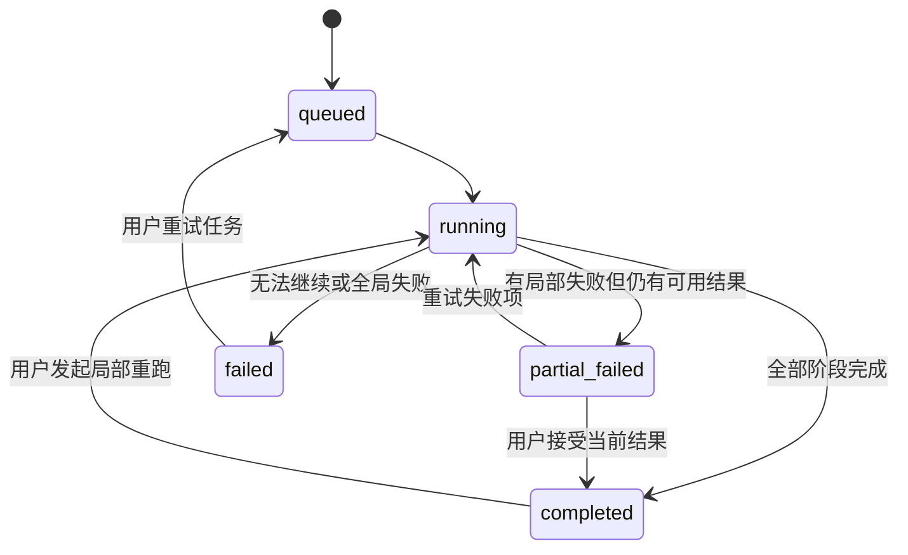
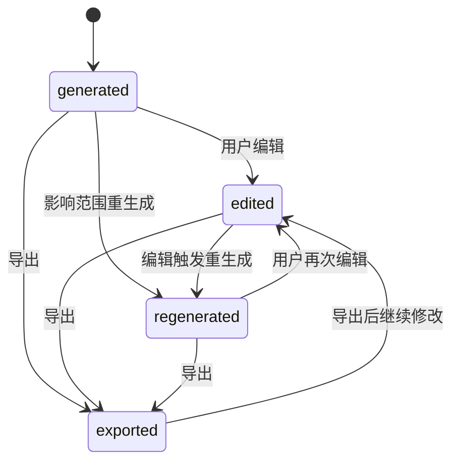
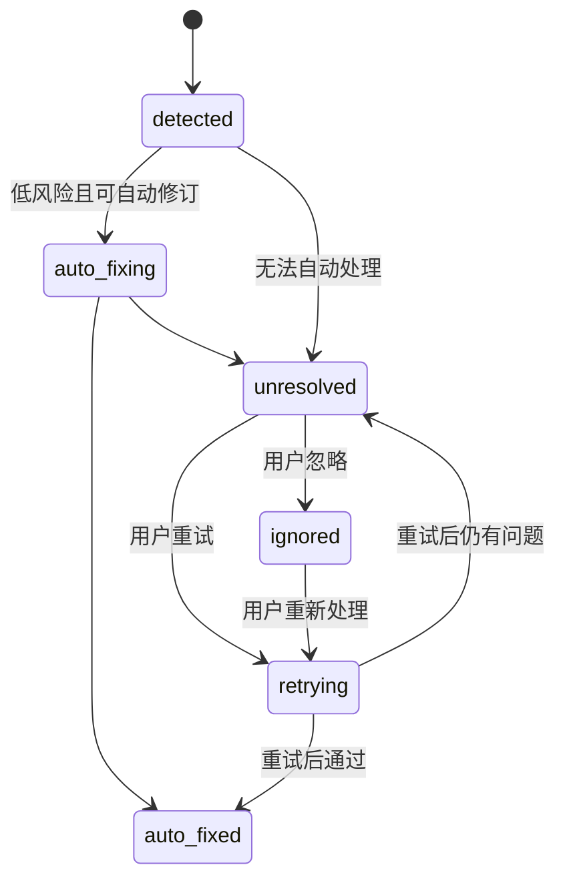

# 业务状态机

> 状态：产品方向已确认，状态方案待评审
>
> 本文档定义用户能理解的产品状态和系统内部状态。状态变化不应要求用户理解数据库或 Workflow 实现。

## 1. 设计原则

- 默认自动连续推进；
- 不设置审批状态；
- 局部失败不等于整集失败；
- 问题可以被忽略，但不能被删除；
- 编辑产生新版本，不覆盖历史；
- 重生成属于新版本和新任务；
- 任务状态和资产状态分开。

## 2. 生产任务状态



### 状态说明

| 状态 | 含义 | 用户动作 |
|---|---|---|
| queued | 已创建，等待执行 | 查看或离开页面 |
| running | 正在执行 | 查看进度和已完成资产 |
| completed | 主流程完成 | 查看、编辑、导出 |
| partial_failed | 部分内容失败 | 查看问题、局部重试或忽略 |
| failed | 整体无法完成 | 查看原因、重新执行 |

## 3. 阶段状态

```text
pending → running → completed
                  ↘ partial_failed
                  ↘ failed
```

阶段包括：

- 剧本解析；
- 故事资产；
- 场次规划；
- 分镜生产；
- 连续性审查；
- 生产包整理。

## 4. 资产状态



资产状态不包含 `approved`。第一版没有正式审批流程。

## 5. 镜头状态

```text
draft
  → generating
  → reviewed
  → needs_attention
  → edited
  → regenerating
  → reviewed
  → exported
```

失败分支：

```text
generating → failed
failed → retrying → generating
```

说明：

- `reviewed` 表示已经完成自动审查，不代表人工审批；
- `needs_attention` 表示存在用户可处理的问题；
- `failed` 表示该镜头生成失败；
- `edited` 表示用户保存过新版本。

## 6. 问题状态



问题不能直接删除，需要保留历史状态。

## 7. 版本状态

```text
current
  → superseded
```

同一资产只有一个当前版本，但旧版本始终可查询。

版本记录包含：

- version；
- before；
- after；
- source；
- reason；
- impactScope；
- createdAt；
- triggeredTaskId。

## 8. 修改任务状态

```text
requested
  → analyzing_impact
  → awaiting_generation
  → regenerating
  → completed
  ↘ partial_failed
  ↘ failed
```

没有 `awaiting_approval`。

## 9. 导出状态

```text
requested → validating → rendering → saved → downloadable
                             ↘ failed
```

导出校验失败的情况：

- 输入资产不存在；
- 文件无法写入；
- 数据无法序列化；
- 系统故障。

普通未处理问题不会阻断导出，但必须进入导出 manifest。

## 10. 状态和用户文案

| 内部状态 | 用户文案 |
|---|---|
| queued | 已排队 |
| running | 正在生成 |
| completed | 已完成 |
| partial_failed | 部分完成，有内容需要处理 |
| failed | 生成失败 |
| needs_attention | 需要关注 |
| ignored | 已忽略 |
| regenerating | 正在重新生成 |
| exported | 已导出 |

## 11. 可用性规则

```text
任务 running：允许查看已完成资产
任务 partial_failed：允许编辑、重试、导出
任务 failed：允许查看已有结果和重新开始
资产 needs_attention：允许编辑、重试、忽略
资产 exported：仍允许编辑，编辑后生成新版本
```

## 12. 不允许的状态变化

- 未创建剧本版本就生成故事资产；
- 没有故事资产上下文就生成分镜；
- 删除唯一当前版本；
- 删除问题记录；
- 失败单镜导致整集已有资产被清空；
- 聊天直接把资产改为新值而不产生版本；
- 忽略问题后在导出中不记录。
