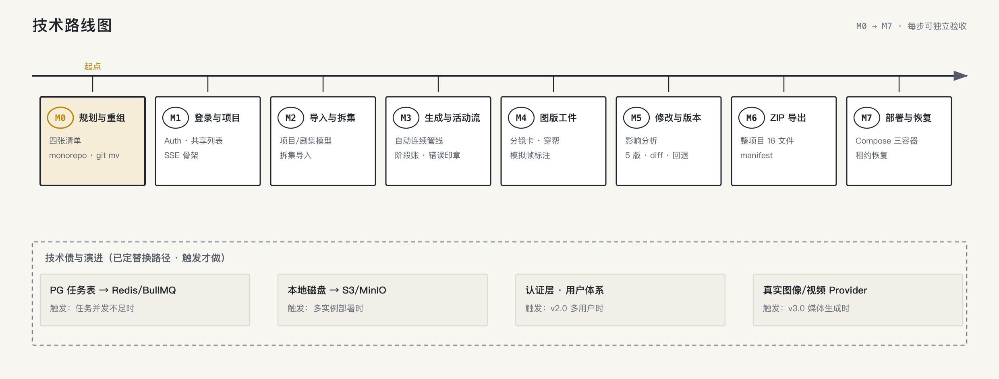

# 技术路线图

> 状态：已确认（2026-08-30）
> 依据：`architecture.md` 技术基线 + goal P0-A..G 实现顺序。
> 里程碑编号与 goal 提示词一一对应，每步可独立验收后才进入下一步。



## 里程碑总览

```text
M0 规划与重组 ─→ M1 登录与项目 ─→ M2 导入与补问 ─→ M3 生成与活动流
                                                        │
M7 部署与恢复 ←─ M6 ZIP 导出 ←─ M5 修改与版本 ←─ M4 图版工件 ┘
```

## M0 — 实现规划与 monorepo 重组

| 交付 | 验收信号 |
|---|---|
| `docs/implementation-plan.md`（复用/重构/新增/淘汰四张清单） | 清单覆盖 Spike 全部源文件，每文件有归属结论 |
| pnpm monorepo 重组（原地） | `pnpm -r check` 通过；`apps/server` 从现 `src/` 迁入保持 git 历史；`apps/web`、`packages/shared` 空骨架就绪 |
| Prisma schema 按新基线扩展（会话/事件/任务/版本/项目级资产） | `prisma validate` + 首个 migration 可执行 |

## M1 — 登录与项目列表（P0-A）

| 交付 | 验收信号 |
|---|---|
| NestJS auth module（demo/demo123，HttpOnly 签名 cookie 7 天，AuthGuard） | 未登录访问 API 401；登录后 7 天免登 |
| 共享项目列表 API + React 页（按 DESIGN.md） | 最近更新倒序、状态标、隐藏 ⋯ 管理入口 + 口令重置 |
| SSE 骨架（事件表 + afterSeq 续传） | 断线重连不丢事件；刷新先快照再续订 |

## M2 — 项目/剧集与剧本导入（P0-B）

| 交付 | 验收信号 |
|---|---|
| 项目/剧集/项目级资产模型 + Repository | 项目级资产可被剧集覆盖（仅本集生效标记） |
| 对话导入链路（意图路由） | 粘贴剧本 → 依次补问项目名→集数→镜头数（建议 20–40 默认 30）→ 建 ScriptVersion（原文只读） |
| 上传 .md/.txt | 文件与粘贴同链路 |

## M3 — 自动连续生成与活动流（P0-C）

| 交付 | 验收信号 |
|---|---|
| Mastra 生成管线（解析→资产→场次→分镜→Prompt→检查→包，无确认门槛） | Worker 领取任务执行，阶段事件实时写 journal |
| SSE 推送 + 边栏阶段账 | 前端阶段账实时推进（当前阶段金圈） |
| 项目互斥 + 取消/继续 | 同项目并发任务被拒；取消保留已完成，可从未完成阶段续跑 |
| 真实模型 Provider + 真实模型失败路径 | 配 Key 走真实输出；无 Key/失败显式报错，不产生替代资产 |

## M4 — 图版区工件（P0-D）

| 交付 | 验收信号 |
|---|---|
| 资产/分镜卡渲染（模拟帧标注、Prompt 续行、场记板圈码） | 与视觉稿工作区一致，逐件实时出现 |
| 穿帮中心 | 措辞类带自动修订、事实类只定位/忽略；失败单项可重试 |

## M5 — 修改、影响分析与版本（P0-E）

| 交付 | 验收信号 |
|---|---|
| 打字修改 → 意图路由 → 影响分析 | "改风衣"展示跨集清点（划掉→替换 diff），确认后局部重生成 |
| 版本管道 | 每资产保留 5 版、可看 diff、可回退；卡片编辑走同一管道 |

## M6 — 整项目 ZIP 导出（P0-F）

| 交付 | 验收信号 |
|---|---|
| 导出服务 + 下载 | 目录 = project-assets.md + 每集 5 文件；被忽略穿帮在 manifest |

## M7 — 部署与恢复（P0-G）

| 交付 | 验收信号 |
|---|---|
| docker-compose（postgres/api/worker） | 一键启动，迁移自动执行 |
| 任务租约恢复 | 重启后 lease 过期任务重新入队，已完成数据不丢 |

## 技术债与演进（v1 不做，触发条件见产品路线图）

| 项 | 触发 | 替换路径 |
|---|---|---|
| PG 任务表 → Redis/BullMQ | 任务并发/吞吐不足 | Worker 领取接口不变，业务层零改动（架构 §5 既定） |
| 本地磁盘 → S3/MinIO | 多实例部署或容量 | AssetStorage 接口已抽象 |
| 认证层 | v2.0 多用户 | Guard 位置预留，不侵入领域层 |
| 真实图像/视频 Provider | v3.0 | ModelProvider 适配器扩展 |

## 工程纪律（贯穿所有里程碑）

- 每里程碑合并前：`pnpm -r check` + 测试绿 + CONTEXT.md 进度更新；
- 重组提交与功能提交分离；Spike 淘汰项在 implementation-plan.md 留痕；
- SSE 事件契约只放 packages/shared，禁止前后端各自定义。
