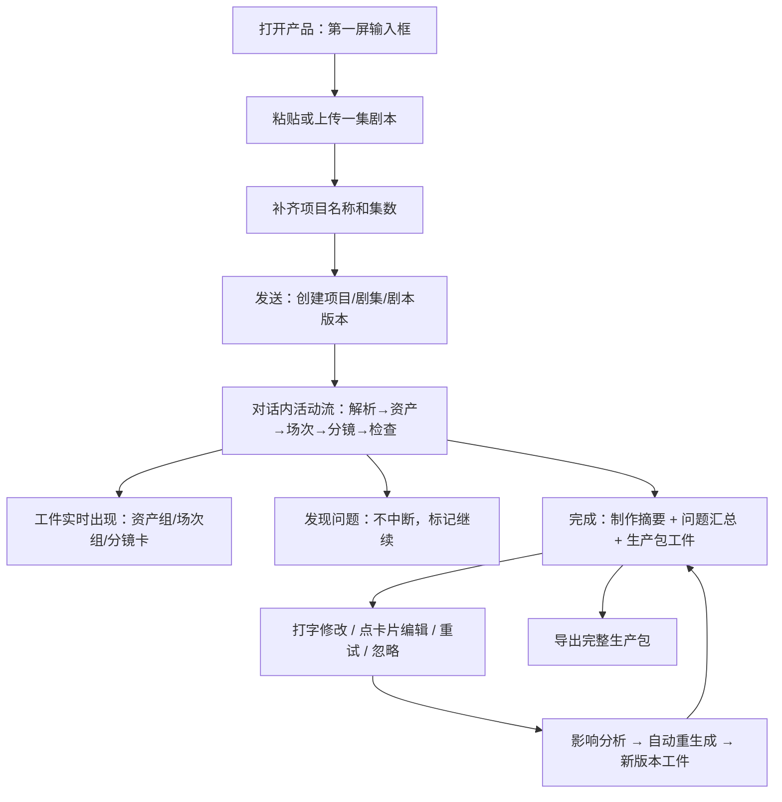
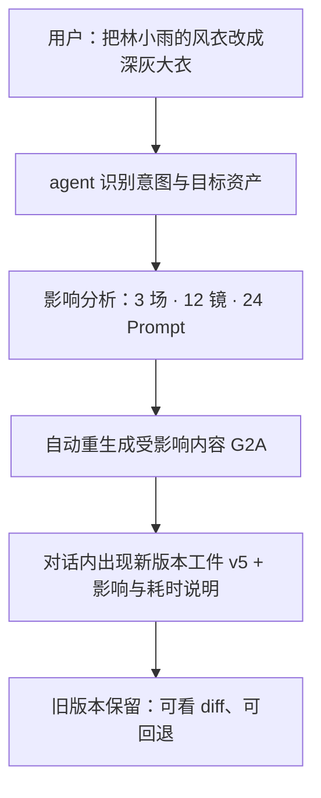
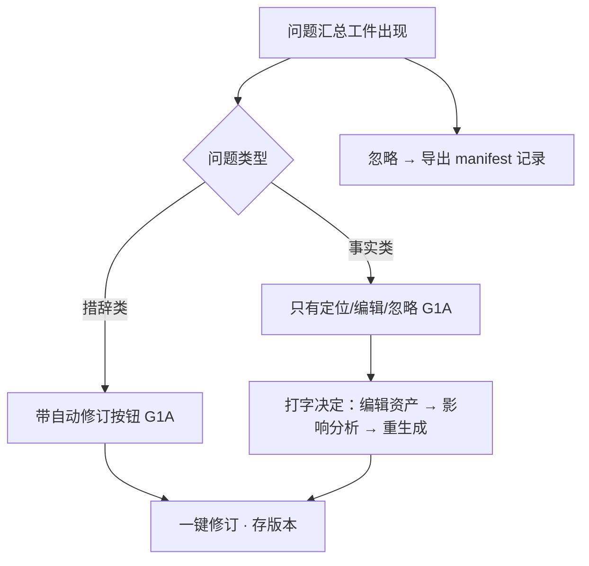

# 用户操作流程 v2：对话形态

> 状态：2026-08-30 随产品形态决策（`product-form.md`）重写，待评审
>
> 流程序列与 v1 一致；变化的是承载面——一切发生在对话里。旧 Spike 的强制确认门槛仍然无效。

## 1. 主流程



## 2. 首次使用

1. 打开服务器地址，看到居中输入框和一句"把一集剧本贴进来"；
2. 粘贴剧本或拖入 `.md`/`.txt`；
3. 就地补齐项目名称、集数（不跳页）；
4. 发送，活动流开始滚动。

第一屏必须交代：自动生成包含什么；生成中可离开；问题不中断整集。

## 3. 生成流程（活动流行为）

用户可以：

- 看到各阶段实时状态与耗时；
- 展开已完成内容（工件实时出现，不用等全部完成）；
- 离开页面，稍后回到同一会话续播进度；
- 运行中继续输入补充要求（排队处理）。

用户不需要：

- 理解 Workflow / StoryBible / Run；
- 在任何阶段审批；
- 手动刷新。

活动流完成后的收敛：折叠为一行"生成完成 · 用时"，过程可回看但不刷屏。

## 4. 打字修改流程（核心新流程）



原则：

- 修改不需要审批，但**必须先报影响范围再执行**（沿用 v1 §5 的告知义务，只是从表单提示变为对话回复）；
- 打字是第一入口；点卡片上的"编辑"改字段是兜底，走同一版本管道。

## 5. 分镜浏览

- 分镜按场次分组为工件；说"只看第 2 场"或点场次过滤；
- 默认展开当前讨论的场次，其余折叠；
- 每张卡：场记板编号（场N·镜N）+ 景别/运镜/时长等规格 + 画面描述 + Image/Video Prompt + 问题标签 + 编辑/重试/版本。

## 6. 问题处理流程



问题不默认阻断，也不消失；导出时被忽略项必须记录。

## 7. 失败重试

- 失败以问题工件呈现（如"镜 18 · 画面描述为空"）；
- 打字"重试镜 18"或点失败项的重试；
- 只重跑失败范围，成功结果保留，原工件原位更新。

## 8. 导出流程

- 生产包工件默认折叠为"生产包 · 9 文件"；展开见 manifest 预览（版本/用时/已修订/失败/被忽略）；
- 点"导出完整生产包"或打字"导出"；
- 第一版一键整包（Q2A），不提供逐文件下载。

## 9. 刷新与恢复

按会话 ID 从服务端恢复消息、工件与折叠状态；生成中回来续播进度，不重复执行、不重复扣费。

## 10. 明确不出现的交互

- 页签导航、仪表盘、面包屑（形态已取消）；
- "批准 StoryBible / Scene / Shot"、"审批人"、"等待审批后继续"；
- "Workflow step 1/2/3" 作为用户必须理解的概念；
- 裸终端日志式活动流（活动必须可折叠、收敛、说人话）。

用户看到的是：

```text
把剧本贴进来
正在生成…（可折叠）
生成完成 · 用时
问题 · 3（1 个可自动修订）
导出完整生产包
```
