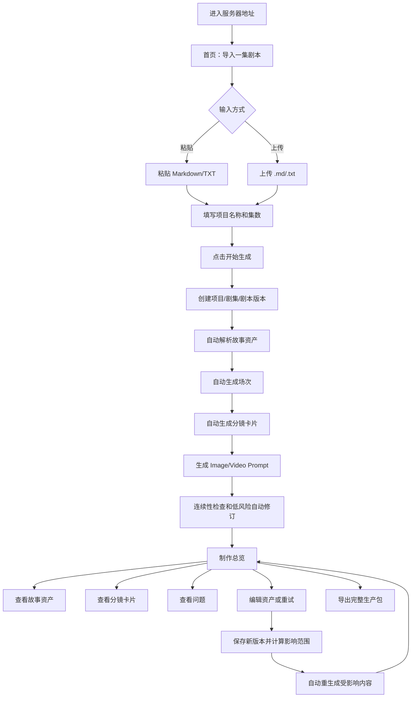
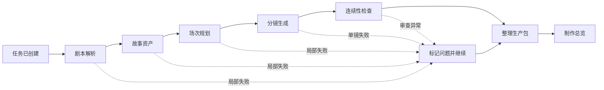
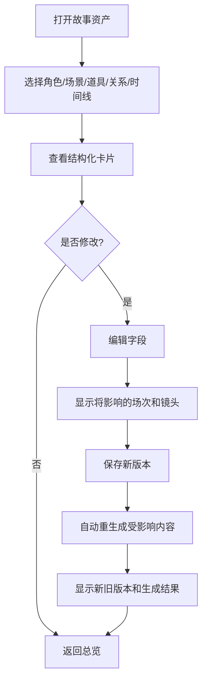
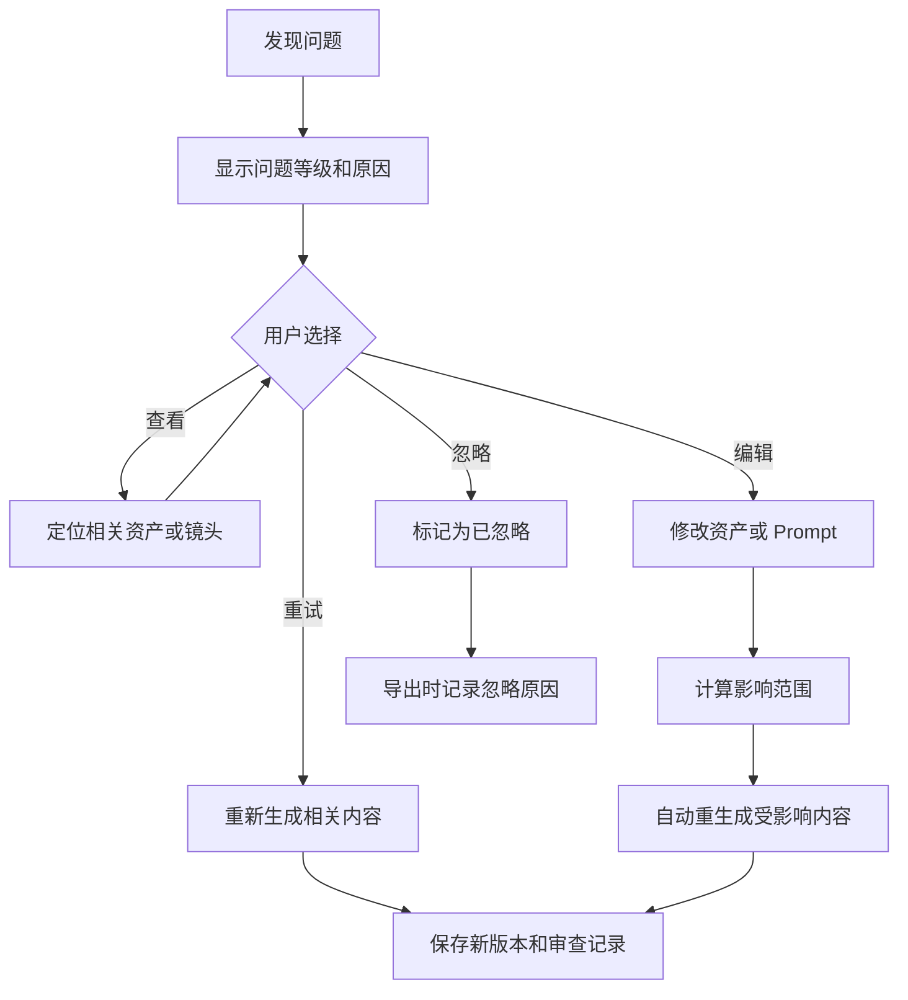
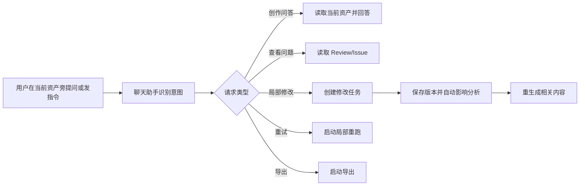

# 用户操作流程与状态流程

> 状态：需求方向已确认，流程方案待评审
>
> 现有代码中的强制确认门槛属于旧 Spike 设计，不能作为本流程的默认产品行为。

## 1. 用户主流程



## 2. 首次使用流程

### 页面目标

让第一次使用的人不用阅读说明，就知道下一步做什么。

### 步骤

1. 打开服务器地址；
2. 看到“导入一集剧本”主按钮；
3. 输入项目名称；
4. 粘贴剧本或上传文件；
5. 点击“开始生成”；
6. 进入生成进度页。

### 页面必须说明

```text
系统会自动完成：故事资产、场次、分镜和 Prompt。
生成过程中可以查看已完成内容。
发现问题不会中断整集任务。
```

## 3. 生成进度流程



### 进度页行为

用户可以：

- 查看总进度；
- 查看各阶段状态；
- 查看已经完成的角色、场次和镜头；
- 离开页面后再次打开；
- 查看失败项；
- 重试失败项。

用户不需要：

- 手动依次启动每个 Workflow；
- 理解 StoryBible 或 Workflow Run；
- 在每个阶段进行审批。

## 4. 制作总览流程

生成完成或部分完成后进入制作总览。

```text
制作总览
├── 生成状态
├── 资产数量
│   ├── 角色
│   ├── 场景
│   ├── 道具
│   ├── 场次
│   └── 分镜
├── 待处理问题
├── 失败项
├── 最近修改
└── 导出操作
```

默认首屏显示：

```text
项目名称 · 第几集
生成状态
角色数 / 场景数 / 场次数 / 分镜数
问题数 / 失败项数
[查看故事资产] [查看分镜] [查看问题] [导出]
```

## 5. 故事资产查看和编辑流程



修改故事资产不需要审批，但必须显示影响范围，例如：

```text
本次修改将影响：
- 3 个场次
- 12 个镜头
- 24 个 Prompt

系统将自动生成新版本，旧版本仍然保留。
```

## 6. 分镜卡片流程

```text
进入分镜
  → 按场次筛选
  → 查看分镜卡片
  → 展开 Prompt 和审查信息
  → 编辑制作字段或 Prompt
  → 保存新版本
  → 可选：重试当前镜头
```

分镜卡片默认展示：

- 画面摘要；
- 人物；
- 动作；
- 景别；
- 构图；
- 运镜；
- 时长；
- 光线和情绪；
- Image Prompt；
- Video Prompt；
- 问题标签；
- 编辑、重试、版本按钮。

第一版不将分镜设计成主表格。

## 7. 问题处理流程



问题不会默认阻断整集生产，也不会从结果中消失。

## 8. 失败重试流程

```text
局部失败
  → 显示失败原因
  → 用户点击重试
  → 仅重跑失败范围
  → 保留已有成功结果
  → 更新任务状态
```

支持：

- 重试单个镜头；
- 重试单个场次；
- 重试全部失败项；
- 查看失败错误；
- 继续使用其他已完成结果。

## 9. 聊天辅助流程

聊天位于工作区右侧，不作为独立主流程。



聊天助手不能直接绕过业务服务修改数据库。

## 10. 导出流程

```text
点击导出
  → 选择 Markdown / JSON / 完整生产包
  → 系统检查资产状态
  → 汇总问题、失败项和忽略项
  → 生成导出文件
  → 保存 ExportPackage
  → 提供下载
```

导出可以包含问题，但必须在 manifest 中标记问题状态。

## 11. 页面刷新和恢复

用户刷新页面或重新访问服务器时：

1. 根据任务或 episode ID 读取数据库；
2. 恢复生成进度；
3. 展示已完成资产；
4. 展示失败和待处理问题；
5. 如果任务仍在运行，继续显示实时状态。

## 12. 明确不出现的交互

产品页面不使用以下概念作为主操作：

- “批准 StoryBible”；
- “批准 Scene”；
- “批准 Shot”；
- “审批人”；
- “等待审批后继续”；
- “Workflow step 1/2/3”作为用户必须理解的技术流程。

用户看到的是：

```text
开始生成
查看结果
查看问题
编辑
重试
导出
```
