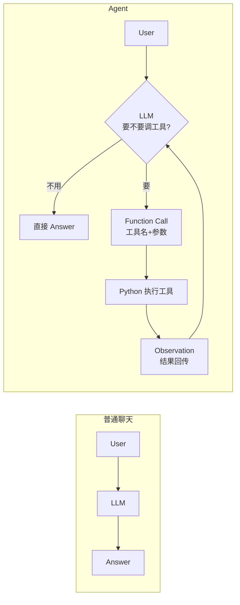
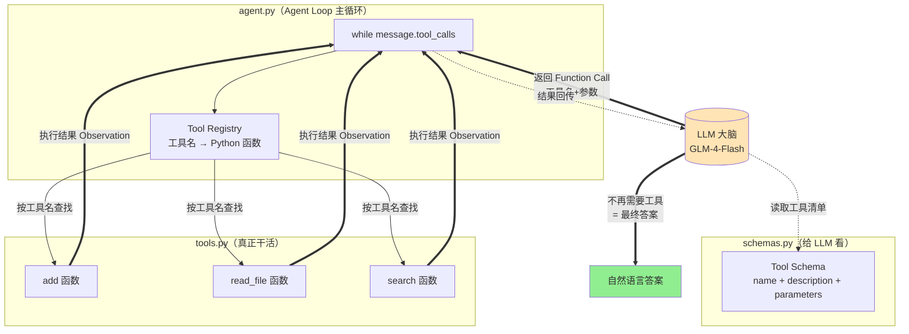
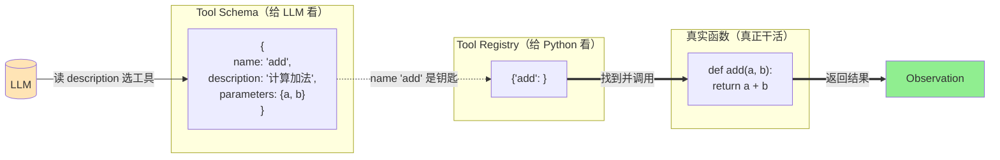
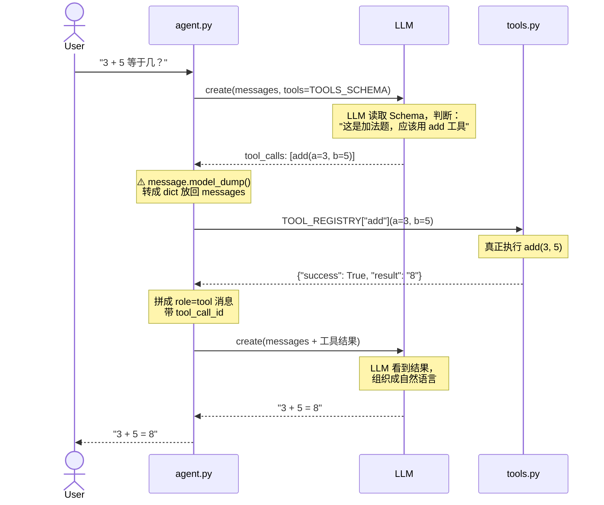
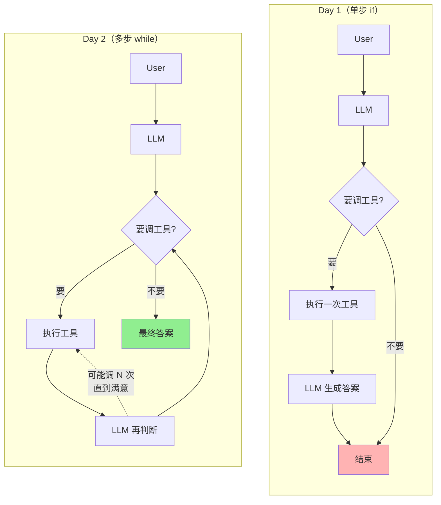
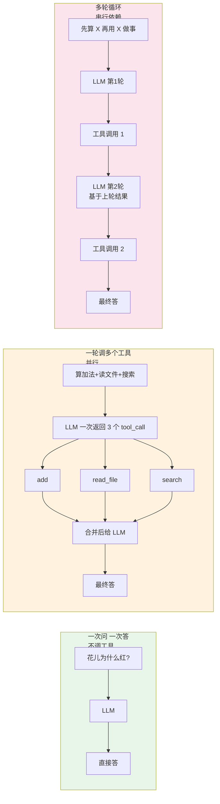

# AI Agent 从零实现 · 学习笔记（Day 1 ~ Day 2）

> 对应 Lesson 01（Agent 基础）+ Lesson 02（Tool Calling）
> 技术栈：智谱 GLM-4-Flash + Python + 智谱官方 SDK（OpenAI 兼容）
> 核心理念：**先学原理，再学框架。不依赖 LangChain，手写 Agent Loop。**

---

## 〇、一个心智模型：Agent 到底是什么

一句话：**Agent = LLM + Tool + Loop**

- **LLM（大脑）**：理解任务、决定调不调工具、组织最终答案
- **Tool（双手）**：真正干活的 Python 函数（算数、读文件、搜索…）
- **Loop（循环）**：不断重复"思考 → 调工具 → 看结果 → 再思考"，直到能回答

普通聊天 vs Agent：

```
普通聊天：User → LLM → Answer            （单向，LLM 只能靠"记忆"）

Agent：   User → LLM → 要调工具吗？
                    ├─ 不用 → 直接 Answer              （例：花儿为什么红）
                    └─ 要   → Function Call → Python 执行 → 结果回传 → LLM → Answer
                                                                       ↑
                                                              可能再调下一个工具（Loop）
```

**对比图**：



### 最关键的一认知（90% 的人会搞错）

> **模型本身不会执行工具。**

模型只输出一句话：`"我要调用 add 函数，参数 a=1, b=2"`。
真正执行 `add(1, 2)` 的是 **Python 代码**。结果再喂回给模型，模型组织成自然语言。

这是理解一切 Agent 框架的钥匙。

---

## 一、四个角色（贯穿整个 Agent 设计）

| 角色 | 是什么 | 放在哪个文件 |
|------|--------|-------------|
| **LLM** | 大脑，决策者 | 通过 `client.chat.completions.create()` 调用 |
| **Tool Schema** | 给 LLM 看的"工具说明书"（告诉它有哪些工具、怎么用） | `schemas.py` |
| **Python Tool** | 真正干活的函数 | `tools.py` |
| **Agent Loop** | 循环调度，把前三者串起来 | `agent.py` |

### 架构总览图



> 🔑 看这张图记住一个关键：**LLM 和 Tool 之间永远不直接相连**，必须经过 Agent Loop（你的 Python 代码）中转。LLM 只"说"，Loop 来"做"。

| 名称 | 面向对象 | 作用 |
|------|---------|------|
| **Tool Schema** | LLM | 告诉模型"有哪些工具可选" |
| **Tool Registry** | Python | 根据 LLM 返回的工具名，找到真正的 Python 函数 |

两者通过**函数名**对应起来。这是 Agent 设计的"接口契约"。

**对照图**：



> 🔑 Schema 里 `name: 'add'` 这个字符串就是"钥匙"，把"给 LLM 看的说明书"和"给 Python 执行的函数"对应起来。**name 写错 = 整个链路断**。

---

## 二、Day 1：最小 Agent（单步工具调用）

### 目标
跑通一次完整的 Function Call 链路：`用户问 → LLM 决策 → 调工具 → 回传结果 → 最终答案`

### 时序图：Day 1 完整流程



> 🔑 这张图最重要的细节：**LLM 出现了 2 次**。第 1 次决策调工具，第 2 次根据结果生成答案。这是 Function Call 的完整生命周期。

### 核心代码骨架

**1. Tool（`tools.py`）—— 普通函数，统一返回格式**

```python
def add(a: float, b: float) -> dict:
    return {"success": True, "result": f"{a} + {b} = {a + b}"}

def read_file(path: str) -> dict:
    try:
        with open(path, "r", encoding="utf-8") as f:
            return {"success": True, "result": f.read()}
    except FileNotFoundError:
        return {"success": False, "result": f"文件不存在：{path}"}
```

> 设计原则：所有 Tool 统一返回 `{"success": bool, "result": ...}`，方便后续统一处理。

**2. Schema（`schemas.py`）—— 给 LLM 看的说明书**

```python
TOOLS_SCHEMA = [
    {
        "type": "function",
        "function": {
            "name": "add",                              # 必须和 tools.py 函数名一致
            "description": "计算两个数字的加法...",       # LLM 据此决定要不要用它
            "parameters": {
                "type": "object",
                "properties": {
                    "a": {"type": "number", "description": "第一个加数"},
                    "b": {"type": "number", "description": "第二个加数"},
                },
                "required": ["a", "b"],
            },
        },
    },
    # ... read_file 同理
]
```

**3. Agent Loop（`agent.py`）—— 单步版**

```python
TOOL_REGISTRY = {"add": add, "read_file": read_file}   # 工具名 → 函数

# 第 1 步：把问题 + 工具说明书发给 LLM
response = client.chat.completions.create(
    model=MODEL, messages=messages, tools=TOOLS_SCHEMA
)
message = response.choices[0].message

# 第 2 步：判断要不要调工具
if message.tool_calls:
    messages.append(message.model_dump())              # ⚠️ 必须转成 dict（见踩坑1）
    for tool_call in message.tool_calls:
        fn_name = tool_call.function.name
        args = json.loads(tool_call.function.arguments)  # ⚠️ 字符串 → dict（见踩坑2）
        result = TOOL_REGISTRY[fn_name](**args)          # 真正执行
        messages.append({
            "role": "tool",
            "content": json.dumps(result, ensure_ascii=False),
            "tool_call_id": tool_call.id,                # ⚠️ 必须带（见踩坑3）
        })
    # 第 3 步：把结果回传，生成最终答案
    final = client.chat.completions.create(model=MODEL, messages=messages, tools=TOOLS_SCHEMA)
    answer = final.choices[0].message.content
```

### 实验结果

| 问题 | Agent 行为 | 现象 |
|------|-----------|------|
| `3 加 5 等于几？` | 调 `add(3,5)` → 8 → 答 8 | ✅ Function Call 全链路打通 |
| `帮我读 README.md` | 调 `read_file` → 读出内容 → 总结 | ✅ Tool + LLM 总结 |
| `花儿为什么是红的？` | **不调工具，直接回答** | ✅ LLM 自主判断 |
| `1234.56 + 7890.12` | 调 `add` → 9124.68 | ✅ 复杂运算必须靠 Tool |

---

## 三、Day 2：多工具 + while 循环（核心升级）

### Day 1 vs Day 2 能力对比图



> 🔑 视觉上一眼可见：Day 1 是一条直线走到底，Day 2 形成了一个"闭环"。这个闭环就是 Agent 的"自主思考"能力——它可以反复调用工具直到满意为止。

### Day 1 → Day 2 只改了一处，但能力天壤之别

```python
# Day 1（单步）：只处理一次工具调用
if message.tool_calls:
    ...

# Day 2（多步）：用 while 循环，直到 LLM 自己不再要工具
while message.tool_calls:
    执行工具
    结果回传
    拿新的 message
# 循环退出 = LLM 不再需要工具 = 最终答案
```

### 为什么需要 while 循环？

举例：用户问"**先算 10+20，把结果告诉我，再算这个结果乘以 2**"。
LLM 必须分两轮：
1. 先调 `add(10, 20)` → 拿到 30
2. 再用 30 这个结果继续调工具

单个 `if` 处理不了这种"**依赖上一步结果**"的连续调用，必须用 `while`。

### 完整 while 循环骨架

```python
steps = 0
while message.tool_calls:
    steps += 1
    if steps > max_steps:          # 防死循环
        break
    messages.append(message.model_dump())
    for tool_call in message.tool_calls:
        fn_name = tool_call.function.name
        args = json.loads(tool_call.function.arguments)
        result = TOOL_REGISTRY[fn_name](**args)
        messages.append({
            "role": "tool",
            "content": json.dumps(result, ensure_ascii=False),
            "tool_call_id": tool_call.id,
        })
    # 关键：用更新后的 messages 再问一次 LLM，看还要不要调工具
    response = client.chat.completions.create(model=MODEL, messages=messages, tools=TOOLS_SCHEMA)
    message = response.choices[0].message

# 循环退出，message.content 就是最终答案
```

### 实验结果（三种典型场景）

| 场景 | 行为 | 学到什么 |
|------|------|---------|
| **一次返回多个 tool_call** | LLM 在第 1 步同时调了 add + search + read_file 三个工具 | LLM 可以并行规划多工具 |
| **真正的多轮循环** | 第 1 步算出 30 → 第 2 步用 30 继续算 | while 循环的威力 |
| **自主决定不调工具** | 读文件后判断"信息够了"，跳过搜索直接答 | LLM 不是无脑调工具，会自己判断 |

### 三种工具调用形态对比图



> 🔑 这三种形态你的 Day 2 Agent 都能处理，这就是 while 循环 + Registry 的威力。形态 3 是最复杂的，也是后续 Research Agent 的核心能力。

---

## 四、踩坑记录（真实遇到的，最宝贵）

### 🕳️ 踩坑 1：`'CompletionMessage' object has no attribute 'get'`

**现象**：第一轮调工具成功，把结果回传后第二次调用 `create()` 直接报错。

**原因**：第一轮 LLM 返回的 `message` 是一个 pydantic 对象，直接 `messages.append(message)` 后，SDK 第二轮期望 messages 里**都是 dict**，于是报错。

**解决**：必须用 `message.model_dump()` 转成 dict 再放进去：
```python
messages.append(message.model_dump())   # ✅ 正确
# messages.append(message)              # ❌ 错误
```

**教训**：messages 列表里所有元素都必须是 dict。这是智谱/OpenAI SDK 的硬性要求。

### 🕳️ 踩坑 2：把 `arguments` 当成 dict 用

**现象**：`fn_name(**tool_call.function.arguments)` 报错。

**原因**：`tool_call.function.arguments` 是 **JSON 字符串**，不是 dict！
```python
tool_call.function.arguments  # '{"a": 3, "b": 5}'  ← 字符串
```

**解决**：必须先 `json.loads()`：
```python
args = json.loads(tool_call.function.arguments)   # 字符串 → dict
result = TOOL_REGISTRY[fn_name](**args)           # 才能用 ** 解包
```

**教训**：LLM 返回的一切都是字符串，包括"看起来像 JSON"的部分。

### 🕳️ 踩坑 3：漏带 `tool_call_id` 导致上下文错乱

**现象**：多轮调用时结果对不上号。

**原因**：当 LLM 一次返回多个 tool_call 时，回传结果必须**用 id 标明"这条结果对应哪次调用"**，否则模型会混乱。

**解决**：回传时必须带 `tool_call_id`：
```python
messages.append({
    "role": "tool",
    "content": json.dumps(result, ensure_ascii=False),
    "tool_call_id": tool_call.id,   # ✅ 必须对应触发它的那次调用
})
```

### 🕳️ 踩坑 4：`No module named 'sniffio'` / `socksio`

**现象**：`ZhipuAI()` 初始化时报缺 sniffio 或 socksio。

**原因**：系统配了 SOCKS 代理（科学上网），httpx 需要额外的包才能走代理。

**解决**：
```bash
pip install sniffio
pip install "httpx[socks]"   # 走 SOCKS 代理需要
```

**教训**：环境问题是 Agent 开发的第一道坎。把 `sniffio` 写进 requirements.txt 一劳永逸。

---

## 五、常见问题（FAQ）

### Q1：LLM 为什么有时候不调工具，直接回答？

因为 LLM 会**自己判断**这个问题用不用得上工具。判断依据是 Schema 里的 `description`。
- 问"花儿为什么红" → LLM 觉得是常识 → 不调工具
- 问"3+5" → LLM 觉得计算需要精确 → 调 `add`

**所以 description 写得好，LLM 才会选对工具。** 这是最容易被忽视的关键。

### Q2：LLM 调用工具的参数从哪来？

完全由 LLM 自己生成。它读了 Schema 里的参数描述，根据用户问题推断该传什么值。这也是为什么参数的 `description` 要写得清楚。

### Q3：如果 LLM 返回了不存在的工具名怎么办？

会报 KeyError。生产代码必须做防御：
```python
if fn_name not in TOOL_REGISTRY:
    result = {"success": False, "result": f"未知工具：{fn_name}"}
```
把这个错误结果回传给 LLM，它会自己调整。

### Q4：怎么防止 Agent 无限循环调工具？

用 `max_steps` 计数，超过上限强制退出：
```python
steps = 0
while message.tool_calls:
    steps += 1
    if steps > max_steps:
        break
```
这是 Lesson 03（State 管理）的核心主题之一。

### Q5：Schema 格式各厂家统一吗？

**不统一，但有事实标准。**
- 参数描述部分（JSON Schema）**统一**——所有厂家都用 `type/properties/required`
- 外层信封**不统一**——OpenAI/智谱用 `{"type":"function","function":{...}}`，Claude 用 `{"name":...,"input_schema":...}`，Gemini 用 SDK 对象
- OpenAI 格式是**事实标准**，国内 DeepSeek、Moonshot、智谱都兼容它

这正是 LangChain / MCP 这些框架存在的价值——抹平各家差异。

---

## 六、难点与思考

### 思考 1：Tool 的本质 = 普通 Python 函数

这是最容易"悟"的一点。`add`、`read_file` 和 LLM 没有任何关系，它们就是你写了一辈子的普通函数。Agent 的魔法**不在 Tool 里**，而在"怎么让 LLM 决定调用谁、传什么参数"。

**推论**：任何能写成 Python 函数的东西，都能变成 Agent 的工具——数据库查询、调 GitHub API、发邮件、操作文件…能力边界 = 你能写的 Python 函数边界。

### 思考 2：while 循环退出由谁决定？

不是你的代码决定的，是 **LLM 自己决定的**。当 LLM 返回的 message 里没有 `tool_calls` 时，循环退出。

这意味着 Agent 是"自主"的——它自己判断"我还要不要再调一个工具"。这是 Agent 区别于普通程序的灵魂。

### 思考 3：LLM 的推理并不总是可靠的

实验里 LLM 把"乘以 2"理解成了"加 2"，最后还嘴硬说等于 60 😄。

这说明：**Agent ≠ 100% 正确**。这正是后续 Lesson 要解决的：
- Lesson 03：State 管理 + max_steps（让流程可控）
- Lesson 09：Evaluation（量化评估 Agent 靠不靠谱）

不要对 LLM 抱有"它一定对"的幻想，要设计机制去验证它的输出。

### 思考 4：统一返回格式为什么重要？

`{"success": bool, "result": ...}` 看起来啰嗦，但它让 Agent 的主循环代码变得极简单——不用为每个工具写特殊处理。这就是"**约定优于配置**"在 Agent 设计里的体现。

---

## 七、自己动手练习（强烈建议做完）

### 练习 1：加一个 `multiply` 工具
1. 在 `tools.py` 加 `multiply(a, b)` 函数
2. 在 `schemas.py` 加对应 schema（name=`multiply`，description=`计算两个数的乘积`）
3. 在 `agent.py` 的 `TOOL_REGISTRY` 注册
4. 测：问 `3 乘以 7 等于几`，看 Agent 会不会自动选对工具

### 练习 2：观察 LLM 的工具选择
分别问这几个问题，记录 LLM 选了哪个工具、为什么：
- `帮我算 1+1` → ？
- `帮我搜一下天气` → ？
- `帮我看看 README` → ？
- `你好` → ？

### 练习 3：故意制造错误
- 问 `调用一个不存在的工具`，看 Agent 怎么反应
- 把 schema 的 name 改得和 registry 不一致，看会报什么错

---

## 八、关键概念速查表

| 术语 | 含义 |
|------|------|
| **Function Call / Tool Call** | LLM 输出"我要调某工具+参数"，但不执行 |
| **Tool Schema** | 给 LLM 看的工具说明书 |
| **Tool Registry** | Python 侧的工具名→函数映射 |
| **Observation** | 工具执行结果，回传给 LLM |
| **Agent Loop** | while 循环：调工具 → 看结果 → 再思考 |
| **tool_call_id** | 标识某次工具调用的 id，回传结果必须带 |
| **max_steps** | 防死循环的最大步数 |

---

## 九、当前进度 & 下一步

```
✅ Lesson 01 (Agent 基础)        完成
✅ Lesson 02 (Tool Calling)      完成
⬜ Lesson 03 (State & Workflow)  Day 3 ← 接入真实联网搜索 + State 管理
⬜ Lesson 04 (RAG)               后续
...
```

下一步（Day 3）：把 `mock_search` 换成**真实的智谱 web_search**，加上 State 管理（记录每步状态）、max_steps 防死循环，做出一个真正能联网的 Research Agent 雏形。

---

## 附：项目结构

```
week-research-agent/
├── requirements.txt          # 依赖
├── .env.example              # API Key 模板
├── config.py                 # 全局配置
├── README.md
├── day1/
│   ├── tools.py              # add + read_file
│   ├── schemas.py            # 2 个工具的 Schema
│   └── agent.py              # 单步 Agent Loop
└── day2/
    ├── tools.py              # + mock_search（3 工具）
    ├── schemas.py            # 3 个工具的 Schema
    └── agent.py              # while 循环版 Agent
```
