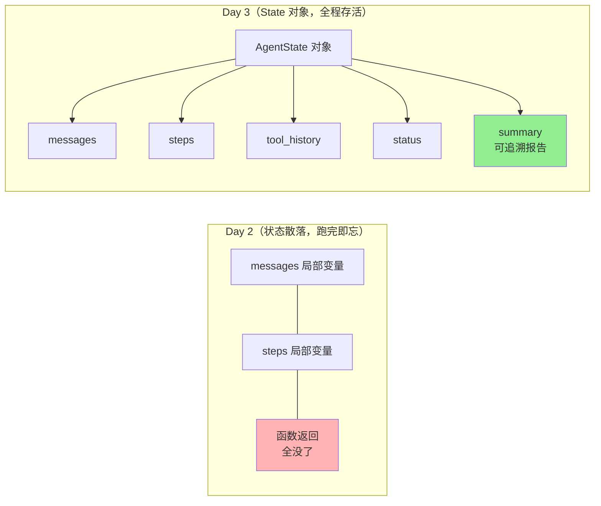
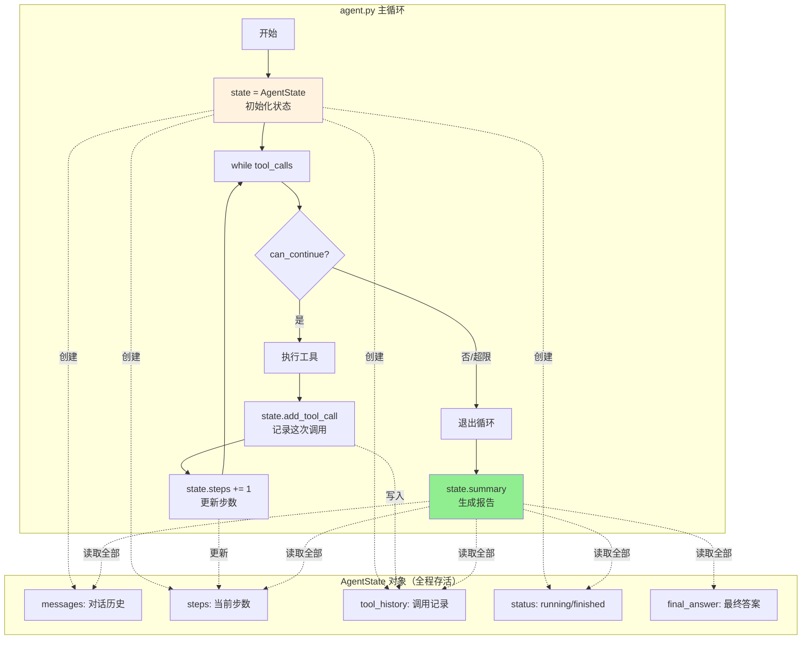
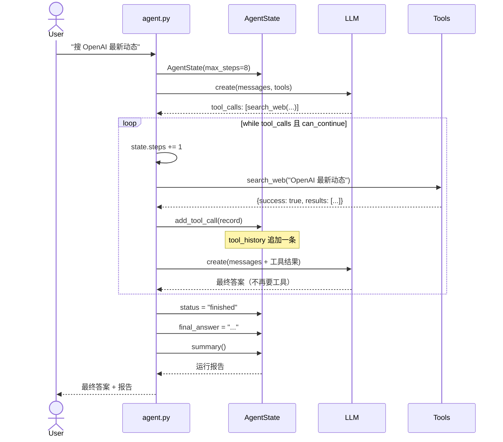
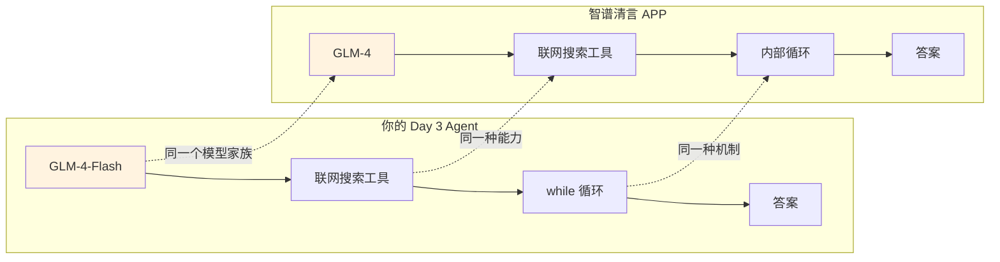

# AI Agent 从零实现 · 学习笔记（Day 3）

> 对应 Lesson 03（State & Workflow）
> 技术栈：智谱 GLM-4-Flash + DuckDuckGo 搜索 + Python
> 核心升级：**State 管理 + 真实联网搜索 + max_steps 防死循环**

> 📂 **关联代码**
> - 目录：`day3/`
> - 核心文件：`day3/state.py`（AgentState + ToolCallRecord）、`day3/agent.py`（带 State 的 Loop）、`day3/tools.py`（真实联网 search_web）、`day3/verify.py`（5 场景验证）
> - 运行：`python day3/agent.py`、`python day3/verify.py`
> - 复用：`day3/state.py` 后来提到 `common/state.py`，被 Day 4/5/8/9 继承

---

## 〇、一个心智模型：从"裸奔"到"有记忆"

Day 2 的 Agent 能跑通，但像"裸奔"——所有状态散在函数局部变量里，**跑完即忘**。Day 3 给 Agent 装上"黑匣子"：

```
Day 2（裸奔）              Day 3（工业级）
──────────────             ──────────────
散落的局部变量      →      AgentState 类统一管理
简单计数            →      max_steps + 可追溯状态
Mock 假数据         →      真实联网搜索（DuckDuckGo）
出错只报错          →      重试 + 优雅降级
跑完即忘            →      完整运行报告（可追溯）
```

**对比图**：



> 🔑 一句话：**State 是 Agent 的"黑匣子"**——既能在飞行中实时判断（`can_continue`），又能在落地后回放分析（`summary`）。

---

## 一、AgentState：状态管理的核心

### 1.1 为什么需要 State？

Day 2 的问题：

| 问题 | 后果 |
|------|------|
| 状态散在局部变量里 | 跑完即忘，无法追溯 |
| 无法调试 | 出错时不知道"第几步、调了什么"才挂的 |
| 无法持久化 | 存数据库、存文件做 Memory？做不到 |
| 无法监控 | 外面想知道"Agent 跑到第几步了"？拿不到 |

Day 3 把所有状态抽成一个 `AgentState` 类，四个好处：**可追溯、可调试、可持久化、可控**。

### 1.2 State 里放什么？

| 字段 | 类型 | 作用 |
|------|------|------|
| `messages` | list | 和 LLM 的完整对话历史（核心） |
| `steps` | int | 已经循环了多少步 |
| `tool_history` | list | 每次工具调用的记录（`ToolCallRecord`） |
| `status` | str | 当前状态：`running` / `finished` / `max_steps_reached` / `error` |
| `final_answer` | str | 最终答案 |
| `error` | str | 出错信息 |
| `max_steps` | int | 最大步数上限（防死循环） |
| `started_at` | float | 开始时间（算总耗时） |

### 1.3 State 的工作原理图



### 1.4 State 的三个核心方法

```python
@dataclass
class AgentState:
    # ... 字段声明见上 ...

    def can_continue(self) -> bool:
        """还能不能继续循环？超过 max_steps 就停。"""
        return self.steps < self.max_steps

    def add_tool_call(self, record: ToolCallRecord):
        """记录一次工具调用。"""
        self.tool_history.append(record)

    def summary(self) -> str:
        """生成运行摘要（可读性强，用于日志和调试）。"""
        # 返回步数/耗时/工具调用明细的完整报告
```

**面向对象的精髓**：数据（字段）和操作数据的方法放一起。Day 2 这些逻辑散在 `agent.py` 里，Day 3 集中到 State 类，`agent.py` 变干净了。

---

## 二、`@dataclass`：Python 状态类的语法糖（重点）

`AgentState` 用了 `@dataclass`，这是 Day 3 最值得深入理解的 Python 特性。

### 2.1 一句话定义

> **`@dataclass` 是一个装饰器，你只声明"这个类有哪些字段"，它自动帮你生成那些枯燥的样板代码（`__init__`、`__repr__`、`__eq__`）。**

它**不改变类的行为**，只是帮你省掉重复劳动。

### 2.2 权威定义（来自官方文档）

不是凭印象讲，直接看 [Python 官方文档](https://docs.python.org/3/library/dataclasses.html)原话：

> **"This module provides a decorator and functions for automatically adding generated special methods such as `__init__()` and `__repr__()` to user-defined classes."**
>
> **"It was originally described in PEP 557."**
>
> **"Added in version 3.7."**

提炼成事实：

| 关键信息 | 内容 |
|---------|------|
| **它是什么** | Python 标准库模块（3.7+ 自带，**不用 pip install**） |
| **规范出处** | [PEP 557](https://peps.python.org/pep-0557/) |
| **做什么的** | 提供装饰器 + 函数，**自动给类生成特殊方法** |
| **生成哪些方法** | `__init__`（构造）、`__repr__`（打印）、`__eq__`（比较）等 |
| **工作机制** | 装饰器扫描类里所有"**带类型注解**的变量"，把它们当字段，基于字段生成方法 |

文档对工作机制的原文：

> **"The `@dataclass` decorator examines the class to find `field`s. A `field` is defined as a class variable that has a type annotation."**

所以 state.py 里 `step: int`、`tool_name: str` 这种"带类型注解的变量"就是字段，`@dataclass` 靠这个识别它们。

### 2.3 JS/TS 类比（前端同学一秒懂）

如果你会 TS，`@dataclass` 可以这样理解：

> **`@dataclass` ≈ TS 的 `interface`（定义字段形状） + `constructor`（自动赋值） + 装饰器语法（`@xxx`）三合一。**

它和 TS/JS 解决同一个痛点：定义"装数据的类"时样板代码太多。

**痛点对比（TS 程序员熟悉的麻烦）**：

```typescript
// TS：字段名要写两遍（interface 一遍，constructor 一遍）
interface ToolCallRecord {
  step: number;
  toolName: string;
  result?: any;
}

class ToolCallRecordImpl implements ToolCallRecord {
  constructor(
    public step: number,        // ← 字段名再写一遍
    public toolName: string,    // ← 字段名再写一遍
    public result: any = null,
  ) {}
}
```

**Python 没有 `@dataclass` 时更惨，字段名要写三遍**：

```python
# Python 不用 @dataclass：字段名出现 3 次
class ToolCallRecord:
    def __init__(self, step, tool_name, result=None):
        self.step = step              # 第 2 遍
        self.tool_name = tool_name    # 第 2 遍
        # 字段名出现在：__init__ 参数、self.xxx 赋值、用的时候
```

**用 `@dataclass` 后，字段名只写一遍**：

```python
@dataclass
class ToolCallRecord:
    step: int                        # ← 只写一遍！
    tool_name: str
    result: Any = None
```

**TS/JS 装饰器机制等价对照**：

```typescript
// TS/JS 装饰器（机制完全相同）
@Component({})              // ← 装饰器给类添加能力
class MyComponent { }
```

```python
# Python 装饰器
@dataclass                  # ← 装饰器给类自动生成 __init__/__repr__
class ToolCallRecord:
    step: int
```

`@Component` 给 Angular 类注入模板；`@dataclass` 给数据类注入构造函数。**机制一模一样：装饰器 = "给类加能力的函数"。**

**自动生成方法的 TS 等价**：

| `@dataclass` 生成的 | TS 等价物 | 作用 |
|---------------------|----------|------|
| `__init__` | `constructor(public x: T)` | 构造函数，自动赋值字段 |
| `__repr__` | `toString()` / `JSON.stringify` | 打印对象能看到字段值 |
| `__eq__` | 自定义 `equals()` | 比较两个对象内容是否相等 |

**`field()` 的 TS 类比**：

```python
# Python
messages: list = field(default_factory=list)
```
```typescript
// TS 等价心智模型
class AgentState {
  messages: Message[] = [];   // TS: 每个实例独立。Python 要绕一圈才能达到同样效果
}
```

> TS 程序员的福利：TS 默认就是"每个实例独立的默认值"，没这个坑。Python 是历史包袱，`field(default_factory=list)` 是补救措施——强制每次创建实例时调用 `list()` 新建空数组，而不是所有实例共享同一个。

### 2.4 用对比看效果

**用 `@dataclass`（3 行）：**
```python
@dataclass
class AgentState:
    messages: list = field(default_factory=list)
    steps: int = 0
    status: str = "running"
```

**不用 `@dataclass`（15+ 行手写）：**
```python
class AgentState:
    def __init__(self, messages=None, steps=0, status="running"):
        self.messages = messages if messages is not None else []
        self.steps = steps
        self.status = status

    def __repr__(self):
        return f"AgentState(messages={self.messages}, steps={self.steps}, ...)"

    def __eq__(self, other):
        if not isinstance(other, AgentState):
            return False
        return (self.messages == other.messages
                and self.steps == other.steps
                and self.status == other.status)
```

**功能完全等价，但 `@dataclass` 省了 12 行样板代码。**

### 2.5 `@dataclass` 自动生成的方法

| 方法 | 作用 | 没有它会怎样 |
|------|------|-------------|
| `__init__` | 构造函数（`AgentState(steps=5)`） | 得手写 `def __init__` 一个个赋值 |
| `__repr__` | 打印好看（`print(state)` 能看到字段） | 打印是 `<AgentState object at 0x...>`，啥也看不到 |
| `__eq__` | 比较两个对象（`state1 == state2`） | 默认比内存地址，永远不相等 |

**核心价值**：你只管"这个类有什么字段"，剩下的交给 `@dataclass`。

### 2.6 ⚠️ 最大的坑：可变默认值必须用 `field`

这是 Python 一个著名陷阱，也是 `state.py` 里最容易踩的雷：

```python
# ❌ 错误写法（实际上 dataclass 会直接报错阻止你）
messages: list = []

# ✅ 正确写法
messages: list = field(default_factory=list)
```

**为什么不能用 `= []`？**

因为可变对象（list/dict/set）作为默认值时，**所有实例会共享同一个对象**：

```python
# ❌ 陷阱演示
class BadState:
    def __init__(self, messages=[]):   # ← 共享同一个 list
        self.messages = messages

s1 = BadState()
s2 = BadState()
s1.messages.append("消息 A")
print(s2.messages)  # ['消息 A']  ← s2 也变了！灾难性 bug
```

```python
# ✅ field(default_factory=list) 的含义
@dataclass
class GoodState:
    messages: list = field(default_factory=list)

g1 = GoodState()
g2 = GoodState()
g1.messages.append("消息 A")
print(g2.messages)  # []  ← 不受影响，每次创建独立的空列表
```

**记忆规则**：
- 默认值是**不可变**的（`int`、`str`、`bool`、`tuple`）→ 直接写 `= 0` / `= ""`
- 默认值是**可变**的（`list`、`dict`、`set`）→ 必须用 `field(default_factory=...)`

> `default_factory=list` 的意思是：每次创建新实例时，**调用 `list()` 生成一个全新的空列表**。factory = 工厂函数 = "怎么造默认值"的函数。

### 2.7 `@dataclass` 和普通类的关系（最容易搞混）

很多人会问："`@dataclass` 是一种特殊的类吗？"

**不是。** `@dataclass` 装饰过的类，和普通类**没有本质区别**。它依然可以：
- 有普通方法（`AgentState` 就有 `can_continue()`、`summary()` 等）
- 有继承
- 有任何普通类的特性

`AgentState` 既有自动生成的 `__init__`/`__repr__`，又有自己手写的业务方法，**两者完美共存**。

### 2.8 什么时候用 `@dataclass`？

| 场景 | 用不用 |
|------|--------|
| **主要用来装数据**（状态、配置、记录） | ✅ 用，省一堆样板 |
| **行为多、数据少**（策略、算法） | ❌ 不用，普通类更合适 |
| **需要自定义 `__init__`**（参数转换、校验） | ❌ 不用，会冲突 |

`AgentState` 和 `ToolCallRecord` 都是"主要装数据"，所以用 `@dataclass` 非常合适。

---

## 三、ToolCallRecord：工具调用的"账本"

每次调用工具，State 都会 `append` 一条 `ToolCallRecord`，记录这次调用的全部信息：

```python
@dataclass
class ToolCallRecord:
    step: int            # 第几步调的
    tool_name: str       # 调了哪个工具
    arguments: dict      # 传了什么参数
    result: Any = None   # 返回了什么
    elapsed: float = 0.0 # 耗时多久
    success: bool = True # 成功了吗
```

**`tool_history` 就是 `list[ToolCallRecord]`**，是 `summary()` 报告的数据来源：

```
工具调用明细:
  ✓ [step 1] search_web({'query': 'Python'}) → {'success': True, ...
  ✓ [step 1] add({'a': 10, 'b': 20}) → {'success': True, 'result': '30'}
  ✗ [step 2] read_file({'path': '不存在.txt'}) → {'success': False, ...
```

> 🔑 没有这个"账本"，Agent 出问题时你根本无从排查。这就是"可追溯"的具体含义。

---

## 四、Day 3 核心代码骨架

### 4.1 State 初始化（`agent.py`）

```python
from state import AgentState, ToolCallRecord

def run_agent(user_input, max_steps=8) -> AgentState:
    state = AgentState(max_steps=max_steps)                    # ← 创建 State
    state.messages = [{"role": "user", "content": user_input}]
    # ...
```

### 4.2 State 在 while 循环里的三个关键用法

```python
while message.tool_calls:
    # ① 用 State 做决策（防死循环）
    if not state.can_continue():                    # ← State 方法
        state.status = "max_steps_reached"
        break
    state.steps += 1                                # ← 更新 State

    # 执行工具...
    for tool_call in message.tool_calls:
        result = TOOL_REGISTRY[fn_name](**args)

        # ② 每次调工具后记录到 State
        state.add_tool_call(ToolCallRecord(          # ← State 方法
            step=state.steps,
            tool_name=fn_name,
            arguments=args,
            result=result,
            elapsed=elapsed,
            success=result.get("success", False),
        ))

# ③ 跑完用 State 生成报告
state.summary()                                      # ← State 方法
```

### 4.3 时序图：Day 3 完整流程



---

## 五、真实联网搜索：Mock → DuckDuckGo

### 5.1 关键设计：函数签名不变，实现可换

这是 Day 3 体现 **Tool 抽象价值**最精彩的部分：

```python
# Day 2（Mock 假数据）
def mock_search(query: str) -> dict:
    return {"success": True, "result": [假数据]}

# Day 3（真实 DuckDuckGo）
def search_web(query: str) -> dict:
    from ddgs import DDGS
    results = []
    for r in DDGS().text(query, max_results=5):
        results.append({...})
    return {"success": True, "results": results}
```

**函数签名 `(query: str) -> dict` 完全一样**，但内部从"假数据"换成了"真实联网"。Agent 的其他代码（schema、registry、loop）**一行都不用改**！

> 🔑 这就是 Tool 抽象的威力：**实现可换，接口不变**。以后想换 Google、Bing、智谱 web_search，只要改 `search_web` 函数体，Agent 代码不用动。

### 5.2 search_web 的重试机制

DuckDuckGo 偶尔会因为网络/代理报错，所以加了 3 次重试：

```python
def search_web(query: str, count: int = 5) -> dict:
    try:
        from ddgs import DDGS
        results = []
        last_error = None
        for attempt in range(3):                    # ← 重试 3 次
            try:
                ddgs = DDGS()
                for r in ddgs.text(query, max_results=count):
                    results.append({...})
                if results:
                    break
            except Exception as e:
                last_error = e
                continue
        # ...
    except Exception as e:
        return {"success": False, "result": f"搜索失败：{...}"}
```

---

## 六、踩坑记录（真实遇到的）

### 🕳️ 踩坑 1：智谱 web_search 需要余额

**现象**：调 `client.web_search.web_search()` 报 `429: 余额不足或无可用资源包`。

**原因**：智谱免费档 GLM-4-Flash 模型调用免费，但 `web_search` 是**收费工具**（0.01 元/次）。免费账号没有 web_search 额度。

**解决**：换成 DuckDuckGo（`ddgs` 包），免费、无需 key、无需充值。

**教训**：免费档的限制要提前查清楚。"模型免费"≠"所有功能免费"。

### 🕳️ 踩坑 2：DuckDuckGo 包改名

**现象**：`from duckduckgo_search import DDGS` 出现警告 `This package has been renamed to 'ddgs'`。

**原因**：包从 `duckduckgo-search` 改名为 `ddgs`，老包会报 RuntimeWarning。

**解决**：`pip install ddgs`，用 `from ddgs import DDGS`。

### 🕳️ 踩坑 3：DuckDuckGo 偶发 `0x304` 网络错误

**现象**：`ValueError: Unsupported protocol version 0x304`，搜索失败。

**原因**：DuckDuckGo 在某些网络环境（代理/SSL）下偶发不稳定。

**解决**：加 3 次重试机制（见 5.2）。英文关键词通常比中文更稳定。

**教训**：**外部服务永远不可靠**，Tool 必须有重试 + 错误降级。这正是 Day 3 错误处理的价值。

### 🕳️ 踩坑 4：可变默认值陷阱（dataclass）

**现象**：两个 AgentState 实例的 `messages` 互相污染。

**原因**：写了 `messages: list = []`（错误），所有实例共享同一个 list。

**解决**：用 `field(default_factory=list)`，每个实例拿独立的空列表。

**教训**：Python 的可变默认值是著名大坑。**可变类型必须用 `field(default_factory=...)`。**

---

## 七、能力验证：5 个场景全通过

为了证明 Day 3 的能力可靠（不只是"跑通了"），写了 `day3/verify.py`，5 个场景真实调 LLM 验证：

| # | 验证能力 | 怎么验证 | 结果 |
|---|---------|---------|------|
| 1 | **State 可追溯性** | 跑完检查 `state.tool_history` 完整 | ✅ |
| 2 | **max_steps 防死循环** | 故意设 `max_steps=1`，看是否强制停 | ✅ |
| 3 | **真实联网搜索** | 问只有联网才能答的问题 | ✅ |
| 4 | **多工具并行** | 一次任务涉及 3 个工具 | ✅ |
| 5 | **错误优雅降级** | 读不存在的文件，Agent 不崩 | ✅ |

**5/5 全部通过，16 个断言 PASS，总耗时 22 秒。**

> 🔑 这个验证脚本的价值：① 改代码后重跑做回归测试；② 面试展示有说服力；③ 是 Day 6 Evaluation 的雏形。

---

## 八、常见问题（FAQ）

### Q1：State 和 messages 有什么区别？messages 不就是状态吗？

`messages` 是 State 的**一部分**（对话历史）。State 还包含 messages 之外的元信息：步数、工具调用记录、状态标记、错误信息、开始时间……这些 messages 里都没有。

> 类比：`messages` 是"对话录音"，State 是"整个任务的档案袋"（包含录音 + 工时表 + 故障记录 + 验收单）。

### Q2：`@dataclass` 是 Python 自带的吗？要装包吗？

**Python 标准库自带**（3.7+），`from dataclasses import dataclass, field`，**不用装任何包**。

### Q3：为什么不用 dict 存状态，要用类？

dict 能存数据，但：① 没有方法（`can_continue`、`summary` 怎么放？）；② IDE 没有自动补全和类型检查；③ 容易写错字段名。类（`@dataclass`）解决了这三个问题。

### Q4：max_steps 设多少合适？

看任务复杂度：
- 简单任务（算数、读文件）：3-5 步够
- Research Agent（多次搜索）：8-10 步
- 复杂工作流：15-20 步

**宁可设小一点**，让 Agent 学会"少而精"地调用工具，而不是无限搜索。

### Q5：Agent 真的会无限循环吗？

会。LLM 可能因为 prompt 不清晰、工具结果不理想，反复调用同一个工具。没有 `max_steps`，它真的会一直转下去——既烧钱又卡死。这就是为什么 `can_continue()` 是必备的。

### Q6：DuckDuckGo 和智谱 web_search 怎么选？

| 维度 | DuckDuckGo | 智谱 web_search |
|------|-----------|----------------|
| 费用 | 免费 | 0.01~0.05 元/次 |
| Key | 不需要 | 需要（且要余额） |
| 中文质量 | 一般 | 好 |
| 稳定性 | 偶发抖动 | 稳定 |
| 适合场景 | 学习、练习 | 生产、正式项目 |

学习阶段用 DuckDuckGo，正式项目用付费搜索（智谱/Google/Bing）。

---

## 九、难点与思考

### 思考 1：State 是"记忆"吗？和 Lesson 05 Memory 什么关系？

**State 是"短期记忆"**（一次运行内的状态），**Memory 是"长期记忆"**（跨会话的状态）。

- State：Agent 跑一次，状态存活一次；跑完如果要持久化，就把它存起来
- Memory：把多次运行的 State 提炼、存储、检索，让 Agent "记住"用户

Day 3 的 State 是 Lesson 05 Memory 的**基础**——没有 State 这个数据结构，Memory 无从谈起。后续会把 State 存进数据库/向量库，就成了 Memory。

### 思考 2：为什么把"防死循环"放在 State 里，而不是 agent.py 里？

`can_continue()` 是 State 的方法，因为"能不能继续"取决于 State 内部的 `steps` 和 `max_steps`。把判断逻辑放在数据旁边，符合"高内聚"原则——agent.py 不用关心"怎么判断"，只管问"能不能"。

### 思考 3：错误处理的两个层次

Day 3 有两层错误处理：

```
第 1 层：Tool 内部（tools.py）
  read_file 捕获 FileNotFoundError → 返回 {success: False}
  search_web 捕获网络错误 → 返回 {success: False}

第 2 层：Agent 主循环（agent.py）
  整个 try/except 包住 → state.status = "error"
```

**第 1 层让工具不崩**，**第 2 层让 Agent 不崩**。即使所有工具都失败，Agent 也能优雅退出，而不是抛异常挂掉。

### 思考 4：Tool 抽象的真正价值在 Day 3 体现

Day 2 → Day 3 把 `mock_search` 换成 `search_web`，**函数签名完全一样**，Agent 代码一行没改。这就是 Tool 抽象承诺的"实现可换、接口不变"。

> 这个理念延伸出去就是 **MCP（Lesson 07）**——把 Tool 标准化、协议化，让任何 Agent 都能用任何工具， regardless of 厂商。

---

## 十、关键概念速查表

| 术语 | 含义 |
|------|------|
| **AgentState** | Agent 运行时的完整状态快照（黑匣子） |
| **ToolCallRecord** | 一次工具调用的完整记录（账本） |
| **`@dataclass`** | 自动生成 `__init__`/`__repr__`/`__eq__` 的装饰器 |
| **`field(default_factory=list)`** | 为可变默认值生成独立实例 |
| **max_steps** | 防死循环的最大步数上限 |
| **`can_continue()`** | State 方法：判断还能不能继续循环 |
| **`summary()`** | State 方法：生成可读的运行报告 |
| **优雅降级** | 工具失败时 Agent 不崩，返回错误信息 |

---

## 十一、当前进度 & 下一步

```
✅ Lesson 01 (Agent 基础)        完成
✅ Lesson 02 (Tool Calling)      完成
✅ Lesson 03 (State & Workflow)  完成（今天）
⬜ Lesson 04 (RAG)               后续
⬜ Day 4: 健壮性（日志/结构化输出）  ← 下一步
⬜ Day 5: 完整 Research Agent 项目
...
```

下一步（Day 4）：在 State 基础上加**日志系统**（把 state 写文件）、**结构化输出**（让 LLM 返回 JSON 而不是自然语言）、**更完善的 retry**。把 Day 3 的"能用"升级成"稳得住"。

---

## 附：Day 3 文件结构

```
day3/
├── state.py        # AgentState + ToolCallRecord（@dataclass）
├── tools.py        # add + read_file + search_web（真实联网）
├── schemas.py      # 三个工具的 Schema
├── agent.py        # 带 State 的 Agent 主循环
└── verify.py       # 5 场景能力验证脚本
```

---

## 十二、认知升级：我现在做的算 Agent 吗？

学完 Day 3 容易产生一个疑问：**"我写的这几百行代码，真的算 Agent 吗？和智谱清言、ChatGPT 比是不是玩具？"**

这一节专门回答这个问题，并教一套**拆解任何 AI 产品**的思维方法。

### 12.1 用严格定义验证：是不是 Agent？

Agent 的公式：**`Agent = LLM + Tool + Loop`**，三要素缺一不可。对照 Day 3 代码：

| 要素 | Day 3 代码位置 | 实证 |
|------|---------------|------|
| **LLM** | `agent.py:50` `ZhipuAI()` | ✅ 真实调智谱 GLM |
| **Tool** | `agent.py:31` `TOOL_REGISTRY = {...}` | ✅ 3 个真实工具 |
| **Loop** | `agent.py:72` `while message.tool_calls:` | ✅ while 循环 |

再用业界判断 Agent 的"特征清单"逐条对照：

| Agent 必备特征 | Day 3 | 证据 |
|---------------|-------|------|
| 能自主决策 | ✅ | 问"花儿为什么红"不调，问"3+5"才调 |
| 能调用工具 | ✅ | add / read_file / search_web |
| 能循环多步 | ✅ | while 循环，最多 8 步 |
| 能感知环境 | ✅ | 真实联网搜索 + 读真实文件 |
| 有状态 | ✅ | AgentState 记录全部历史 |
| 有终止条件 | ✅ | max_steps + LLM 自主停止 |
| 有错误处理 | ✅ | try/except + 重试 + 降级 |

**7 个特征全中。按任何严肃标准，这都是一个 Agent。**

### 12.2 但要诚实：它是"最小可用 Agent"，不是"生产级"

分清级别很重要：

```
等级 1：玩具 Demo       ← 大多数教程停在这里
等级 2：最小可用 Agent  ← 你现在在这里 ✅
等级 3：健壮 Agent      ← Day 4-5 的目标
等级 4：生产级 Agent    ← Day 7 部署后
```

**离生产级还差什么：**

| 缺的能力 | Day 几补 |
|---------|---------|
| 日志系统（可审计） | Day 4 |
| 结构化输出（机器可读） | Day 4 |
| 完善的重试 + 超时 | Day 4 |
| 真正的"研究"工作流 | Day 5 |
| 评估体系 | Day 6 |
| 对外 API 服务 | Day 7 |

> **你现在（等级 2）已经秒杀市面上 80% 标着"AI Agent"的 demo。** 很多所谓 Agent 其实只是套了层 prompt 的聊天机器人，根本没有 Tool + Loop。

### 12.3 思维方法：三层对比法

遇到"X 和 Y 有什么共同点/差别"这类问题，用**三层对比法**：

```
第 1 层：它们都是什么？（找共同的本质）
第 2 层：它们各自怎么工作？（找原理层面的同/异）
第 3 层：它们做出来的东西有什么不一样？（找结果的差别）
```

### 12.4 实战：你的 Day 3 Agent vs 智谱清言 APP

用三层对比法拆解这个真实问题。

**第 1 层：它们都是什么？**

> **共同点：都是 `Agent = LLM + Tool + Loop` 的实现。原理是同一套。**



**最重要的认知**：你写的几百行 Python，和智谱清言几百万行的工程，**核心原理是一样的**。差别不在原理，在工程量。

**第 2 层：原理层面的差异**

| 维度 | 你的 Day 3 Agent | 智谱清言 APP |
|------|-----------------|-------------|
| 谁在做决策 | GLM-4-Flash（免费版） | GLM-4（更强大版本） |
| 搜索工具 | DuckDuckGo（质量一般） | 智谱自研搜索（多引擎） |
| 循环控制 | `max_steps=8` 硬上限 | 复杂状态机 + 动态决策 |
| 错误处理 | try/except + 重试 3 次 | 多层兜底 + 降级策略 |
| 用户系统 | 无（命令行） | 账号/历史/多端同步 |
| 性能 | 单次调用，几秒 | 高并发，毫秒级 |

> **差异一句话：原理相同，但智谱清言在每个环节都"做得更精致"——更强的模型、更好的搜索、更聪明的决策、更稳的工程。**

**第 3 层：用户感知的差别**

| 用户感受 | 你的 Day 3 Agent | 智谱清言 |
|---------|-----------------|---------|
| 搜同一问题 | 能搜到，中文质量一般 | 搜得准，结果好 |
| 响应速度 | 几秒到十几秒 | 流式输出，看起来很快 |
| 多轮对话 | 每次都是新的（无记忆） | 记得你之前说过啥 |
| 界面 | 黑乎乎的命令行 | 精致的 APP |
| 稳定性 | 偶尔网络抖动 | 几乎不会挂 |
| 能服务多少用户 | 1 个（你自己） | 几千万同时在线 |

### 12.5 最关键的认知：Agent 不是黑魔法

通过这个对比，应该悟到一个道理：

> **ChatGPT、智谱清言、Cursor、Devin……这些看起来很酷的 AI 产品，核心原理你已经掌握了。** 它们的"酷"来自：
>
> 1. 更强的模型（靠厂商）
> 2. 更好的工具（靠接 API）
> 3. **更精致的工程（你能做，Day 4-7 就是干这个）**

换句话说：

```
你现在已经站在了"懂原理"这一侧。
接下来 Day 4-7，是把你从"懂原理"推向"能做出生产级产品"。
```

### 12.6 思维练习：拆解任何 AI 产品

下次你看到任何 AI 产品，都问自己这三个问题：

1. **它的 LLM 是什么？**（大脑）
2. **它的工具有哪些？**（双手）
3. **它的循环怎么工作？**（怎么决定下一步）

只要能回答这三个，那个产品对你来说就**不再神秘**——它是你 Day 3 Agent 的"放大版"。

**举例：拆解 Cursor（AI 编程工具）**

| 问题 | 答案 |
|------|------|
| LLM | Claude / GPT-4 |
| 工具 | 读文件、写文件、执行命令、搜索代码 |
| 循环 | 看代码 → 改 → 测试 → 再改 |

**和你 Day 3 的 Agent 一模一样，只是工具更多、循环更复杂。**

### 12.7 一句话总结

> **你现在拥有的已经是一个真正的 Agent——有大脑（LLM）、有双手（3 个真实工具）、会反复思考（while 循环）、记得自己干过啥（State）、出错也不崩（错误处理）。它只是还年轻，Day 4-7 会让它越来越成熟，最后能部署给别人用。**

---

## 十三、亲手体验指南

跑 `python day3/agent.py`，按这 6 个任务玩，每个体验一种能力：

| 任务 | 输入 | 体验的能力 |
|------|------|-----------|
| 1 | `搜一下 2026 年最新的 AI Agent 框架，总结` | 真实联网搜索 |
| 2 | `算 1234.56 + 7890.12` | 工具调用精度 |
| 3 | `读 ../README.md，告诉我项目做什么` | 读文件 + LLM 总结 |
| 4 | `做三件事：搜 Python + 算 10+20 + 读 README，综合告诉我` | 多工具并行 |
| 5 | `读 不存在的文件.md` | 错误优雅降级 |
| 6 | `花儿为什么是红的？` | LLM 自主不调工具 |

每玩一个，注意看：
1. 中间的 `🔧 调用工具` 行——Agent 选了什么工具、传了什么参数
2. 底部的 `=== Agent 运行摘要 ===`——完整执行过程（State 的产物）
