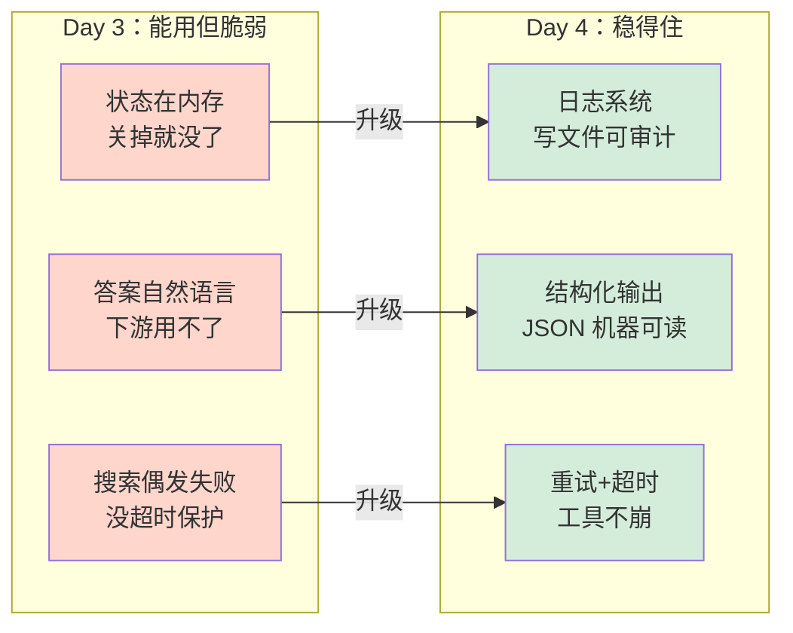

# AI Agent 从零实现 · 学习笔记（Day 4）

> 对应路线图：健壮性升级（不在原 Lesson 列表，但属于 Lesson 03-04 之间的工程必修课）
> 技术栈：智谱 GLM-4-Flash + DuckDuckGo + Python logging + 装饰器
> 核心升级：**日志系统 + 结构化输出 + 重试/超时**

---

## 〇、一个心智模型：从"能用"到"稳得住"

Day 3 的 Agent 已经能跑通所有功能，但有三个隐患——**一旦出错就抓瞎**。Day 4 把它从"能用但脆弱"升级成"稳得住"：

```
Day 3（能用但脆弱）           Day 4（稳得住）
───────────────              ──────────────
状态在内存，关掉就没了  →     日志系统：写文件可审计
答案自然语言，下游用不了 →    结构化输出：JSON 机器可读
搜索偶发失败，没超时保护 →    重试+超时：工具不崩
```

**对比图**：



> 🔑 核心工程原则：**永远不要相信外部依赖（LLM、搜索 API）会稳定，要为失败做准备。**

---

## 一、升级 1：日志系统（`logger.py`）

### 1.1 解决什么问题？

Day 3 的所有状态只是 `print()` 到屏幕：

```python
# Day 3 agent.py
print(f"\n{state.summary()}")           # ← 打到屏幕
print(f"\n🤖 最终答案：\n{state.final_answer}")
```

**终端一关，全没了。** 出了问题想回查"当时 Agent 到底干了什么"，无从下手。

### 1.2 Day 4 怎么做？

写 `logger.py`，做两件事，分别给"人"和"程序"看：

| 产物 | 格式 | 给谁看 | 作用 |
|------|------|--------|------|
| `logs/run_YYYYMMDD_HHMMSS.log` | 文本 | **人** | 一次运行一个文件，过程详细，审计/调试用 |
| `logs/runs.jsonl` | JSONL | **程序** | 每次运行追加一行，累积所有历史，统计/分析用 |

### 1.3 真实日志长什么样

**`.log` 文件（给人看）**：
```
21:11:54 [INFO] ==================================================
21:11:54 [INFO] 📝 用户问：花儿为什么这样红
21:11:54 [INFO] 结构化输出：False
21:11:54 [INFO] --- 第 1 步 ---
21:11:54 [INFO] 🔧 调用工具：search_web({'query': '花儿为什么这样红'})
21:11:54 [INFO]    ✓ 结果（1.46s）：[{'title': '花儿为什么这样红 - 维基百科...
21:11:54 [INFO] 📋 运行摘要：状态=finished 步数=1 工具=1
```

**`runs.jsonl`（给程序看，每次运行追加一行）**：
```json
{
  "timestamp": "2026-07-04T21:11:54",
  "user_input": "花儿为什么这样红",
  "status": "finished",
  "steps": 1,
  "tool_names": ["search_web"],
  "elapsed_sec": 2.03,
  "final_answer_length": 152
}
```

用 Python 一行就能分析历史运行：
```python
import json
with open("logs/runs.jsonl") as f:
    runs = [json.loads(line) for line in f]
success_rate = sum(r["status"] == "finished" for r in runs) / len(runs)
```

### 1.4 为什么分两个文件？

- **`.log` 是给人读的**：格式自由，带 emoji 和缩进，看一眼就懂
- **`.jsonl` 是给程序读的**：每行一个 JSON，严格结构化，方便统计

**两者各有用途，不要混**。给程序看自然语言很痛苦，给人看纯 JSON 也不直观。

### 1.5 用 Python 标准库 `logging`，不自己造轮子

```python
import logging

logger = logging.getLogger("agent")
logger.setLevel(logging.DEBUG)        # 全开，由 handler 决定记到什么级别

# 文件 handler：全记
file_handler = logging.FileHandler(log_file)
file_handler.setLevel(logging.DEBUG)

# 终端 handler：只显示重要信息
console_handler = logging.StreamHandler()
console_handler.setLevel(logging.INFO)
```

**日志级别的含义**：

| 级别 | 含义 | 用在哪 |
|------|------|--------|
| DEBUG | 详细调试信息 | 只进文件，终端不显示 |
| INFO | 关键节点（开始、调工具） | 文件 + 终端 |
| WARNING | 警告（接近上限） | 文件 + 终端 |
| ERROR | 出错 | 文件 + 终端 |

> 一个比喻：Day 3 的 Agent 是"金鱼记忆"（7 秒就忘），Day 4 装上了"行车记录仪"（全程留痕）。

---

## 二、升级 2：结构化输出（`schemas.py`）

### 2.1 解决什么问题？

Day 3 的答案是一段自然语言：
```python
"OpenAI 最近发布了 GPT-5 测试版，扩展到 50000 人..."
```

人能读，但**程序处理不了**。想做下面这些事都很难：
- 把答案存数据库的 `summary` 字段
- 提取关键词做标签
- 统计置信度

### 2.2 Day 4 怎么做？

让 LLM 返回**结构化 JSON**：
```json
{
  "summary": "OpenAI 最新动态",
  "key_points": ["发布了 GPT-5", "扩展测试规模", "强化安全"],
  "sources": ["https://openai.com/..."],
  "confidence": "high"
}
```

程序可以直接 `json.loads()` 拿到任意字段。

### 2.3 定义响应格式

在 `schemas.py` 里新增 `RESPONSE_FORMAT`：

```python
RESPONSE_FORMAT = {
    "type": "json_object",
    "schema": {
        "type": "object",
        "properties": {
            "summary": {"type": "string"},
            "key_points": {"type": "array", "items": {"type": "string"}},
            "sources": {"type": "array", "items": {"type": "string"}},
            "confidence": {"type": "string", "enum": ["high", "medium", "low"]},
        },
        "required": ["summary", "key_points", "confidence"],
    },
}
```

**两种 schema 的区别**（重要）：

| 类型 | 作用 | 给谁 |
|------|------|------|
| `TOOLS_SCHEMA`（Day 1-3） | 告诉 LLM 有哪些工具可调 | LLM |
| `RESPONSE_FORMAT`（Day 4 新增） | 告诉 LLM 答案长什么样 | LLM |

### 2.4 ⚠️ 踩坑：`response_format` 不可靠

**现象**：传了 `response_format`，但 LLM 返回的不是预期 JSON object，而是一个 JSON 数组 `["About | OpenAI"]`。

**原因**：智谱的 `response_format` 参数**不会严格按 schema 强制**，LLM 仍可能返回任意 JSON。

**解决**：双管齐下——`response_format` + **在 prompt 里明确要求格式**：

```python
if structured:
    actual_input = (
        f"{user_input}\n\n"
        "请严格按以下 JSON 格式回答（不要输出任何其他内容）：\n"
        "{\n"
        '  "summary": "...",\n'
        '  "key_points": [...],\n'
        "}"
    )
```

**解析时加类型检查**（必须是 dict，不能是 list）：
```python
parsed = json.loads(state.final_answer)
if isinstance(parsed, dict):
    state.structured_answer = parsed      # ✅ 正确
else:
    state.structured_answer = None        # ❌ 格式不对
```

> 🔑 **教训**：模型厂商的"格式约束"功能都不绝对可靠。**最稳的做法 = API 参数 + prompt 明确指令 + 解析时类型校验，三层防护。**

---

## 三、升级 3：重试 + 超时（`tools.py`）

### 3.1 解决什么问题？

Day 3 的 `search_web` 虽然加了重试，但有两个问题：
1. **没有超时保护**：万一某次请求卡死 30 秒，整个 Agent 卡死
2. **重试逻辑写死在工具里**：每个工具都要重复写，违反 DRY 原则

### 3.2 Day 4 怎么做？写通用装饰器

```python
def retry_with_timeout(timeout: float = 10.0, retries: int = 3):
    """装饰器：给任何函数加超时 + 重试。"""
    def decorator(func):
        @functools.wraps(func)
        def wrapper(*args, **kwargs):
            last_error = None
            for attempt in range(1, retries + 1):
                try:
                    # 用线程池实现超时
                    with ThreadPoolExecutor(max_workers=1) as executor:
                        future = executor.submit(func, *args, **kwargs)
                        result = future.result(timeout=timeout)
                    return result  # 成功，直接返回
                except FuturesTimeout:
                    last_error = TimeoutError(f"超时（{timeout}s）")
                except Exception as e:
                    last_error = e
            # 全部重试都失败
            return {"success": False, "result": f"重试 {retries} 次仍失败：{last_error}"}
        return wrapper
    return decorator
```

**用法——一行装饰器搞定**：
```python
@retry_with_timeout(timeout=10.0, retries=3)
def search_web(query: str) -> dict:
    from ddgs import DDGS
    # 函数体一行都没改，但自动获得超时+重试能力
    ...
```

### 3.3 装饰器是什么？（JS/TS 类比）

如果你会 TS，装饰器就是 Python 版的 decorator：

```typescript
// TS 装饰器
@Component({})
class MyComponent { }
```

```python
# Python 装饰器（机制完全相同）
@retry_with_timeout(timeout=10, retries=3)
def search_web(query): ...
```

**装饰器 = "给函数加能力的函数"**。`@retry_with_timeout` 给 search_web 加了超时和重试能力，但 search_web 自己的代码一行没改。

**JS 最接近的类比是高阶函数**：

```javascript
// JS 等价心智模型
function retryWithTimeout(timeout, retries) {
    return function(originalFunc) {
        return function(...args) {
            // 包一层：超时 + 重试逻辑
            // 然后调 originalFunc(...args)
        }
    }
}

const searchWeb = retryWithTimeout(10, 3)(originalSearchWeb)
```

Python 的 `@` 只是语法糖，本质就是高阶函数。

### 3.4 超时保护实测

```python
@retry_with_timeout(timeout=0.5, retries=2)   # 故意设超短超时
def slow_tool():
    time.sleep(2)   # 睡 2 秒，肯定超时
    return {"success": True}

result = slow_tool()
# → {'success': False, 'result': '重试 2 次仍失败：TimeoutError: 超时（0.5s）'}
```

**没有保护会怎样**：整个 Agent 卡死 2 秒，期间什么都做不了。
**有保护会怎样**：触发超时，重试 2 次都超时，优雅返回错误而非崩溃，Agent 可以继续。

### 3.5 为什么用线程池实现超时？

Python 有个臭名昭著的 GIL（全局解释器锁），导致多线程不能真正并行执行 CPU 任务。但**等待 I/O（网络请求、文件读写）时会释放 GIL**，所以用线程池给网络请求加超时是可行的。

`ThreadPoolExecutor` + `future.result(timeout=N)` 是标准库自带的最简单的"给函数加超时"方案，不用引入 async/await 改造整个代码。

---

## 四、踩坑记录（真实遇到的）

### 🕳️ 踩坑 1：import 路径冲突

**现象**：`from schemas import TOOLS_SCHEMA, RESPONSE_FORMAT` 报错 `cannot import name 'RESPONSE_FORMAT'`。

**原因**：day4 和 day3 都有 `schemas.py`，`sys.path` 里先加了 day3 目录，Python 找到了 day3 的 schemas（没有 `RESPONSE_FORMAT`）。

**解决**：用 `importlib.util` 绝对路径 import day3 的 state.py，避免同名模块冲突：

```python
import importlib.util
_day3_state_path = os.path.join(..., "day3", "state.py")
_spec = importlib.util.spec_from_file_location("day3_state", _day3_state_path)
_day3_state_module = importlib.util.module_from_spec(_spec)
_spec.loader.exec_module(_day3_state_module)
AgentState = _day3_state_module.AgentState
```

**教训**：多个目录有同名模块时，`sys.path` 的顺序会决定 import 谁。要么改名，要么用绝对路径 import。

### 🕳️ 踩坑 2：`response_format` 不可靠

**现象**：传了 `response_format`，LLM 仍返回非预期 JSON（数组而非对象）。

**原因**：智谱的 `response_format` 不严格强制格式。

**解决**：三层防护——API 参数 + prompt 明确要求 + 解析时类型校验。

**教训**：模型厂商的格式约束都不绝对可靠，永远要有解析时的兜底。

### 🕳️ 踩坑 3：结构化输出 vs 工具调用的张力（重要发现）

**现象**：开启结构化输出后，LLM **跳过工具调用**，直接用旧知识答。

**原因**：当 prompt 强势要求"返回 JSON"时，LLM 急着完成任务输出格式，倾向于不走工具流程。

**影响**：这是一个真实的权衡——结构化输出和工具调用会互相干扰。

**解决**：Day 5 会用"两步法"——先调工具收集信息（普通模式），最后一步才切换到结构化输出。

**教训**：Agent 设计中，**多个强势指令会互相干扰**。要么分阶段执行，要么弱化其中一方。

### 🕳️ 踩坑 4：回归 bug——main() 不打印答案

**现象**：用户反馈"Agent 跑完了但没显示答案"。

**原因**：写 Day 4 时注意力全在加日志，logger 内部记录了答案，就下意识以为"日志记了就行"，**忘了终端还要 print 给用户看**。

**原来的代码**：
```python
run_agent(user_input, ...)   # ❌ 没接收返回值，没 print
```

**修复**：
```python
state = run_agent(user_input, ...)   # ✅ 接收 state
print(f"🤖 Agent 答案：\n{state.final_answer}")  # ✅ 打印答案
```

**教训**：**加新功能时，老功能必须回归测试**。这是典型的"回归 bug"——加了日志，漏了打印。`verify.py` 测的是函数返回值，没测 main 的终端输出，所以没发现。

---

## 五、常见问题（FAQ）

### Q1：为什么要复用 Day 3 的 state.py，不重写一份？

体现**代码资产积累**——每天的代码不是一次性的，而是下一关的基础。Day 3 写好的 `AgentState` 和 `ToolCallRecord`，Day 4 直接拿来用，一行没改。

这也是为什么真实项目要分模块——好的抽象能被复用，而不是每次重写。

### Q2：日志级别怎么选？

- **DEBUG**：开发时想看的一切细节（"参数是什么、中间值多少"）
- **INFO**：关键节点（"开始、调了什么工具、结束了"）
- **WARNING**：接近上限或异常但能处理（"达到 max_steps 80%"）
- **ERROR**：出错了（"工具失败、解析失败"）

原则：**生产环境终端只显示 INFO 及以上，DEBUG 只进文件**。

### Q3：`response_format` 和 prompt 明确要求，必须两个都用吗？

**建议都用**。`response_format` 是 API 层的约束，prompt 是指令层的约束。单独用任何一个都不够稳定：
- 只用 `response_format`：LLM 可能返回合法 JSON 但结构不对（比如返回数组而非对象）
- 只用 prompt：LLM 可能不听话，加一段解释文字导致 JSON 解析失败

两个一起用 + 解析时校验，是最稳的。

### Q4：装饰器能不能加在 add / read_file 上？

技术上可以，但**没必要**。
- `add` 是纯计算，不会失败，不会卡住
- `read_file` 失败已经用 try/except 捕获了

`@retry_with_timeout` 只加在**可能因网络/外部依赖失败**的工具上（如 `search_web`）。无脑加在所有工具上会增加无谓的开销。

### Q5：结构化输出和工具调用冲突，那什么时候用结构化？

- **需要机器读**：答案要存数据库、做后续处理 → 用结构化
- **只需要人读**：终端对话、聊天机器人 → 用自然语言

Day 5 的 Research Agent 会用"两步法"：中间步骤用自然语言（让工具正常调用），最终报告才切换结构化输出。

---

## 六、难点与思考

### 思考 1：健壮性的本质是"为失败做准备"

Day 4 三项升级的共同主题：**不信任任何外部依赖**。
- LLM 可能不按格式返回 → 加类型校验
- 搜索 API 可能失败 → 加重试
- 搜索可能卡死 → 加超时
- 整个流程可能出错 → 加日志留证据

**玩具代码假设一切顺利，工业代码假设一切都会出错。** 这就是"能用"和"稳得住"的本质区别。

### 思考 2：日志不是可选的，是必需的

Day 3 没有 logger 也能跑，但一旦上线给用户用，出了问题你就抓瞎——"用户说 Agent 答错了，但你不知道它当时调了什么、返回了什么"。

日志的价值不在正常运行时，而在**出问题时**。没有日志，生产事故根本无法排查。

### 思考 3：装饰器是 Python 的"中间件"概念

如果你接触过 Express/Koa 的中间件、Angular 的拦截器，Python 装饰器是同一个东西——**在函数前后加逻辑，而不改函数本身**。

`@retry_with_timeout` 就是 search_web 的"中间件"，在它外面包了一层重试和超时逻辑。函数自己不知道被包了，照常工作。

### 思考 4：Day 4 揭示了 Agent 工程的真实难点

Day 1-3 学的是 Agent 的**机制**（怎么调工具、怎么循环）。
Day 4 学的是 Agent 的**工程**（怎么让它稳定、可观测、可机器读）。

真实世界里，Agent 80% 的工作量在 Day 4 这种"工程打磨"上，而不是 Day 1-3 的机制实现。这也是为什么很多人能写 demo 却做不出产品——**机制不难，工程难**。

---

## 七、Day 3 vs Day 4 全面对比

| 维度 | Day 3 | Day 4 |
|------|-------|-------|
| **定位** | "能用" | "稳得住" |
| **出问题时** | 关掉终端就找不到了 | 日志文件完整保留 |
| **答案形式** | 自然语言（人能读） | 可选 JSON（人 + 程序都能用） |
| **工具卡死** | 整个 Agent 卡死 | 10 秒超时 + 3 次重试，不崩 |
| **重试逻辑** | 写死在 search_web 里 | 通用装饰器，所有工具可复用 |
| **可观测性** | 只有终端 print | 文件日志 + JSONL 统计 |
| **代码复用** | 每天重写 | 复用 Day 3 的 state.py |

---

## 八、架构图：Day 4 的完整数据流

```mermaid
graph TB
    subgraph "Day 4 三项升级"
        L[logger.py<br/>日志系统]
        T[tools.py<br/>@retry_with_timeout]
        S[schemas.py<br/>RESPONSE_FORMAT]
    end

    subgraph "agent.py 主流程"
        A[run_agent] --> B{structured?}
        B -->|是| C[加 JSON 格式指令到 prompt]
        B -->|否| D[自然语言]
        C & D --> E[while 循环调工具]
        E --> F[工具执行]
        F --> G[结果回传 LLM]
        G --> H{structured?}
        H -->|是| I[解析 JSON 挂到 state]
        H -->|否| J[直接用文本]
    end

    subgraph "Day 3 复用"
        S3[state.py<br/>AgentState]
    end

    T -.->|保护| F
    L -.->|全程记录| A
    L -.->|保存摘要| I
    S -.->|提供格式| C
    S -.->|提供格式| I
    S3 -.->|import 复用| A

    style L fill:#d4edda
    style T fill:#d4edda
    style S fill:#d4edda
    style S3 fill:#fff3e0
```

---

## 九、关键概念速查表

| 术语 | 含义 |
|------|------|
| **日志系统** | 把运行过程写文件，事后可查、可审计 |
| **JSONL** | JSON Lines，每行一个 JSON，适合程序分析 |
| **结构化输出** | 让 LLM 返回 JSON 而非自然语言，机器可读 |
| **`RESPONSE_FORMAT`** | 定义答案 JSON 结构的 schema |
| **装饰器 `@xxx`** | 给函数加能力的语法糖，不改函数本身 |
| **`@retry_with_timeout`** | 通用装饰器：超时 + 重试保护 |
| **`ThreadPoolExecutor`** | 标准库线程池，用于实现函数超时 |
| **回归 bug** | 加新功能导致老功能失效的 bug |
| **三层防护** | API 参数 + prompt 指令 + 解析校验 |

---

## 十、当前进度 & 下一步

```
✅ Lesson 01 (Agent 基础)
✅ Lesson 02 (Tool Calling)
✅ Lesson 03 (State & Workflow)
✅ Day 4 健壮性（日志+结构化+重试）  ← 完成
⬜ Day 5: 完整 Research Agent 项目   ← 下一步
⬜ Day 6: Evaluation 评估
⬜ Day 7: 部署上线
```

**Day 4 给 Day 5 铺好的路**：

| Day 4 能力 | Day 5 怎么用 |
|-----------|-------------|
| 日志系统 | 记录 Research Agent 每一步搜索过程 |
| 结构化输出 | 最终研究报告输出为 JSON |
| 重试/超时 | 多步搜索时某步失败不影响整体 |
| AgentState | Research Agent 状态管理基础 |
| Agent Loop | 多步搜索 → 摘要 → 综合的核心机制 |

下一步（Day 5）：把 Day 1-4 所有能力整合成一个完整的"研究助手"产品——多步搜索、自动摘要、生成研究报告。

---

## 附：Day 4 文件结构

```
day4/
├── logger.py      # 日志系统（.log + JSONL）
├── tools.py       # @retry_with_timeout 装饰器 + 三个工具
├── schemas.py     # TOOLS_SCHEMA + RESPONSE_FORMAT
└── agent.py       # 整合三项升级的主流程

logs/              # 运行时生成（gitignore，不进仓库）
├── run_YYYYMMDD_HHMMSS.log
└── runs.jsonl
```

---

## 十一、亲手体验指南

跑 `python day4/agent.py`，体验两种模式：

| 模式 | 输入示例 | 体验点 |
|------|---------|--------|
| 普通模式 | `搜一下 OpenAI 最新动态` | 自然语言答案 + 日志记录 |
| 结构化模式 | `json 搜一下 OpenAI 最新动态` | JSON 答案（注意可能不调工具） |
| 错误场景 | `读 不存在的文件.md` | Agent 不崩，优雅降级 |

跑完后看 `logs/` 目录：
```bash
ls logs/                          # 看所有日志文件
cat logs/runs.jsonl | tail -1     # 看最近一次运行摘要
```

体验时注意感受 Day 3 → Day 4 的差别：**Day 3 跑完什么都没留下，Day 4 跑完有完整记录**。
