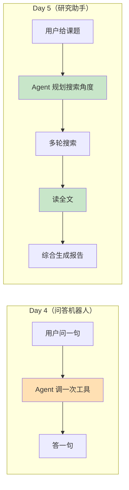

# AI Agent 从零实现 · 学习笔记（Day 5）

> 对应 Day 5：完整 Research Agent
> 技术栈：智谱 GLM-4-Flash + DuckDuckGo + readability-lxml + Python
> 核心升级：**两步法 + System Prompt + 包结构 + fetch_url 深度阅读**

> 📂 **关联代码**
> - 目录：`research_agent/`（Python 包，产品形态）+ `common/`（公共代码）
> - 核心文件：`research_agent/agent.py`（两步法编排）、`researcher.py`（阶段 A 研究 Loop）、`reporter.py`（阶段 B 报告生成）、`prompts.py`（System Prompt）、`state.py`（ResearchState，三层继承）
> - 公共：`common/tools.py`（+ `fetch_url`）、`common/schemas.py`、`common/state.py`、`common/logger.py`
> - 运行：`python -m research_agent`
> - 关键设计：业务逻辑零改动，是 Day 7 部署、Day 8 Workflow、Day 9 Streaming 的地基

---

## 〇、一个心智模型：从"零件"到"产品"

Day 1-4 是在造**零件**——每天学一个机制（Tool Calling / Loop / State / 健壮性）。
Day 5 是第一次**把零件组装成产品**：

```
Day 1-2：会调工具         （零件：Tool Calling）
Day 3：  会循环 + 有记忆   （零件：Loop + State）
Day 4：  会容错 + 可观测   （零件：健壮性）
─────────────────────────────────────────────
Day 5：  组装成"研究助手"  （产品：完整 Research Agent）
```

**本质转变**：从"用户问一句 → Agent 答一句"升级成"用户给一个课题 → Agent 自主规划、多轮搜索、读全文、综合生成研究报告"。这是从"聊天机器人"到"研究助手"的跃迁。

**对比图**：



> 🔑 一句话：**Day 5 的 Agent 会自己决定"搜什么、搜几次、读哪篇、什么时候停"。** 这是"被动问答"和"主动研究"的分界线。

---

## 一、两步法：Day 4 踩坑 3 的彻底解法（核心）

### 1.1 Day 4 留的坑

Day 4 踩坑 3 发现：**结构化输出和工具调用会互相干扰**。一旦 prompt 强势要求"返回 JSON"，LLM 就急着输出格式，跳过工具调用，直接用旧知识编答案。

这在"研究助手"场景下是致命的——我们要 Agent 先老老实实搜索，最后才输出结构化报告。两个目标打架。

### 1.2 Day 5 的解法：拆成两个阶段

```
阶段 A（researcher）：研究循环
  - 给 System Prompt（"你是研究助手"）
  - 允许调 search_web / fetch_url
  - 不要求任何输出格式
  - LLM 自由思考、多轮搜索
  → 产出：findings（素材文本）

阶段 B（reporter）：报告生成
  - 不给任何工具（LLM 调不了 search_web）
  - 传 response_format 强制 JSON
  - 把 findings 喂给它，让它综合
  → 产出：结构化报告 dict
```

**两步彻底隔离**，谁也不干扰谁。这是 Day 5 最有技术含量的一点。

### 1.3 为什么不能合并成一步

很多人会想："我能不能让 Agent 一边搜索一边输出 JSON？"

**不能。** 原因是 LLM 的注意力是有限的：

```
如果同时要求"调工具" + "输出 JSON 格式"：
  LLM 的注意力被分到两个强势目标上
  → 经常为了"满足格式"而牺牲"调用工具"
  → Day 4 踩坑 3 实证：直接跳过工具编答案
```

两步法是**串行分工**：阶段 A 只想一件事（搜索），阶段 B 只想一件事（综合）。专注度上去了，质量就上去了。

### 1.4 代码骨架

```python
# agent.py - 两步法编排
def run_research_agent(topic):
    state = ResearchState(topic=topic)

    # 阶段 A：研究（允许工具，不要求格式）
    state = run_research(state, client, logger)

    # 阶段 B：报告（不给工具，强制 JSON）
    state = run_report(state, client, logger)

    return state

# researcher.py - 阶段 A 的关键：不传 response_format
response = client.chat.completions.create(
    model=Config.MODEL,
    messages=state.messages,
    tools=RESEARCH_TOOLS_SCHEMA,   # ✅ 给工具
    temperature=Config.TEMPERATURE,
    # ❌ 故意不传 response_format
)

# reporter.py - 阶段 B 的关键：不传 tools，只传 response_format
response = client.chat.completions.create(
    model=Config.MODEL,
    messages=[{"role": "user", "content": user_prompt}],
    temperature=Config.TEMPERATURE,
    response_format=RESPONSE_FORMAT,  # ✅ 强制 JSON
    # ❌ 故意不传 tools
)
```

### 1.5 两步法的代价

不是没缺点：

| 维度 | 单步法 | 两步法 |
|------|--------|--------|
| 简单任务 | 快，一步到位 | 略浪费（必走两步） |
| 复杂任务 | 容易打架 | 稳定 |
| token 成本 | 低 | 高（阶段 B 要重新喂 findings） |
| 延迟 | 低 | 高（多一次 LLM 调用） |

**权衡**：对"研究"这种需要严谨综合的任务，两步法的稳定性值得这个代价。简单问答场景还是单步好。

---

## 二、System Prompt：给 Agent 一个身份（新概念）

### 2.1 前 4 天为什么不需要 System Prompt

Day 1-4 的 Agent 没有 System Prompt，每次都是 `messages = [{"role": "user", "content": ...}]`——纯被动问答。用户问什么答什么。

这在"工具调用练习"阶段没问题，但要做"研究助手"就不够：用户给一个课题，Agent 不知道该怎么拆解、该搜几次、什么时候停。

### 2.2 System Prompt 是什么

> **System Prompt 是放在对话最前面的"身份卡 + 行为规范"，告诉 LLM "你是谁、该怎么工作"。**

```python
state.messages = [
    {"role": "system", "content": RESEARCHER_SYSTEM_PROMPT},  # ← 身份卡
    {"role": "user", "content": f"请研究以下课题：{topic}"},
]
```

Day 5 的 System Prompt（`prompts.py`）核心内容：

```
你是一个专业的研究助手。

【你有两个工具】
1. search_web：搜索，返回摘要。用于"广度探索"。
2. fetch_url：读网页全文。用于"深度阅读"。

【你的工作方式：先搜后读】
1. 拆解课题：先想清楚需要从哪几个角度搜索
2. 先用 search_web 广度搜索
3. 再用 fetch_url 深度阅读：挑出 1-3 个最相关的链接读全文
4. 适度收敛：通常 2-4 次搜索 + 1-3 次深度阅读就够了
...
```

### 2.3 System Prompt 的威力：Agent 自主规划

这是 Day 5 最神奇的地方。我只在 System Prompt 里写了"拆解课题、多角度搜索"，**没写具体怎么拆**。但 LLM 读完后，自己规划出了这样的搜索策略（真实运行）：

```
课题：GLM-4 和 GPT-4 的区别

Agent 自主决定的搜索关键词：
  第 1 轮：GLM-4 model architecture      ← "先搞清楚 GLM-4"
  第 2 轮：GPT-4 model architecture      ← "再搞清楚 GPT-4"
  第 3 轮：GLM-4 vs GPT-4 performance    ← "对比性能"
  第 4 轮：GLM-4 vs GPT-4 application    ← "对比场景"
  第 5 轮：GLM-4 vs GPT-4 background     ← "了解背景"
```

先分述（1、2 轮）再对比（3、4、5 轮）——这是 LLM 自己悟出来的研究方法论。**System Prompt 教的是"怎么思考"，不是"具体做什么"。**

### 2.4 System Prompt vs User Prompt

| 维度 | System Prompt | User Prompt |
|------|--------------|-------------|
| 角色 | "你是谁、该怎么干" | "这次具体做什么" |
| 位置 | messages 第 1 条，role=system | 后续，role=user |
| 是否变化 | 一次定义，全程不变 | 每次请求不同 |
| 影响范围 | Agent 的整体行为模式 | 单次任务 |

**类比**：System Prompt 是员工的"岗位职责说明书"，User Prompt 是每天布置的"具体任务"。员工根据岗位职责来处理每天的任务。

---

## 三、包结构：从"练习脚本"到"工程产品"

### 3.1 为什么 Day 5 改用包结构

Day 1-4 每天都是**单目录 + 几个 .py 文件**：

```
day4/
├── agent.py
├── tools.py
├── schemas.py
└── logger.py
```

这对"学习练习"够了，但 Day 5 是个产品，更复杂（两步法、多个阶段、独立模块），单目录会挤成一团。所以 Day 5 用了 **Python 包**（package）：

```
research_agent/           ← 这是个"包"（有 __init__.py）
├── __init__.py
├── __main__.py           ← 入口：python -m research_agent
├── agent.py              ← 编排层（两步法串联）
├── researcher.py         ← 阶段 A
├── reporter.py           ← 阶段 B
├── prompts.py            ← System Prompt
└── state.py              ← ResearchState
```

### 3.2 `__main__.py` 是什么

> **`__main__.py` 是 Python 包的"默认入口"。有了它，就能用 `python -m 包名` 运行整个包。**

```bash
# 没有 __main__.py 时，只能：
python research_agent/agent.py        # 跑某个文件

# 有 __main__.py 后，可以：
python -m research_agent              # 跑整个包（更正式）
```

`-m` 的意思是"把这个目录当模块运行"，Python 会自动找里面的 `__main__.py`。这是 Python 的标准实践（`python -m http.server` / `python -m pytest` 都是这个机制）。

### 3.3 包内 import 的坑（踩过）

包内模块互相 import 时，**不能用裸 import**：

```python
# ❌ 错误：在包里用裸 import
from state import ResearchState       # python -m 时找不到
from prompts import SYSTEM_PROMPT     # ModuleNotFoundError

# ✅ 正确：用包绝对路径
from research_agent.state import ResearchState
from research_agent.prompts import SYSTEM_PROMPT
```

**原因**：`python -m research_agent` 把 `research_agent` 当成顶层包，包内模块互相引用必须带包名前缀。这是 Python 包机制的要求，Day 5 开发时踩过这个坑。

---

## 四、common/ 公共目录：代码资产积累的落地

### 4.1 为什么要提取 common/

Day 4 笔记里吐槽过：想复用 Day 3 的 `state.py`，只能用 `importlib` 绝对路径加载，7 行又丑又脆弱的代码。Day 5 索性把"所有 Day 都会用"的代码提到公共目录：

```
common/
├── __init__.py
├── tools.py      ← add / read_file / list_dir / search_web / fetch_url
├── schemas.py    ← TOOLS_SCHEMA + RESPONSE_FORMAT
├── logger.py     ← setup_logger + save_run_summary
└── state.py      ← AgentState + ToolCallRecord（基类）
```

从此任何 Day 都能干净地复用：

```python
# 之前（Day 4 的丑陋写法）
import importlib.util
_spec = importlib.util.spec_from_file_location("day3_state", "/abs/day3/state.py")
...  # 7 行

# 现在（Day 5 的干净写法）
from common.state import AgentState, ToolCallRecord  # 1 行
```

### 4.2 三层 State 继承链

`common/state.py` 提取后，State 形成了清晰的继承链：

```
common.AgentState                （Day 3 基类：messages/steps/tool_history/...）
    ↓ 继承
Day 4 AgentState                 （+ structured_answer）
    ↓ 继承
Day 5 ResearchState              （+ topic/findings/report）
```

每一层只加自己需要的字段，老代码完全不动。这就是"代码资产积累"——**Day 3 写的代码，Day 5 还在用，而且用得很舒服。**

```python
# research_agent/state.py
@dataclass
class ResearchState(_BaseAgentState):   # 继承 common.AgentState
    topic: str = ""
    findings: str = ""
    report: dict = field(default_factory=dict)
```

---

## 五、fetch_url 工具：从"看摘要"到"读全文"

### 5.1 能力缺口的暴露

Day 5 跑通后，我有意识地审视："这真的算 Agent，还是只是个搜索工具？"

答案指向一个真实的能力缺口：**Agent 只能看到 DuckDuckGo 返回的 300 字摘要**。一篇 3000 字的深度文章，Agent 只看到开头就敢写进报告。这正是"像搜索工具"的根因。

### 5.2 fetch_url 做了什么

新增 `fetch_url` 工具，用 `readability-lxml` 自动提取网页正文：

```python
@retry_with_timeout(timeout=15.0, retries=2)
def fetch_url(url: str, max_length: int = 5000) -> dict:
    import urllib.request
    from readability import Document

    req = urllib.request.Request(url, headers={"User-Agent": "..."})
    with urllib.request.urlopen(req, timeout=10) as resp:
        html = _decode_html(resp.read(), ...)

    doc = Document(html)            # readability 提取正文
    title = doc.short_title()
    text = _html_to_text(doc.summary())   # HTML → 纯文本

    return {"success": True, "url": url, "title": title, "content": text[:max_length]}
```

### 5.3 两个工具的分工

```
search_web：广度探索
  - 输入：关键词
  - 输出：5-10 条结果，每条 300 字摘要
  - 价值：快速发现"有哪些相关文章"

fetch_url：深度阅读
  - 输入：单个 URL
  - 输出：一篇文章的完整正文（5000 字）
  - 价值：深入了解"某篇文章具体说了什么"
```

**配合使用**：先 `search_web` 找到相关链接，再 `fetch_url` 读全文。这正是人类做研究的方式——先 Google 找到文章，再点进去读。

### 5.4 Agent 的决策深度质变

加 fetch_url 后，Agent 的决策链路从"线性搜索"变成"搜读交替"：

```
加工具前（1 个工具）：
  搜 → 看摘要 → 换个词再搜 → 看摘要 → ...
  所有关键词都是"搜索角度"的变换

加工具后（2 个工具）：
  搜 → 看摘要 → "这篇 Wikipedia 最权威，读全文"
    → fetch_url → 发现新线索 → 基于全文再搜
  出现"工具切换"和"基于内容深挖"的决策
```

**真实运行的验证**（课题"LangChain 是什么"）：

```
第 1 轮：🔎 搜索：LangChain              ← 广度探索
        ✓ 找到 2 条结果（300 字摘要）
第 2 轮：📖 读全文：wikipedia.org/LangChain  ← Agent 自主决定读 Wikipedia
        ✓ 正文 5000 字符
```

报告里提到了"Alpha Vantage、Apify、ArXiv、AWS Lambda"等具体工具名——这些信息**只可能来自 Wikipedia 全文的表格**，300 字摘要里根本没有。这就是 fetch_url 的价值实证。

---

## 六、踩坑记录（真实遇到的）

### 🕳️ 踩坑 1：包内裸 import 找不到模块

**现象**：`python -m research_agent` 运行时报 `ModuleNotFoundError: No module named 'state'`。

**原因**：包内模块用了裸 import（`from state import ResearchState`）。`python -m` 把 `research_agent` 当顶层包，包内引用必须带包名前缀。

**解决**：包内一律用绝对 import：
```python
# ❌ from state import ResearchState
# ✅ from research_agent.state import ResearchState
```

**教训**：Python 包机制有它的规矩。一旦目录里有 `__init__.py`，它就是个包，内部 import 要遵守包的规则。

### 🕳️ 踩坑 2：ddgs 库不走系统代理

**现象**：在有代理的环境下，`search_web` 持续超时失败，但浏览器能正常访问 DuckDuckGo。

**原因**：`ddgs` 库底层用 `requests`/`urllib3`，**不会自动读系统代理环境变量**（`HTTPS_PROXY`）。需要显式传 `proxy=` 参数。

**解决**：
```python
proxy = os.environ.get("HTTPS_PROXY") or os.environ.get("https_proxy")
ddgs = DDGS(proxy=proxy) if proxy else DDGS()
```

**教训**：**第三方库的代理行为不能假设**。很多库（requests、urllib3）会读环境变量，但 `ddgs` 不会。这种差异只有真踩了才知道。

### 🕳️ 踩坑 3：超时阈值卡在成功边缘

**现象**：调大代理后 `search_web` 仍偶发失败，但日志显示"重试 3 次 × 10 秒"——每次都卡在 10 秒左右被超时杀掉。

**原因**：DuckDuckGo 经代理后单次请求约 10-12 秒，而 `@retry_with_timeout(timeout=10.0)` 正好设成 10 秒。**工具快要成功了，但超时先触发**——典型的边界 off-by-one。

**解决**：把超时调到 30 秒、重试调到 5 次，给足容错空间。

**教训**：**超时阈值不能拍脑袋定**。要先测真实耗时，再设一个"略大于 p99 耗时"的值。设小了误杀正常请求，设大了起不到保护作用。

### 🕳️ 踩坑 4：DuckDuckGo 在代理网络下持续不稳定

**现象**：即使调大超时和重试，DuckDuckGo 在某些代理链路下仍持续失败（切到 Yahoo 后备源也失败）。

**原因**：免费服务的稳定性受网络环境影响大。Day 3 笔记的踩坑 3 就提过"DuckDuckGo 偶发不稳定"，这次是更严重的持续不稳定。

**解决**：现状是靠重试 + 错误降级撑着。真正的解法是换付费搜索（智谱 web_search / SerpAPI / Tavily），但学习阶段先用免费。

**教训**：**外部免费服务永远不可靠**。生产环境必须有付费备份方案。Day 4 的"健壮性设计"（重试 + 超时 + 优雅降级）在这种时候真的救命——至少 Agent 不会崩，会给出 low confidence 的诚实报告。

---

## 七、常见问题（FAQ）

### Q1：两步法为什么不合并成一步？

详见 1.3。核心：LLM 注意力有限，同时要求"调工具 + 输出格式"会互相干扰。Day 4 踩坑 3 实证过。串行分工质量更高。

### Q2：System Prompt 写多长合适？

越长越能控制行为，但越长越占 token。经验值：
- 简单角色：3-5 行（"你是 XX 助手"）
- 复杂任务：50-200 行（带工作流程、工具说明、注意事项）
- Day 5 的研究助手 Prompt 约 30 行，是中等复杂度

### Q3：findings 为什么要单独提取，不直接传 messages 给阶段 B？

`messages` 里有大量无关内容（system prompt、assistant 的思考过程、tool_call 元数据）。阶段 B 只需要"搜到了什么、读到了什么"。提取成干净文本：① 省 token；② 阶段 B 注意力不被分散。

### Q4：fetch_url 为什么截断到 5000 字？

LLM 有上下文窗口限制（GLM-4-Flash 约 128K token）。一篇长文可能 2 万字，几篇就撑爆上下文。5000 字是"够用又不撑爆"的平衡点。`truncated` 字段会告诉 Agent"这篇被截断了"，它自己判断够不够。

### Q5：DuckDuckGo 这么不稳，为什么不直接换智谱 web_search？

智谱 web_search 是**收费工具**（0.01-0.05 元/次），免费档没额度。学习阶段优先用免费方案（DuckDuckGo）。Day 7 部署或正式项目再考虑付费搜索。

---

## 八、难点与思考

### 思考 1：Day 5 让"Agent 三要素"第一次真正协作

前 4 天学了三要素（LLM + Tool + Loop），但它们是**孤立练习**。Day 5 第一次让三者真正协作：

```
LLM  ← System Prompt 给它"研究助手"身份，决策质量提升
Tool ← search_web + fetch_url 两个工具配合，广度 + 深度
Loop ← while 循环让 LLM 在"搜-读-再搜"中迭代
```

**单独看每个要素都不难，难的是让它们配合出"研究"这种复杂行为。** 这是从"会用工具"到"会用工具解决问题"的跨越。

### 思考 2：编排、运行时、规则引擎——三个被混说的概念

学 Day 5 时查资料遇到"Orchestration / Runtime / Rule Engine"这些词，一开始很混乱。理清后才发现：**我的 Day 5 代码里这三层都有，只是没命名。**

| 概念 | Day 5 代码位置 | 作用 |
|------|--------------|------|
| **编排（Orchestration）** | `agent.py` 的两步法 | 决定"先 research 再 report"的流程 |
| **运行时（Runtime）** | `researcher.py` 的 while 循环 | 实际跑循环、调工具、管状态 |
| **规则引擎（Rule Engine）** | `can_continue()` / 工具白名单 / max_steps | 硬性约束，LLM 绕不过 |

**关键认知**：
- 编排是"设计图"（流程）
- 运行时是"施工队"（执行）
- 规则引擎是"安监员"（约束）

为什么现在混在一起能跑？因为 Day 5 规模小（~100 行）。**当 Agent 长大到 10+ 步骤，不分层会失控**。LangGraph（Lesson 08）存在的意义就是帮你管理"编排 + 运行时"。

> 现在手写这三层，是为了 Lesson 08 用框架时**真正懂框架在帮你干什么**。

### 思考 3：工具数量 vs 决策深度

Day 5 加 fetch_url 后有个观察：**让 Agent 明显变强的，不是"多了一个工具"，而是"工具之间能切换"。**

```
1 个工具（只有 search_web）：
  Agent 的决策只有"搜什么关键词"
  → 线性搜索，深度有限

2 个工具（search_web + fetch_url）：
  Agent 的决策变成"搜什么 + 要不要读这篇全文"
  → 出现工具切换、基于内容深挖
```

这印证 Day 4 思考 5 的观点：**工具之间的切换决策，是 Agent 智能的体现。** 工具数量不是关键，工具之间能否形成"决策链"才是。

### 思考 4：为什么 Day 5 是"产品"而不是"练习"

| 维度 | Day 1-4（练习） | Day 5（产品） |
|------|----------------|--------------|
| 代码组织 | 单目录脚本 | Python 包 |
| 交互模式 | 一问一答 | 给课题 → 自主研究 |
| 工具配合 | 单工具 | 多工具协作 |
| 用户价值 | 学习用 | 真能查资料 |
| 可扩展性 | 加功能要重写 | 加工具改一处 |

**Day 5 第一次有了"产品形态"**——虽然简陋，但骨架是对的：包结构、两步法、可插拔工具。后面 Day 6（评估）/ Day 7（部署）都在这个骨架上加。

---

## 九、Day 4 vs Day 5 全面对比

| 维度 | Day 4 | Day 5 |
|------|-------|-------|
| **定位** | "稳得住" | "像个产品" |
| **交互** | 一问一答 | 给课题 → 研究报告 |
| **工具数** | 4（add/read/list/search） | 2（search/fetch，研究专用） |
| **Prompt** | 无 System Prompt | 有 System Prompt（研究助手身份） |
| **输出** | 自然语言 / 单次 JSON | 两步法生成的结构化报告 |
| **架构** | 单循环 | 两步法（research + report） |
| **代码组织** | 单目录 | Python 包 + common/ |
| **决策深度** | "调哪个工具" | "搜什么 + 读哪篇 + 何时停" |
| **State 继承** | Day 3 → Day 4 | Day 3 → Day 4 → Day 5 |

---

## 十、关键概念速查表

| 术语 | 含义 |
|------|------|
| **两步法** | 研究（researcher，用工具）+ 报告（reporter，用格式）分离 |
| **System Prompt** | 给 LLM 的"身份卡 + 行为规范"，决定整体行为模式 |
| **`__main__.py`** | Python 包的默认入口，支持 `python -m 包名` 运行 |
| **common/** | 公共代码目录，所有 Day 共用，避免重复 |
| **findings** | 阶段 A 收集的素材文本，喂给阶段 B 生成报告 |
| **fetch_url** | 读网页全文的工具（vs search_web 看摘要） |
| **编排（Orchestration）** | 决定任务执行顺序和组合的"流程设计"层 |
| **运行时（Runtime）** | 实际跑循环、调工具、管状态的"执行引擎"层 |
| **规则引擎（Rule Engine）** | 硬性约束 Agent 行为的"安全护栏"层 |
| **readability-lxml** | 网页正文提取库（Mozilla Readability 算法移植） |

---

## 十一、当前进度 & 下一步

```
✅ Lesson 01 (Agent 基础)
✅ Lesson 02 (Tool Calling)
✅ Lesson 03 (State & Workflow)
✅ Day 4 健壮性（日志+结构化+重试）
✅ Day 5 完整 Research Agent（两步法 + fetch_url）  ← 完成
⬜ Day 6: Evaluation 评估                           ← 下一步
⬜ Day 7: 部署上线
```

**Day 5 给 Day 6 铺好的路**：

| Day 5 能力 | Day 6 怎么用 |
|-----------|-------------|
| 结构化报告 | 报告字段（confidence 等）作为评估指标 |
| JSONL 日志 | 历史运行数据 → 统计成功率/步数/耗时 |
| 两步法 | 分别评估"研究质量"和"报告质量" |
| 多工具决策 | 评估"工具选择是否合理" |

下一步（Day 6）：给 Agent 做体检——用数据量化"它到底有多好"，而不是凭感觉说"还行"。

---

## 附：Day 5 文件结构

```
week-research-agent/
├── common/                       ← 公共代码（Day 5 重构提取）
│   ├── __init__.py
│   ├── tools.py                  ← add/read_file/list_dir/search_web/fetch_url
│   ├── schemas.py                ← TOOLS_SCHEMA + RESPONSE_FORMAT
│   ├── logger.py                 ← setup_logger + save_run_summary
│   └── state.py                  ← AgentState + ToolCallRecord（基类）
├── research_agent/               ← Day 5 产品
│   ├── __init__.py
│   ├── __main__.py               ← CLI 入口（python -m research_agent）
│   ├── agent.py                  ← 两步法编排
│   ├── researcher.py             ← 阶段 A：研究循环
│   ├── reporter.py               ← 阶段 B：报告生成
│   ├── prompts.py                ← System Prompt
│   └── state.py                  ← ResearchState（继承 common.AgentState）
├── day1/ day2/ day3/ day4/       ← 学习记录（保留不动）
└── logs/                         ← 运行时生成
```

---

## 十二、亲手体验指南

跑 `python -m research_agent`，试这些课题，对比有无 fetch_url 的效果：

| 课题 | 体验点 |
|------|--------|
| `LangChain 是什么` | 看 Agent 会不会主动 fetch Wikipedia 全文 |
| `Python 3.13 有什么新特性` | 看多角度搜索策略 |
| `React 和 Vue 哪个好` | 看对比类课题的研究方式 |
| `一个特别冷门的话题` | 看 DuckDuckGo 失败时的错误降级 |

每跑一次，注意看：
1. 中间的 `🔎 搜索` 和 `📖 读全文` 行——Agent 的工具切换决策
2. 底部的 `=== 研究维度 ===`——搜索次数、关键词、素材长度
3. `logs/runs.jsonl`——历史运行数据（Day 6 评估的数据源）
