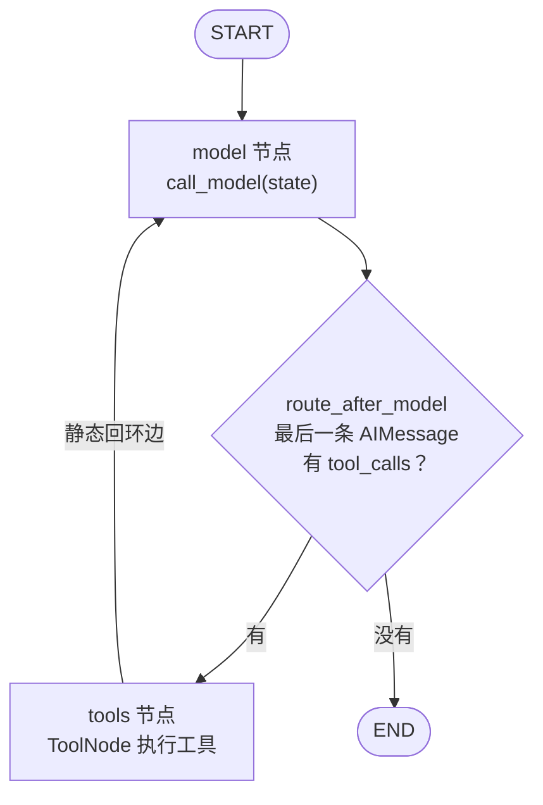

# LangGraph 学习笔记（用图重写对比版）

> 学习方式：与手写版平行实现 `langgraph_version/`，不改动 `research_agent/`。每课先独立跑通，再谈迁移。
> 核心认知：**手写版的 while 循环没有消失，它变成了看得见的图结构。**
> 前置：已完成手写 Agent（Day 1-10）+ RAG + LangChain 对照（LangChain-学习笔记.md）

> 📂 **关联代码**
>
> - `langgraph_version/lesson01_minimal_graph.py`（Lesson 01：最小 StateGraph 工具循环，已实测跑通）
> - 对照的手写版：`day3/agent.py`（while 循环）、`common/state.py`（AgentState）
> - 对照的 LangChain 版：`langchain_version/agent.py`（bind_tools 循环）
> - 运行：`.venv/bin/python -m langgraph_version.lesson01_minimal_graph`
> - 依赖：`requirements.txt` 已加 `langgraph>=1.0.0`（环境实际装的是 1.2.9）

---

## 〇、心智模型：图纸与机器

最容易犯的误解是把 `StateGraph` 当成"正在运行的 Agent"。它是**两阶段模型**：

```text
阶段 1：描述（写代码时）
    创建图纸 → 登记节点（add_node）→ 铺边（add_edge）
    此刻什么都不会运行！只是"声明"

阶段 2：执行（invoke 时）
    compile() 把图纸变成机器 → 机器按边路由状态 → 跑完返回
```

一句话总览：

> **`StateGraph` 对象 = 一张装配图纸；`compile()` 把图纸变成可执行的机器；`invoke()` 是按下开机键。**

和手写版的本质区别：

```text
手写版：控制流是代码 —— while / if 写死在 Python 里
LangGraph：控制流是数据 —— 节点和边是"登记"进去的结构
          代码只剩下节点里的普通函数
```

---

## 一、先纠正一个词：edge 是"边"不是"边界"

图论词汇：

```text
图 G = (V, E)
      V = 节点集合
      E = 边集合，每条边表示"从 A 到 B 可以走"
```

`add_edge` 是在**铺从 A 站到 B 站的传送带**，不是画边界线。`add_conditional_edges` 是装**岔路口**。

---

## 二、graph 实例方法逐个拆解（对照 lesson01 代码）

### 2.1 `StateGraph(MinimalGraphState)` —— 创建图纸，绑定白板

```python
graph = StateGraph(MinimalGraphState)
```

**这张图里所有工位共用同一块白板（State）**：

- 白板长什么样由 `MinimalGraphState` 定义（messages、model_calls）
- 每个节点都能读整块白板，只能通过返回"增量更新"往白板上写

对应手写版：`state = ResearchState(...)` 那个从头传到尾的对象。

### 2.2 `add_node("model", call_model)` —— 登记工位

```python
graph.add_node("model", call_model)
graph.add_node("tools", ToolNode(TOOLS))
```

**关键认知：add_node 只是登记，不执行。** 像在公司通讯录里写下"model 这个岗位，职责是函数 call_model"。此刻图里甚至还没有"先做谁后做谁"的概念——那由边决定。

节点 = 普通 Python 函数（或 ToolNode），签名约定：

```python
def node(state) -> dict:   # 读整个 state，返回增量更新
    ...
    return {"messages": [response]}   # 只返回要更新的 key
```

### 2.3 `add_edge(START, "model")` —— 铺传送带（静态边）

```python
graph.add_edge(START, "model")      # 入口：开机第一个进 model
graph.add_edge("tools", "model")    # tools 干完活，必回 model
```

边回答一个问题：**"这个节点干完后，下一个是谁？"**

- `START → model`：入口边，决定从哪开始
- `tools → model`：**这条回环边就是手写 while 循环的本体**——"工具执行完再问一次 LLM"，在图里是一根线

### 2.4 `add_conditional_edges(...)` —— 岔路口（动态边）

```python
graph.add_conditional_edges(
    "model",
    route_after_model,                    # 路由函数：看 state，返回去向
    {"tools": "tools", "end": END},       # 返回值 → 目的地的映射
)

def route_after_model(state) -> str:
    if last_message.tool_calls:
        return "tools"    # → 走 tools 线
    return "end"          # → 走 END 线
```

普通边是"干完必去 B"；条件边是"干完由路由函数说了算"。

对应手写版：

```python
while message.tool_calls:   # ← 这个判断，被搬进了路由函数
```

### 2.5 核心认知：while 循环 = 三根线

> **`while message.tool_calls` = `model→tools` 条件边 + `tools→model` 回环边 + 条件边开 `END` 出口。**
> 循环没消失，只是从代码跳转变成了图上的几何结构。



### 2.6 `compile()` —— 图纸变机器

```python
app = graph.compile()
```

做三件事：

1. **结构校验**：孤儿节点（登记了但没有边连它）、缺入口等
2. 把声明式拓扑翻译成内部调度程序（底层是 Pregel 超步模型）
3. 返回"可调用物"——`invoke / stream / checkpoint` 都作用在它上面

**图纸和机器是两个对象**：所以是 `app = graph.compile()`，后面 `app.invoke(...)` 而不是 `graph.invoke(...)`。

### 2.7 `invoke(initial_state)` —— 开机运行

机器内部的执行循环，展开后就是手写 while 的泛化版：

```text
① 状态从 START 进入，激活第一个节点（model）
② 运行节点函数：call_model(state) → 返回增量 {"messages": [resp], ...}
③ Reducer 合并：messages 用 add_messages 追加，model_calls 覆盖
④ 查边决定下一个激活节点：
     model 的出边是条件边 → route_after_model(state)
       ├─ "tools" → 激活 ToolNode
       └─ "end"   → 到 END，停机
⑤ 回到 ②，直到走进 END 或撞上 recursion_limit
```

每执行一步叫一个 **super-step**。`recursion_limit` 数的就是它。

---

## 三、State：从 dataclass 到 TypedDict + reducer

### 3.1 手写版 vs 图版

```python
# 手写版（对象式，直接改属性）
@dataclass
class ResearchState:
    messages: list
    steps: int = 0
    tool_history: list = field(default_factory=list)

# LangGraph 版（TypedDict + reducer，节点返回增量）
class MinimalGraphState(TypedDict):
    messages: Annotated[list[BaseMessage], add_messages]
    model_calls: int
```

### 3.2 为什么 messages 必须加 `add_messages`

普通字段默认 reducer 是**覆盖**：

```python
# 原 state {"messages": [A, B]}，节点返回 {"messages": [C]}
# 默认结果：[C] ❌ 全历史丢了
```

`add_messages` 是专为聊天记录设计的 reducer：

```python
# 原 state {"messages": [A, B]}，节点返回 {"messages": [C]}
# 结果：[A, B, C] ✅ 追加；同 id 消息则更新
```

对应手写版的 `state.messages.append(message)` + `state.messages.append(tool_message)`。区别：手写版手动改对象；图版节点返回增量，Graph 统一按 reducer 合并。

---

## 四、手写版 ↔ LangGraph 完整对照表

| 手写版（day3/researcher.py） | LangGraph 版（lesson01） |
| --- | --- |
| `ResearchState` dataclass | `TypedDict` Graph State |
| `state.messages.append(...)` | `add_messages` reducer |
| `while message.tool_calls:` | `model → tools → model` 循环边 |
| `if message.tool_calls` | Conditional Edge 路由函数 |
| `TOOL_REGISTRY[fn_name](**args)` | `ToolNode(TOOLS)` |
| 手拼 `{"role":"tool", ...}` dict 回传 | ToolNode 自动生成 ToolMessage |
| `state.steps` / `max_steps` | 业务计数 + `recursion_limit`（框架级） |
| 返回 state 对象 | `invoke()` 返回最终 State dict |

### max_steps 与 recursion_limit 不要混淆

| 机制 | 控制什么 | 层次 |
| --- | --- | --- |
| `max_steps` | 业务：最多研究几轮"模型→工具" | 业务边界，应保留 |
| `recursion_limit` | 框架：整张图最多执行多少 super-step | 框架护栏，防图拓扑死循环 |

双保险设计：业务上限管"研究几轮"，框架上限管"图别转飞"。

---

## 五、为什么要"控制流数据化"？

手写 while 一点都不差，绕一圈图的价值在哪？**控制流变成结构后，框架能统一处理它**：

| 能力 | 手写版要自己造 | 图版白拿 |
| --- | --- | --- |
| 画架构图 | 手画 | `app.get_graph().draw_*()` 直接导出 |
| 流式输出 | on_progress 回调 + Queue + SSE 桥接 | `app.stream(stream_mode="updates")` |
| 断点续跑 | 自己序列化 state | Checkpointer 按 super-step 存快照 |
| 人工介入 | 自己插判断 | `interrupt()` 暂停在任意节点 |
| 换拓扑 | 改 while/if 结构 | 增删几行 add_node/add_edge |

**Day 9 手写的 on_progress + Queue + SSE 整套桥接，图版对应 `stream(stream_mode="updates")`**——框架"知道"一次节点执行是天然的进度事件边界；手写 while 里这个边界要自己定义。

> 🔑 **拓扑扩展的边际成本趋近于零：加一个工具不改图结构，加一个阶段只需两行 add_node + add_edge。** 这是控制流数据化的回报。

---

## 六、Lesson 01 实测记录

代码：`langgraph_version/lesson01_minimal_graph.py`

图结构：`START → model → [有 tool_calls?] → tools → model ... → END`

实测输出（2026-08-17）：

```
=== Lesson 01：最小 LangGraph 工具循环 ===
图：START → model → tools → model → END

=== LangGraph 运行轨迹 ===
1. SystemMessage: 你是计算助手。遇到加法必须调用 add 工具，拿到结果后用中文简洁回答。
2. HumanMessage: 12.5 加 7.25 等于多少？
3. AIMessage: 工具调用 → add({'a': 12.5, 'b': 7.25})
4. ToolMessage: Observation → {"success": true, "result": "12.5 + 7.25 = 19.75"}
5. AIMessage: 12.5 加 7.25 等于 19.75。
模型调用次数：2

最终回答：12.5 加 7.25 等于 19.75。
```

读这个 trace 的方式：第 3 条是 model 节点的产出（决定调工具），第 4 条是 tools 节点的产出（Observation），第 5 条是 model 再次被激活后的最终回答——**每条消息背后都对应一次节点执行（一个 super-step）**。

运行命令：

```bash
cd week-research-agent
.venv/bin/python -m langgraph_version.lesson01_minimal_graph
```

---

## 七、踩坑记录

### 🕳️ 踩坑 1：Pyright 报"无法解析 langchain_core / langgraph 导入"

**现象**：LSP 对 lesson01 报 6 个 `reportMissingImports`，但 `.venv/bin/python -m ...` 运行完全正常。

**原因**：项目用 `.venv` 虚拟环境（Python 3.14），而全局 Pyright 没有绑定这个环境，找不到 `.venv/lib/python3.14/site-packages` 里的第三方包。

**解决**（双管齐下）：

1. 项目根加 `pyrightconfig.json`，把解释器指到 venv：

```json
{ "venvPath": ".", "venv": ".venv" }
```

1. 文件顶部加一行兜底（编辑器缓存未刷新时仍会误报）：

```python
# pyright: reportMissingImports=false
```

**教训**：**"LSP 报错 ≠ 代码错"，先确认 LSP 绑定的解释器是不是项目 venv。** 用运行结果做最终裁决。

### 🕳️ 踩坑 2：`graph.invoke()` 返回值类型是 `dict[str, Any] | Any`

**现象**：把 `invoke()` 结果直接传给 `print_trace(result: MinimalGraphState)` 时 Pyright 报类型不兼容。

**原因**：`invoke` 的签名返回宽泛类型，编译期无法知道运行时的 dict 恰好符合 State schema。

**解决**：显式 `cast`（与手写版"信任运行时结构"同一哲学，因为 TypedDict 本来就只是类型标注）：

```python
from typing import cast
result = cast(MinimalGraphState, graph.invoke(initial_state, config={"recursion_limit": 10}))
```

**教训**：TypedDict 是"结构性约定"不是运行时校验；框架入口处的类型缝隙用 cast 收口，节点内部继续享受类型提示。

### 🕳️ 踩坑 3：langchain-community 弃用警告

**现象**：`from langchain_community.chat_models import ChatZhipuAI` 触发 DeprecationWarning：`langchain-community is being sunset`。

**原因**：LangChain 正在拆分社区包；且 `langchain-zhipuai` 官方集成包导出为空（LangChain 时期就踩过）。

**应对**：学习阶段保留现状（能跑）；**迁移完整 Research Agent 时把 ChatZhipuAI 包成可替换的 LLM Adapter**，不把这个旧集成耦合进图编排——真要换模型只改 Adapter 一处。

### 🕳️ 踩坑 4：Python 3.14 + 包版本组合

环境实际版本：langgraph 1.2.9 / langchain 1.3.14 / langchain-core 1.5.0 / Python 3.14.4。文档里大量教程基于 langgraph 0.x，`create_react_agent` 等旧入口已进 `langchain-classic`。**查 API 以本机安装版本的签名 为准，不要照抄旧教程。**

---

## 八、难点与思考

### 思考 1：图不是"更聪明"，是"更可见"

LangGraph 不替你思考，也不替你写业务逻辑。Node 内仍是普通函数。它解决的是三件事：**State 怎么流转、Node 下一步去哪、过程可不可以被观测/暂停/恢复**。手写版这三件事都藏在代码里，图版把它们提到结构层。

### 思考 2：声明式的代价是间接性

`add_node`/`add_edge` 只登记不执行——好处是拓扑可整体检视（get_graph、draw）、可增量修改；代价是调试时不能像读 while 那样线性读代码，要脑补"机器按边走"的过程。**invoke 展开成五步循环**（见 §2.7）是脑补的脚手架。

### 思考 3：与 storyboard-agent 的决策互相印证

agent-base 里"不用 LangGraph：loop 是直线循环手写 20 行"依然成立——**单层直线循环用手写更直接**。图的收益在：多阶段串联、动态分支（Send）、需要 checkpoint/断点的长任务、需要 stream 的服务。这正好是 week-research-agent 后续课程要逐个验证的场景。

---

## 九、关键概念速查表

| 术语 | 含义 | 对应手写版 |
| --- | --- | --- |
| **StateGraph** | 图的图纸类，绑定一个 State schema | ResearchState 的"壳" |
| **State** | 全图共享白板，TypedDict/dataclass 定义 | state 对象 |
| **Reducer** | 节点增量如何合并进 State（默认覆盖） | 手动赋值语义 |
| **add_messages** | messages 专用 reducer：追加 + 同 id 更新 | `state.messages.append(...)` |
| **Node** | 干活的普通函数，`(state) -> 增量dict` | 循环体里的各步骤 |
| **Edge（边）** | "A 干完去 B"的传送带 | 代码里的顺序/跳转 |
| **Conditional Edge** | 岔路口：路由函数看 state 决定去向 | `if message.tool_calls` |
| **START / END** | 虚拟入口/终点节点 | 函数入口 / return |
| **compile()** | 图纸→机器：校验+生成调度器 | （无，手写直接跑） |
| **invoke()** | 开机同步执行，返回最终 State | 调 run_research_agent() |
| **stream()** | 按节点增量产出事件 | on_progress 回调 |
| **super-step** | 一次节点执行 + 状态合并 | while 的一轮迭代 |
| **recursion_limit** | 框架级 super-step 上限 | （max_steps 是业务级） |
| **ToolNode** | 预置工具执行节点，产出 ToolMessage | TOOL_REGISTRY 执行段 |
| **Checkpointer** | 按 super-step 存状态快照，可断点续跑 | （未实现，对应未来需求） |
| **Pregel** | LangGraph 底层的消息传递执行模型 | （手写版的"调用栈"） |

---

## 十、当前进度 & 下一步

```text
✅ 手写版 Agent（Day 1-10 + RAG + LangChain 对照）   ← 你懂原理
✅ LangGraph Lesson 01：最小工具循环图（已实测）      ← 图的三要素入门
⬜ Lesson 02：接入真实三工具（search_web / fetch_url / query_docs）
⬜ Lesson 03：迁移两步法（researcher_model ↔ ToolNode → collect_findings → reporter）
⬜ Lesson 04：业务 max_tool_rounds + recursion_limit 双护栏
⬜ Lesson 05：stream(stream_mode="updates") 接 SSE，对照 Day 9 手写桥接
⬜ Lesson 06：Checkpointer 持久化，对照 Day 10 SQLite Memory（区分对话记忆 vs 执行快照）
⬜ Lesson 07：大课题图化——Planner + Send 扇出 + 子图 × N + Synthesizer（对照 workflow/）
```

配套架构图（已提交仓库）：

- 当前实现架构：`docs/research-agent-current-architecture.svg`
- LangGraph 目标架构：`docs/research-agent-langgraph-target-architecture.svg`

---

## 附：文件结构

```text
langgraph_version/
├── __init__.py
└── lesson01_minimal_graph.py   ← Lesson 01：最小 StateGraph + ToolNode + 条件路由

pyrightconfig.json              ← 把 Pyright 绑到 .venv
requirements.txt                ← 新增 langgraph>=1.0.0
```

---

## 附：三句话记住本课

1. **`StateGraph` 是图纸不是机器：`add_node` 登记工位、`add_edge` 铺传送带，全都只是声明。**
2. **`compile()` 把图纸变成机器，`invoke()` 开机——机器内部跑的仍是"取状态→执行节点→reducer 合并→查边找下一站"的循环，和手写 while 同构。**
3. **`while message.tool_calls` = `model→tools` 边 + `tools→model` 回环 + 条件边开 END 出口。循环没消失，只是从代码变成了看得见的结构。**
